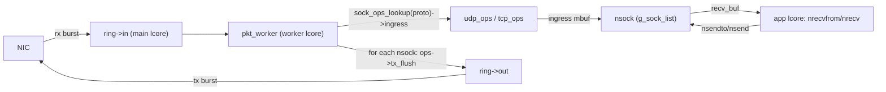

# dpdk-l 用户态协议栈 — 架构与功能状态

本文档梳理 `dpdk-l` 仓库当前的文件架构，并逐项列出用户态协议栈**已完成**与**未完成**的功能。未完成功能在代码对应位置均以 `TODO` 注释标注（见文末“未完成功能”表的行号引用）。

仓库当前包含三个递进演进的模块，最新且最完整的是 `08_tcp`：

| 模块 | 定位 | 关键变化 |
|------|------|----------|
| `06_netarch` | 最初原型：ARP/ICMP/UDP 收发，无 socket 层 | 单文件 `netarch.c`，UDP 无应用接口 |
| `07_udp` | 引入用户态 socket API（仅 UDP） | `socket_api.c/.h`、`net_addr.c/.h`、`udp_app.c` echo 应用 |
| `08_tcp` | 统一 socket + sock_ops + 表驱动 TCP 状态机 | 新增 `socket.c/.h`、`sock_ops.h`、`pkt_frame.c/.h`、`tcp.c/.h` |

下文以 `08_tcp` 为准。

---

## 一、08_tcp 文件架构

```
08_tcp/
├── main.c            EAL 初始化、NIC RX/TX 主循环、worker 派发、ARP sweep 定时器
├── socket.h / socket.c   ★ 统一 socket：struct nsock、fd 位图分配器、注册表、BSD API 派发器
├── sock_ops.h        ★ 每协议 ops 向量 + sock_ops_lookup
├── pkt_frame.h / pkt_frame.c   ★ 共享 Ethernet+IPv4 组帧 helper (eth_ipv4_build)
├── tcp.h / tcp.c     ★ TCP：表驱动状态机、tcp_ops、编解码/egress
├── udp.h / udp.c     UDP：udp_ops、收发、egress
├── socket_api.h      兼容 shim（仅 #include "socket.h"，保持 udp_app.c 不变）
├── udp_app.h / udp_app.c   UDP echo 应用（在独立 lcore 上运行）
├── arp.h / arp.c     ARP 表 + ARP 包构造/处理
├── icmp.h / icmp.c   ICMP echo reply
├── net_context.h / net_context.c   全局本端身份 g_net（port/ip/mac/mempool）
├── net_addr.*        （已删除，并入 socket.c）
├── ring.h / ring.c   NIC↔worker 的 in/out 环
├── port.h / port.c   以太网端口初始化
├── list.h            侵入式双向链表宏 LL_ADD/LL_REMOVE
├── config.h          编译期开关 ENABLE_* 与常量
├── log.h             分级日志 + IP/MAC 格式化
└── Makefile          SRCS-y：main net_context ring arp udp icmp port socket pkt_frame udp_app tcp
```

### 核心抽象

**统一 socket `struct nsock`**（[socket.h](08_tcp/socket.h)）：持有 fd、本地地址、recv/send 环、mutex/cond、ops 指针、链表节点；传输私有状态嵌入 `u` 联合体（TCP 放 `tcp_stream`，UDP 无私有态）。

**ops 向量 `struct sock_ops`**（[sock_ops.h](08_tcp/sock_ops.h)）：`ingress / tx_flush / send / recv / close / connect / listen / accept`。`sock_ops_lookup(proto)` 按 IP 协议号查表；`main.c` 的派发与 worker 循环对协议完全无感。

**表驱动 TCP 状态机**（[tcp.c](08_tcp/tcp.c)）：`tcp_state_ops[TCP_STATUS_MAX]` 每状态一个 handler；所有状态切换走 `tcp_stream_set_status`，日志统一。

### 数据流



### 三线程模型

- **main lcore**：NIC RX → `ring->in`；`ring->out` → NIC TX；ARP sweep 定时器。
- **worker lcore**：`ring->in` → `dispatch_packet` → `ops->ingress`；遍历 `g_sock_list` 调 `ops->tx_flush`。
- **app lcore**：`udp_app_entry` 阻塞在 `nrecvfrom`，echo 回 `nsendto`。

### 接收交付模型（设计建议）

当前 TCP/UDP 的 `recv_buf` 直接挂整包 `mbuf`，应用侧 `nrecv` / `tcp_recv` 自己剥 eth/ip/tcp（或 udp）头再拷 payload。这是为了少一次分配与拷贝、先跑通路径的阶段性简化，**不是长期目标抽象**。

更合理的分层是：

- **协议层职责**：校验、（TCP）按序/重组、更新 ack、回 ACK、重传与窗口等；处理完成后把**已就绪的数据**交给应用。
- **交付给应用的**：字节流或 payload（指针 + 长度），而不是仍带 L2/L3/L4 头的线包。
- **不必**把 RX 数据再包装成发送侧的 `tcp_fragment`——那是 TX 描述符（主机侧字段 → `tcp_build_pkt`），不是通用接收缓冲。

极致零拷贝时仍可把底层 buffer 指针交给应用，但应用看到的应是 **payload 视图**，而不是自己去解析三层头。等实现 short read 不丢数据、乱序重组、流式 `recv` 时，协议侧几乎必然要维护自己的接收缓冲（stream buffer），而不是继续把原始 `mbuf` 塞进 `recv_buf`。

---

## 二、已完成功能

### 基础设施
- DPDK EAL 初始化、单端口收发、burst 收发、丢包统计（[main.c](08_tcp/main.c)）
- 软件环 `in/out` 单例（[ring.c](08_tcp/ring.c)）
- 全局本端身份 `g_net`（port_id / local_ip / local_mac / mempool）（[net_context.c](08_tcp/net_context.c)）
- 分级日志 + IP/MAC 格式化（[log.h](08_tcp/log.h)）
- 编译期功能开关 `ENABLE_*`（[config.h](08_tcp/config.h)）

### socket 层（统一）
- 统一 `struct nsock`，UDP/TCP 共用同一注册表 `g_sock_list`（[socket.c](08_tcp/socket.c)）
- 真实 fd 位图分配器 `fd_alloc/fd_release`（替代原先恒为 3 的桩）
- 唯一命名的 recv/send 环 `sock_recv_%u / sock_send_%u`（修复多 socket 命名冲突）
- BSD 风格 API 派发器：`nsocket / nbind / nsendto / nrecvfrom / nclose / nconnect / nlisten / naccept`，全部转发到 `sk->ops->...`
- `sock_ops` 向量 + `sock_ops_lookup`，加新协议无需改 `main.c`

### ARP
- ARP 表 `arp_table_instance / arp_lookup / arp_table_add`（[arp.c](08_tcp/arp.c)）
- ARP request 回复、reply 学习
- ARP sweep 定时器周期性扫描 /24 子网（[main.c](08_tcp/main.c)）
- 未解析 MAC 时自动发 ARP request 并把待发包回队重试（UDP/TCP 共用）

### ICMP
- ICMP echo request → echo reply（[icmp.c](08_tcp/icmp.c)）

### UDP
- `udp_build_pkt` 构造 Eth/IPv4/UDP（已改用共享 `eth_ipv4_build`）
- `udp_ingress`：按 (dst_ip, dst_port, proto) 查 socket，投递 mbuf 到 recv_buf，signal cond
- `udp_tx_flush`：从 send_buf 取 mbuf，ARP 解析后送 out 环
- `udp_send / udp_recv / udp_close`（ops 实现）
- 阻塞 `nrecvfrom`（mutex/cond），含部分读语义（截断后剩余字节回队）
- UDP echo 应用（[udp_app.c](08_tcp/udp_app.c)）

### TCP
- `tcp_stream` 瘦身为 `nsock.u.tcp`（remote 4-tuple / status / sent_seq / recv_ack）
- **表驱动状态机** `tcp_state_ops[TCP_STATUS_MAX]`
- 服务端被动三次握手：LISTEN → SYN_RECV → ESTABLISHED
  - [1/3] 收 SYN → 排 SYN+ACK 到 send_buf → 进 SYN_RECV
  - [2/3] `tcp_tx_flush` 发送 SYN+ACK
  - [3/3] 收 ACK（校验 ack == isn+1）→ 进 ESTABLISHED，sent_seq 推进 1
- ESTABLISHED 收到 payload → 投递 mbuf 到 recv_buf → signal cond（首次接通 TCP 接收路径）
- `tcp_send`（PSH+ACK 数据段）/ `tcp_recv` / `tcp_close`
- 进程级 ISN 生成器（一次性播种，每连接步进，[tcp.c](08_tcp/tcp.c)）
- `tcp_stream_set_status` 统一状态迁移日志
- 统一 mbuf 归属契约：ingress handler 一律消费 mbuf

### 共享组帧
- `eth_ipv4_build` 共享 L2/L3 组帧，UDP/TCP 仅填 L4（[pkt_frame.c](08_tcp/pkt_frame.c)）

---

## 三、未完成功能（代码内均有 TODO 标注）

### TCP — 状态机与连接管理

| 功能 | 位置 | 说明 |
|------|------|------|
| 主动打开（客户端） | [tcp.c:261](08_tcp/tcp.c), [tcp.c:278](08_tcp/tcp.c), [socket.c:258](08_tcp/socket.c) | CLOSED/SYN_SENT 为 drop 桩；`tcp_ops.connect = NULL`，`nconnect` 返回 -1 |
| 监听 backlog / accept 队列 | [tcp.c:267](08_tcp/tcp.c), [socket.c:269](08_tcp/socket.c), [socket.c:281](08_tcp/socket.c) | `tcp_ops.listen/accept = NULL`；无 listen socket 概念 |
| 连接拆除（FIN 交换） | [tcp.c:264-269](08_tcp/tcp.c), [tcp.c:547](08_tcp/tcp.c) | FIN_WAIT_1/2、CLOSE_WAIT、LAST_ACK、CLOSING、TIME_WAIT 全为 drop 桩；`tcp_close` 直接丢队列，不发 FIN |
| RST 生成/接收 | [tcp.c:319](08_tcp/tcp.c) | RST 完全忽略 |
| TCP 选项解析 | [tcp.c:317](08_tcp/tcp.c) | MSS / 窗口缩放 / SACK / 时间戳未解析；rx 端 opt_len 恒 0 |
| 监听门控 | [tcp.c:314](08_tcp/tcp.c) | 任意本地端口的 SYN 都会建 socket，无“是否在监听”校验 |

### TCP — 可靠性与流控

| 功能 | 位置 | 说明 |
|------|------|------|
| 重传与 RTO 定时器 | [tcp.c:411](08_tcp/tcp.c) | 发送后立即释放 fragment，无重传队列，丢包则连接永久卡死 |
| 序号校验 / 顺序重组 | [tcp.c:235](08_tcp/tcp.c), [tcp.c:521](08_tcp/tcp.c) | 不校验 in-order，乱序/重复段直接投递；短读丢弃本段剩余字节 |
| 收端 ACK 生成 | [tcp.c:240](08_tcp/tcp.c) | 收到数据后从不回纯 ACK，对端无法推进窗口 |
| 流控 / 滑动窗口 | [tcp.c:243](08_tcp/tcp.c), [tcp.c:449](08_tcp/tcp.c) | 不看对端 rx_win；发送无背压；rx_win 固定 `TCP_INITIAL_WINDOW_SIZE` |
| 拥塞控制 | — | 无 |
| 按 MSS 分段 | [tcp.c:453](08_tcp/tcp.c) | 超长 payload 编码为单帧 |

### socket 层

| 功能 | 位置 | 说明 |
|------|------|------|
| fd 表 / 注册表线程安全 | [socket.c:51](08_tcp/socket.c) | `fd_alloc` 与 `g_sock_list` 变更无锁，app lcore 与 worker lcore 会竞争 |
| TCP 主动/被动打开 API | [socket.c:258](08_tcp/socket.c), [socket.c:269](08_tcp/socket.c), [socket.c:281](08_tcp/socket.c) | `nconnect/nlisten/naccept` 依赖 ops，TCP ops 为 NULL |
| socket 选项 | — | 无 SO_REUSEADDR 等 |

### UDP

| 功能 | 位置 | 说明 |
|------|------|------|
| RX 校验和校验 | [udp.c:78](08_tcp/udp.c) | `dgram_cksum` 与 IPv4 头校验和均不校验 |
| 分片 / 重组 | [udp.c:168](08_tcp/udp.c) | 超长 payload 不分片；无 IP 分片重组 |

### ARP

| 功能 | 位置 | 说明 |
|------|------|------|
| 缓存老化 / 淘汰 | [arp.c:58](08_tcp/arp.c) | 表项永不过期，表单调增长，过期 MAC 绑定永久残留 |
| 无故 ARP / 冲突检测 | — | 无 |

### ICMP

| 功能 | 位置 | 说明 |
|------|------|------|
| 非 echo 类型 | [icmp.c:94](08_tcp/icmp.c) | destination unreachable / time exceeded 等一律丢弃，无法向 UDP/TCP 上报错误 |
| echo 负载回显 | [icmp.c:80](08_tcp/icmp.c) | reply 只含 ICMP 头，ping 负载丢失 |

### 网络层 / 整体

| 功能 | 位置 | 说明 |
|------|------|------|
| IPv6 支持 | [main.c:59](08_tcp/main.c) | 仅 ARP + IPv4 |
| IP 分片重组 | [main.c:66](08_tcp/main.c) | 分片 IPv4 报文直送 L4，仅首片被解析 |
| TCP 应用 | [main.c:212](08_tcp/main.c) | 仅有 UDP echo 应用，无 TCP 应用验证收发路径 |
| 路由 / 转发 | — | 单接口，无路由表 |

---

## 四、如何扩展（加一个新协议）

统一架构的目标之一就是让扩展低成本。新增一个传输协议只需：

1. 写 `xxx.h` 定义私有状态（如有）和 `extern const struct sock_ops xxx_ops`。
2. 写 `xxx.c` 实现 `ingress / tx_flush / send / recv / close`（可复用 `eth_ipv4_build` 填 L4），定义 `xxx_ops`。
3. 在 [socket.c](08_tcp/socket.c) 的 `sock_ops_lookup` 加一个 `case IPPROTO_XXX: return &xxx_ops;`。
4. `nsocket(SOCK_..., IPPROTO_XXX)` 即可拿到 fd；`main.c` 派发与 worker tx_flush 自动生效，无需改动。

加一个 TCP 新状态/迁移：在 [tcp.c](08_tcp/tcp.c) 的 `tcp_state_ops[]` 表里加一行 `{ handler }` 并实现该 handler，经 `tcp_stream_set_status` 切换状态即可——不再需要改 `switch`。

---

## 五、构建与运行

```bash
cd 08_tcp && make          # 静态链接 build/dpdk_tcp
./bind-dpdk.sh            # 绑定 DPDK 驱动（按需）
./build/dpdk_tcp -l 0-2 ...  # 3 个 lcore：main/worker/app
```

`make` 通过且 `-Wall -Wextra` 无警告。`udp_app.c` 源码零改动即重新通过编译，验证统一 API 对既有行为保持兼容。
