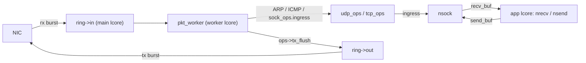

# dpdk-l 用户态协议栈 — 架构与功能状态

本文档描述仓库中**当前现网模块** [`pro-stack/`](pro-stack/) 的文件架构、已完成能力与通向功能完备协议栈的未完成项。行号会随代码变动；未完成项以源码中的 `TODO` 注释为准。

总目标：**先做成功能完备的 TCP 协议栈**（可靠性、流控、选项、RST 等），再补强 **ARP / ICMP** 与网络层（分片、路由等）。文档中的长期设计一律按高效方案书写；当前低效实现仅作为过渡状态说明。

---

## 一、pro-stack 文件架构

```
pro-stack/
├── main.c              EAL 初始化、NIC RX/TX 主循环、worker 派发、定时器（ARP sweep / TCP RTO）
├── socket.h / socket.c 统一 socket：struct nsock、fd 位图、注册表、BSD API 派发器
├── sock_ops.h          每协议 ops 向量 + sock_ops_lookup
├── pkt_frame.h / .c    共享 Ethernet+IPv4 组帧 helper (eth_ipv4_build)
├── tcp.h / tcp.c       TCP：表驱动状态机、tcp_ops、编解码/egress、定时器
├── tcp_app.h / .c      TCP echo server / client 应用（config 开关）
├── udp.h / udp.c       UDP：udp_ops、收发、egress
├── udp_app.h / .c      UDP echo 应用（默认关闭）
├── socket_api.h        兼容 shim（#include "socket.h"）
├── arp.h / arp.c       ARP 表 + ARP 包构造/处理
├── icmp.h / icmp.c     ICMP echo reply
├── net_context.h / .c  全局本端身份 g_net（port/ip/mac/mempool）
├── ring.h / ring.c     NIC↔worker 的 in/out 环
├── port.h / port.c     以太网端口初始化
├── list.h              侵入式双向链表宏 LL_ADD/LL_REMOVE（过渡；目标改为哈希表）
├── config.h            ENABLE_* 开关与常量
├── log.h               分级日志 + IP/MAC 格式化
└── Makefile            产出 build/pro-stack
```

### 核心抽象

**统一 socket `struct nsock`**（[socket.h](pro-stack/socket.h)）：持有 fd、本地地址、recv/send 环、mutex/cond、ops 指针、链表节点；传输私有状态嵌入 `u` 联合体（TCP 放 `tcp_stream`，UDP 无私有态）。

**ops 向量 `struct sock_ops`**（[sock_ops.h](pro-stack/sock_ops.h)）：`ingress / tx_flush / send / recv / close / connect / listen / accept`。`sock_ops_lookup(proto)` 按 IP 协议号查表；`main.c` 的派发与 worker 循环对协议完全无感。

**表驱动 TCP 状态机**（[tcp.c](pro-stack/tcp.c)）：`tcp_state_ops[TCP_STATUS_MAX]` 每状态一个 handler；状态切换走 `tcp_stream_set_status`。

### 数据流



### 三线程模型

- **main lcore**：NIC RX → `ring->in`；`ring->out` → NIC TX；`rte_timer_manage`（ARP sweep、TCP SYN RTO / TIME_WAIT）。
- **worker lcore**：`ring->in` → `dispatch_packet` → ARP/ICMP/`ops->ingress`；遍历 socket 调 `ops->tx_flush`（过渡实现；目标见下文效率项）。
- **app lcore**：`tcp_client_entry` / `tcp_server_entry` / `udp_app_entry`（由 `config.h` 的 `ENABLE_*` 选择；默认 TCP client 开、TCP server / UDP app 关）。

### 接收交付模型（长期目标）

**当前**：UDP 仍在 `recv_buf` 挂整包 `mbuf`；TCP ESTABLISHED 已改为 `tcp_rx_blob`（纯 payload）+ `ofo` 乱序队列，`tcp_recv` 不再剥 L2–L4。

**目标（高效）**：

- **协议层**：校验、按序/乱序重组、更新 ack、回 ACK、重传与窗口；完成后把**已就绪字节流**交给应用。
- **交付给应用**：统一 stream buffer / payload 视图（含拆除态）；ofo 结构升级为红黑树 + 链表（见效率表）。
- **不必**把 RX 数据再包装成发送侧的 `tcp_fragment`——那是 TX 描述符。

极致零拷贝时仍可把底层 buffer 指针交给应用，但应用看到的应是 **payload / 字节流**，而不是自己去解析三层头。

---

## 二、已完成功能

### 基础设施

- DPDK EAL 初始化、单端口 burst 收发、丢包统计（[main.c](pro-stack/main.c)）
- 软件环 `in/out` 单例（[ring.c](pro-stack/ring.c)）
- 全局本端身份 `g_net`（[net_context.c](pro-stack/net_context.c)）
- 分级日志 + IP/MAC 格式化（[log.h](pro-stack/log.h)）
- 编译期功能开关 `ENABLE_*`（[config.h](pro-stack/config.h)）
- `rte_timer`：ARP sweep；TCP SYN_SENT RTO（指数退避）与 TIME_WAIT 2MSL

### socket 层

- 统一 `struct nsock`，UDP/TCP 共用 `g_sock_list`（[socket.c](pro-stack/socket.c)）
- fd 位图分配器 `fd_alloc/fd_release`（`NSOCK_FD_MAX=1024`）
- 唯一命名的 recv/send 环 `sock_recv_%u / sock_send_%u`
- BSD 风格 API：`nsocket / nbind / nsend / nrecv / nsendto / nrecvfrom / nclose / nconnect / nlisten / naccept`
- `sock_ops` + `sock_ops_lookup`；TCP 已接线 `connect/listen/accept/close`

### ARP

- ARP 表 `arp_table_instance / arp_lookup / arp_table_add`（[arp.c](pro-stack/arp.c)）
- ARP request 回复、reply 学习；从 TCP/UDP RX 学习对端 MAC
- ARP sweep 定时器周期性扫描 /24（可关）
- 未解析 MAC 时自动发 ARP request 并把待发包回队重试

### ICMP

- ICMP echo request → echo reply（[icmp.c](pro-stack/icmp.c)）

### UDP

- `udp_build_pkt` / `udp_ingress` / `udp_tx_flush` / `udp_send` / `udp_recv` / `udp_close`
- 阻塞 `nrecvfrom`（mutex/cond），含部分读语义
- UDP echo 应用（[udp_app.c](pro-stack/udp_app.c)，默认关闭）

### TCP

- `tcp_stream` 嵌入 `nsock.u.tcp`（peer、status、seq/ack、backlog、accept_queue、timer）
- **表驱动状态机**覆盖经典状态（CLOSED … FIN_WAIT_2）
- **被动打开**：LISTEN → SYN_RECV → ESTABLISHED；`tcp_listen` backlog + `accept_queue`；`tcp_accept` 分配 fd
- **主动打开**：CLOSED → SYN_SENT → ESTABLISHED；隐式 bind + 临时端口；SYN RTO + 指数退避
- **控制段 RTO**：SYN_SENT / SYN_RECV（SYN+ACK）与 FIN（FIN_WAIT_1 / LAST_ACK / CLOSING）独立定时重传
- ESTABLISHED：累计 ACK、`tcp_rx_blob` 按序交付；OOO 入 `ofo` 链表（重叠裁剪后 drain）；`tcp_send` / `tcp_recv`
- **发送滑动窗口**：`sndbuf` + `snd_una`/`sent_seq`；TX 后数据保留至 ACK；数据 RTO（Go-Back-N）；按 `TCP_DEFAULT_MSS` 切段
- **被动拆除**：ESTABLISHED → CLOSE_WAIT → LAST_ACK → CLOSED
- **主动拆除**：FIN_WAIT_1/2、CLOSING、TIME_WAIT（2MSL 定时器）
- ISN 生成器；统一 mbuf 归属：ingress 一律消费 mbuf
- 演示应用：[tcp_app.c](pro-stack/tcp_app.c)（server / client）

### 共享组帧

- `eth_ipv4_build` 共享 L2/L3；UDP/TCP 仅填 L4（[pkt_frame.c](pro-stack/pkt_frame.c)）

---

## 三、未完成功能与路线图

优先级：**完备 TCP（P0/P1）→ ARP/ICMP 与网络层（P2）**。括号内为源码 `TODO` 位置（约数，以注释为准）。

### P0 — TCP 正确性（丢包/乱序/窗口下仍可用）

| 功能 | 位置 | 说明 / 目标设计 |
|------|------|-----------------|
| 收端 / 发端流控 | [tcp.c](pro-stack/tcp.c) ESTABLISHED；`tcp_sndbuf_append` | 不看对端 `rx_win`；`sndbuf` 满时 `tcp_send` 直接 -1。目标：通告窗口限制发送；满缓冲时阻塞或 `EAGAIN` |
| RST 生成 / 接收 | [tcp.c](pro-stack/tcp.c) | 关闭端口、无匹配 TCB、accept 队列满等应发 RST；非法 RST 应拆除连接 |
| FIN 段 payload | [tcp.c](pro-stack/tcp.c) FIN_WAIT_2 等 | FIN 携带的数据应先交付再消费 FIN |
| fd / 注册表线程安全 | [socket.c](pro-stack/socket.c) | `fd_alloc` 与 `g_sock_list` 无锁。目标：锁或无锁并发结构（与哈希表一并设计） |

### P1 — 完备 TCP（选项、拥塞、校验、API）

| 功能 | 位置 | 说明 / 目标设计 |
|------|------|-----------------|
| TCP 选项 | [tcp.c](pro-stack/tcp.c) ~848 | 解析/协商 MSS、窗口缩放、SACK、时间戳 |
| 拥塞控制 | — | 无 cwnd/ssthresh。目标：至少 Reno（慢启动 / 拥塞避免 / 快重传快恢复） |
| 协商 MSS / 选项驱动分段 | [tcp.c](pro-stack/tcp.c) 选项 TODO | 发送已按 `TCP_DEFAULT_MSS` 切段；目标：握手协商 MSS 后按协商值切 |
| RTT → RTO | — | 数据路径固定 RTO + 退避，无 SRTT/RTTVAR |
| 重复 ACK / 快重传 | — | 依赖 ACK 处理与 SACK（可选） |
| RX 校验和 | — | TX 已算；RX 应校验 TCP（及 IPv4）校验和 |
| socket 选项 | — | `SO_REUSEADDR`、非阻塞、`TCP_NODELAY` 等 |
| 接收交付抽象 | 见上文 | ESTABLISHED 已用 `tcp_rx_blob`；目标：统一 stream buffer，FIN_* 等状态同样走重组交付 |

### P2 — ARP / ICMP / 网络层

| 功能 | 位置 | 说明 / 目标设计 |
|------|------|-----------------|
| ARP 缓存老化 / 淘汰 | [arp.c](pro-stack/arp.c) ~58 | 表项永不过期。目标：TTL + 容量淘汰；MAC 变更时更新 |
| 无故 ARP / 冲突检测 | — | 无 |
| ARP 解析策略 | [main.c](pro-stack/main.c) sweep | 现状 /24 全扫偏重。目标：按需 ARP + 老化；sweep 降级或限速 |
| ICMP echo 负载 | [icmp.c](pro-stack/icmp.c) ~80 | reply 应回显请求负载 |
| 非 echo ICMP | [icmp.c](pro-stack/icmp.c) ~94 | destination unreachable / time exceeded 等，并向 UDP/TCP 上报 |
| IP 分片重组 | [main.c](pro-stack/main.c) ~69 | 分片直送 L4。目标：IP 层重组后再交 L4 |
| UDP 校验和 / 发送分片 | [udp.c](pro-stack/udp.c) ~78, ~174 | RX 不校验；超 MTU 不分片 |
| IPv6 | [main.c](pro-stack/main.c) ~62 | 仅 ARP + IPv4 |
| 路由 / 多接口 | — | 单接口、无路由表 |

---

## 四、效率目标（用高效方案替换现状）

下列现状可跑通演示，**不是**长期架构；实现完备 TCP 时应一并替换。

| 现状（低效） | 目标（高效） |
|--------------|--------------|
| `g_sock_list` / 4-tuple / 监听端口 / ARP 均为 O(n) 链表扫描 | 连接表、监听表、ARP 表用哈希（如 DPDK `rte_hash`），查找 O(1) 期望 |
| worker 每轮遍历全部 socket 调 `tx_flush` | 仅冲洗有待发数据的 socket：dirty 队列，或 `send_buf` / `sndbuf` 非空时入队 |
| TCP ofo 为 O(n) 排序双向链表 | 仿 Linux：红黑树（按 seq）+ 双向链表，插入 O(log n)、从 `recv_ack` drain O(1)；满队列/压力回收防 DoS（见 `tcp_ofo_link` TODO） |
| `tcp_send` → `sndbuf` 仍 memcpy | （可选）零拷贝 / mbuf 引用计数 |
| ARP /24 周期性广播 | 按需解析 + 缓存老化；全网扫仅作可选调试手段 |

---

## 五、如何扩展（加一个新协议）

1. 写 `xxx.h` 定义私有状态（如有）和 `extern const struct sock_ops xxx_ops`。
2. 写 `xxx.c` 实现 `ingress / tx_flush / send / recv / close`（可复用 `eth_ipv4_build`），定义 `xxx_ops`。
3. 在 [socket.c](pro-stack/socket.c) 的 `sock_ops_lookup` 增加 `case IPPROTO_XXX: return &xxx_ops;`。
4. `nsocket(..., IPPROTO_XXX)` 即可；`main.c` 派发与 worker `tx_flush` 自动生效。

加一个 TCP 新状态/迁移：在 [tcp.c](pro-stack/tcp.c) 的 `tcp_state_ops[]` 加一行并实现 handler，经 `tcp_stream_set_status` 切换即可。

---

## 六、构建与运行

```bash
cd pro-stack && make          # 静态链接 build/pro-stack
./bind-dpdk.sh                # 绑定 DPDK 驱动（按需）
./build/pro-stack -l 0-2 ...  # main + worker + 至少一个 app lcore
```

常用开关见 [config.h](pro-stack/config.h)：

| 宏 | 默认 | 作用 |
|----|------|------|
| `ENABLE_TCP_APP` | 1 | 启用 TCP ops / 应用 |
| `ENABLE_TCP_CLIENT` | 1 | app lcore 跑 TCP client |
| `ENABLE_TCP_SERVER` | 0 | app lcore 跑 TCP echo server |
| `ENABLE_UDP_APP` | 0 | UDP echo 应用 |
| `ENABLE_ARP` / `ENABLE_ICMP` / `ENABLE_ARP_SWEEP` | 1 | L2/L3 辅助路径 |

`TCP_APP_PORT`、`TCP_CLIENT_PEER_IP` 等演示参数同样在 `config.h`。
