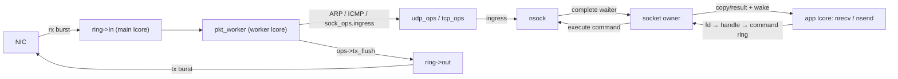

# dpdk-l 用户态协议栈 — 架构与功能状态

本文档描述仓库中**当前现网模块** [pro-stack/](pro-stack/) 的文件架构、已完成能力与协议栈/流量发生器路线图。行号会随代码变动；实现细节以源码和测试为准，traffic-gen 的完整设计见 [DESIGN-traffic-gen.md](docs/DESIGN-traffic-gen.md)。

总目标：**先做成功能完备的 TCP 协议栈**（可靠性、流控、选项、RST 等），再补强 **ARP / ICMP** 与网络层（分片、路由等），并在此基础上完成可复现的 traffic-gen 闭环。文档中的长期设计一律按高效方案书写；当前低效实现仅作为过渡状态说明。

---

## 一、pro-stack 文件架构

```
pro-stack/
├── stack_runtime.h/.c  owner worker 循环与上层 reactor callback
├── socket.h / socket.c 统一 socket、fd→handle 表、端点注册表、BSD API 命令入口
├── socket_owner.h / .c 代际句柄、应用命令环、阻塞操作 waiter 与 owner 生命周期
├── owner_io.h / .c     owner-local 非阻塞 transport API 与 ready-event 消费
├── owner_timer.h / .c  owner-local 通用定时器接口（当前后端为 rte_timer）
├── sock_ops.h          每协议 ops 向量 + sock_ops_lookup
├── pkt_frame.h / .c    共享 Ethernet+IPv4 组帧 helper (eth_ipv4_build)
├── tcp.h / tcp.c       TCP：表驱动状态机、tcp_ops、编解码/egress、定时器
├── tcp_ofo.h / .c      TCP 乱序队列、压力控制与指标
├── tcp_options.h / .c  MSS/窗口缩放/Timestamp/SACK 选项
├── tcp_rtt.h / .c      RTT 采样、SRTT/RTTVAR 与 RTO
├── tcp_sack.h / .c     SACK scoreboard 与丢包恢复
├── tcp_cc*             NewReno/CUBIC 拥塞控制
├── udp.h / udp.c       UDP：udp_ops、收发、egress
├── tcp_memory.*        owner-local TCP 固定对象池
├── udp_memory.*        owner-local UDP RX 节点池
├── socket_api.h        兼容 shim（#include "socket.h"）
├── arp.h / arp.c       ARP 表 + ARP 包构造/处理
├── icmp.h / icmp.c     ICMP echo reply
├── ipv4_reassembly.*   IPv4 分片重组与过期维护
├── rx_dispatch.*       硬件 RSS 回退时的软件流分发
├── net_context.h / .c  全局本端身份 g_net（port/ip/mac/mempool）
├── ring.h / ring.c     NIC↔worker 的 in/out 环
├── port.h / port.c     以太网端口初始化
├── rbtree.h / .c       通用侵入式红黑树（TCP OFO 索引）
├── config.h            ENABLE_* 开关与常量
├── log.h               分级日志 + IP/MAC 格式化
└── Makefile            协议栈静态库构建目标

test/
├── test_rbtree.c       红黑树单元测试
├── test_ofo.c          TCP OFO 队列单元测试
├── test_tcp_paws.c     TCP PAWS 单元测试
├── test_tcp_sack.c     TCP SACK/恢复单元测试
├── test_tcp_cc.c       拥塞控制单元测试
├── test_owner_io.c     owner_io / ready queue 回归测试
├── test_owner_timer.c  owner timer、容量、owner 约束与回调生命周期测试
├── test_flow_udp.c     UDP flow 与 owner-local API 回归测试
├── test_*              RSS、IPv4 重组、scenario、CSV 等测试
└── Makefile            统一测试构建目标

apps/
├── stack-demo/         协议栈示例入口、NIC 主循环与 echo app 调度
├── tcp-echo/           TCP echo server / active-open client 示例
└── udp-echo/           UDP echo 示例

traffic-gen/
├── main_tg.c           独立发生器入口
├── core/               reactor、scheduler、flow、连接池、统计与 scenario
├── proto/              HTTP 与 DNS L7 插件
├── scenarios/          可复现测试剧本
└── Makefile            链接 pro-stack 静态库生成 build/traffic-gen
```


### 核心抽象

**统一 socket** `struct nsock`（[socket.h](pro-stack/socket.h)）：由 packet worker 独占，持有本地地址、协议队列、ops、owner slot/generation 和传输私有状态。应用 fd 表只保存 `{id, generation, owner_lcore, protocol}` 句柄，不保存 `nsock` *；所有 BSD API 经 [socket_owner.c](pro-stack/socket_owner.c) 的 MPSC command ring 提交。UDP bind、TCP bind/listener/4-tuple 仍走 DPDK hash。

**ops 向量** `struct sock_ops`（[sock_ops.h](pro-stack/sock_ops.h)）：`ingress / tx_flush / send / recv / close / connect / listen / accept`。`sock_ops_lookup(proto)` 按 IP 协议号查表；`stack_runtime.c` 的派发与 worker 循环对协议完全无感。

**表驱动 TCP 状态机**（[tcp.c](pro-stack/tcp.c)）：`tcp_state_ops[TCP_STATUS_MAX]` 每状态一个 handler；状态切换走 `tcp_stream_set_status`。

### 数据流




### 三线程模型

- **main lcore**：NIC RX → `ring->in`；`ring->out` → NIC TX；只管理 ARP 等基础设施 timer。
- **worker lcore（socket owner）**：处理 command ring、`ring->in`、协议状态机、owner timer 和最终释放；TX 通过 owner-local dirty queue 只冲洗有发送工作的 socket。
- **app lcore**：示例 echo app 只持有整数 fd；其 API 调用通过 command ring 阻塞等待结果，不直接访问 TCB。高并发 `traffic-gen` 则注册在 owner worker 的 reactor callback 中。


### 接收交付模型（长期目标）

**当前**：BSD/app-visible UDP 仍在 `recv_buf` 挂整包 `mbuf`；traffic-gen
owner-local UDP 使用按需节点的有界 RX FIFO，TX mbuf 直接进入 worker 输出环；
TCP ESTABLISHED 已改为 `tcp_rx_blob`（纯 payload）+ `ofo` 乱序队列，`tcp_recv`
不再剥 L2–L4。

**目标（高效）**：

- **协议层**：校验、按序/乱序重组、更新 ack、回 ACK、重传与窗口；完成后把**已就绪字节流**交给应用。
- **交付给应用**：统一 stream buffer / payload 视图（含拆除态）；FIN_* 状态同样走重组交付。
- **不必**把 RX 数据再包装成发送侧的 `tcp_fragment`——那是 TX 描述符。

极致零拷贝时仍可把底层 buffer 指针交给应用，但应用看到的应是 **payload / 字节流**，而不是自己去解析三层头。

---


## 二、已完成功能


### 基础设施

- DPDK EAL 初始化、单端口 burst 收发、丢包统计（[apps/stack-demo/](apps/stack-demo/)）
- 按 owner/lcore 分片的 NIC↔worker `in/out` 软件环（[ring.c](pro-stack/ring.c)）
- 全局本端身份 `g_net`（[net_context.c](pro-stack/net_context.c)）
- 分级日志 + IP/MAC 格式化（[log.h](pro-stack/log.h)）
- 编译期功能开关 `ENABLE_*`（[config.h](pro-stack/config.h)）
- `owner_timer`：每 worker 独立 engine、严格 owner-lcore arm/cancel/callback、容量与残留检查；当前封装 `rte_timer`，TCP 与 traffic-gen 不依赖具体后端
- IPv4、TCP 和 UDP RX 软件校验；IPv4 UDP 零校验和按 RFC 768 接受
- IPv4 分片在进入 L4 前通过 `rte_ip_frag` 重组，并对表项执行定期过期维护（[ipv4_reassembly.c](pro-stack/ipv4_reassembly.c)）
- 多 RX/TX queue；优先使用硬件 RSS 固定四元组 owner，能力不足时回退到单 RX queue 软件分发


### socket 层

- 统一 `struct nsock`；协议查找走 owner-local 哈希索引，生命周期枚举走 generation-protected slot table，TX 使用 dirty socket queue（[socket.c](pro-stack/socket.c)）
- fd→代际句柄表 O(1) 查找与分配（`NSOCK_FD_MAX=1024`）
- socket 注册表：UDP 本地二元组、TCP 本地 bind、listener 与 TCP 四元组均通过 `rte_hash` 索引
- **per-worker owner 生命周期**：fd 表保存代际句柄；应用命令不携带裸指针；packet ingress、TCP timer、状态迁移与 `nsock_free` 全部归流所属 worker
- owner slot、ready 资源、协议 registry 和 flow map 按 lcore 分片；endpoint hash 不走全局锁
- worker 只冲洗 dirty socket；ARP 未解析的 socket 按邻居分桶等待，邻居学习后事件唤醒
- 阻塞 `send/recv/connect/accept` 使用 owner-only waiter 队列；owner 遇到 `EAGAIN/EINPROGRESS` 时挂起命令但不阻塞包处理
- `nclose` 原子撤销 fd 后仅发起协议关闭；TCP TCB 可继续经历 FIN/TIME_WAIT，终态由 owner 延迟释放；generation 防止 slot 复用 ABA
- owner 数据路径已移除 socket mutex/condition variable；recv/send ring 的 producer/consumer 和 SPSC flags 已收紧
- traffic-gen owner socket 容量按 scenario 和 shard 自动计算，并支持 `--socket-id-max`；app-visible fd 与 TCP 缓冲预算独立配置
- BSD/app-visible socket 使用唯一命名的 recv/send 环
`sock_recv_%u / sock_send_%u`；traffic-gen owner-local socket 不创建这两个环
- BSD 风格 API：`nsocket / nbind / nsend / nrecv / nsendto / nrecvfrom / nclose / nconnect / nlisten / naccept / nsetsockopt / ngetsockopt`；当前 socket option 支持 TCP `SO_LINGER`
- `sock_ops` + `sock_ops_lookup`；TCP 已接线 `connect/listen/accept/close`


### ARP

- 有界 `rte_hash` 邻居缓存（[arp.c](pro-stack/arp.c)）：O(1) 查找、TTL 老化、LRU 容量淘汰和 MAC 变更刷新
- ARP request 回复、reply 学习；TCP/UDP RX 对已确认邻居仅刷新活跃时间戳，未命中、未完成解析或 MAC 变更时学习对端 MAC；入站 ARP 校验以太网/IPv4 格式和 sender MAC
- 未解析 MAC 时按需发送 ARP request；同一 IP 在 probe 间隔内去重，失败后退避重试；待发数据仍留在 socket 队列
- 不再默认扫描 /24；`ENABLE_ARP_SWEEP` 仅在 packet worker 中以固定批量和 60 秒间隔执行受控诊断 sweep


### ICMP

- ICMP echo request → echo reply（[icmp.c](pro-stack/icmp.c)）


### UDP

- `udp_build_pkt` / `udp_ingress` / `udp_tx_flush` / `udp_send` / `udp_recv` / `udp_close`
- 阻塞 `nrecvfrom` 由 owner recv waiter 实现，transport probe 保持非阻塞并支持部分读语义
- UDP echo 示例（[apps/udp-echo/](apps/udp-echo/)，默认关闭）


### TCP

- `tcp_stream` 嵌入 `nsock.u.tcp`（peer、status、seq/ack、backlog、accept_queue、timer）
- **表驱动状态机**覆盖经典状态（CLOSED … FIN_WAIT_2）
- **被动打开**：LISTEN → SYN_RECV → ESTABLISHED；`tcp_listen` backlog + `accept_queue`；`tcp_accept` 分配 fd
- **主动打开**：CLOSED → SYN_SENT → ESTABLISHED；隐式 bind + 临时端口；SYN RTO + 指数退避
- **控制段 RTO**：SYN_SENT / SYN_RECV（SYN+ACK）与 FIN（FIN_WAIT_1 / LAST_ACK / CLOSING）独立定时重传
- ESTABLISHED：累计 ACK、`tcp_rx_blob` 按序交付；OOO 通过 RB-tree（查找）+ 双向链表（drain）重组，保留重叠裁剪与 FIN；每 TCB 和 owner OFO 内存均有上限
- **OFO 压力控制与可观测性**：正常模式保留 32 节点硬上限；依据 descriptor/payload pool、owner 字节预算和本轮最大乱序距离，在压力状态使用 8/16/24 节点档位；runtime/CSV 提供 current、peak、接受/释放、距离、drop 和压力切换指标
- **TCP 选项**：MSS、窗口缩放、Timestamp/PAWS、SACK-Permitted、SACK 与 D-SACK 的解析、协商和发送
- **发送滑动窗口**：`sndbuf` + `snd_una`/`sent_seq`；按对端通告窗口和协商 MSS 限制 TX，TX 后数据保留至 ACK
- **RTT/RTO**：Timestamp/ACK 采样、SRTT/RTTVAR、自适应 RTO、Karn 抑制和超时退避
- **丢包恢复**：重复 ACK、NewReno 快重传/快恢复，以及 RFC 6675 SACK scoreboard、Pipe/NextSeg 恢复
- **拥塞控制**：可选 NewReno 与 RFC 9438 CUBIC；CUBIC 包含 HyStart++，默认算法由编译期配置选择
- **发送侧应用背压**：本地高水位与对端窗口共同限制写入；阻塞请求停放在 owner waiter 队列，`MSG_DONTWAIT` 返回 `EAGAIN`
- **被动拆除**：ESTABLISHED → CLOSE_WAIT → LAST_ACK → CLOSED
- **主动拆除**：FIN_WAIT_1/2、CLOSING、TIME_WAIT（2MSL 定时器）
- **有界关闭**：FIN_WAIT_2 具有 60 秒 hard deadline；data/FIN RTO 耗尽、FIN 入队失败和 linger deadline 统一进入 owner-local abort，best-effort RST 不阻塞本地资源回收
- **linger 策略**：默认异步 graceful FIN；zero linger 立即 abortive close；positive linger 异步启动 graceful close并以配置时间为 hard deadline
- ISN 生成器；统一 mbuf 归属：ingress 一律消费 mbuf
- 演示应用：[apps/tcp-echo/](apps/tcp-echo/)（server / client）


### 共享组帧

- `eth_ipv4_build` 共享 L2/L3；UDP/TCP 仅填 L4（[pkt_frame.c](pro-stack/pkt_frame.c)）


### traffic-gen

- 独立二进制入口；reactor 与 socket owner 同核，通过 owner-local 非阻塞 transport API 驱动 flow
- JSON scenario、CPS token bucket、并发水位、flow/transaction 对象池和资源背压
- HTTP/1.1 GET、HTTP keep-alive 连接池、短连接，以及 UDP DNS 插件
- per-worker shard、硬件 RSS/软件分发、四元组固定归属和 owner-local L7 parser
- 按 worker 采集吞吐、并发、延迟、错误分类、内存、dirty TX、ring/NIC drop 和 OFO 指标；低频汇总并写入 CSV
- 停止发车且 active 归零后启动 120 秒 owner-local drain timer；超时输出 TCP 状态直方图并仅清理当前 owner，CSV 保留残留数、强制清理数和 TCP pool in-use
- 已完成 1k → 1 万 → 10 万并发的多 worker 爬坡记录；环境、参数和瓶颈归档于 [PERFORMANCE.md](docs/PERFORMANCE.md)


### 测试与工程化

- TCP OFO、PAWS、SACK、拥塞控制、临时端口、owner_io、ARP、RSS/端口拓扑、UDP flow、IPv4 重组、scenario/scheduler、CSV 和协议插件回归测试
- TCP 拆除态与 ESTABLISHED 共用 stream 重组、接收窗口、`tcp_rx_blob` 和 EOF 交付路径，覆盖 FIN_WAIT/CLOSE_WAIT 的乱序、窗口裁剪与重传边界
- 生命周期并发回归覆盖 close 与 pending 操作、slot/fd 复用、RST/timer、listener/child、FIN/TIME_WAIT 和 UDP pending receive
- 根目录 [run-sanitizers.sh](run-sanitizers.sh) 支持一键 ASan/UBSan 独立构建和完整测试
- 已删除 `nsock->fd` 等失真兼容字段，并同步 OFO、ring ownership 与 SPSC 约束文档

---


## 三、TODO 与路线图

本节只保留尚未完成的工作，不再混列历史完成项。优先级为：**先补公开 API 与事件模型，再扩展性能、网络协议和产品能力**。

### P1 — 公开 API、事件模型与 owner 命令

- [ ] **完善 command 生命周期与取消**：当前 command 位于调用线程栈上，调用者必须等待 completion；加入超时、线程取消、异步 API 或 coroutine 前，应改为 slab/heap command，并设计引用计数、取消状态和 late completion。
- [ ] **改进 command ring 背压**：当前 ring 满时 app lcore 通过 `rte_pause()` 忙等；评估 per-app ring、控制命令保留容量、eventfd/futex 或高低水位，同时保证 CLOSE 等生命周期命令绝不丢失。
- [ ] **落地公开 epoll-like 就绪模型**：提供 `READ` / `WRITE` / `CONNECTED` / `ERROR` / `HUP` 事件；同一 socket 按 `{id, generation}` 合并，并为 ready ring 满定义可恢复策略，不能静默丢失状态迁移。
- [ ] **完成公开非阻塞 API 闭环**：补充 socket 级 nonblocking 状态、`naccept4(..., SOCK_NONBLOCK)`、`ngetsockopt(SO_ERROR)` 和一致的短读/短写/异步 connect 错误语义。
- [ ] **补充常用 socket 选项**：至少覆盖 `SO_REUSEADDR`、`TCP_NODELAY` 和非阻塞状态查询与设置。
- [ ] **改造示例应用的多连接调度**：TCP echo server 不应因单连接阻塞 `nrecv` 而停止 `accept`；改用公开 nonblocking + poll/ready API 或连接任务调度。


### P2 — 性能与资源效率

- [ ] **实现协议栈内部 payload 零拷贝**：在不改变现有应用缓冲区 API 的前提下，评估 TCP TX retained mbuf/引用计数、TCP RX/OFO mbuf slice 和 UDP RX 持有策略；必须带自动复制回退、资源上限、完整释放语义和可观测性。
- [ ] **实现 owner_timer 时间轮后端**：先用 profile 证明收益，再以时间轮或分层时间轮替换当前 `rte_timer` backend；TCP/traffic-gen 保持公共接口不变，随后为 `tg_flow` 嵌入 timer node 并删除 `tg_flow_expire()` 每轮全表扫描。
- [ ] **补齐延迟与容量可观测性**：增加 P50/P95/P99/最大值直方图，以及各 owner pool 的容量、当前值、峰值和失败原因，支持长测判断缓慢泄漏。


### P3 — 网络协议与 traffic-gen 产品能力

#### ARP、ICMP 与网络层

- [ ] **实现 Gratuitous ARP 与地址冲突检测**：启动或地址变更时主动通告，并检测重复地址。
- [ ] **补全 ICMP echo payload**：reply 回显 request payload，而不只返回固定头部（[icmp.c](pro-stack/icmp.c)）。
- [ ] **处理非 echo ICMP**：支持 destination unreachable、time exceeded 等，并向 UDP/TCP 上报可消费的异步错误。
- [ ] **实现 UDP TX IPv4 分片**：当前超 MTU datagram 不分片；发送端应按 MTU 构造合法 fragment，并保持错误与部分发送语义明确。
- [ ] **增加 IPv6 支持**：覆盖邻居发现、IPv6 输入输出和 TCP/UDP pseudo-header；当前仅支持 ARP + IPv4。
- [ ] **增加路由与多接口**：引入路由选择、下一跳和按接口的本地身份；当前只有单接口、无路由表。


#### traffic-gen 协议与产品闭环

- [ ] **增加一种轻量长连接协议**：Redis 或 MQTT 二选一，复用现有 scenario、flow、连接池和统计抽象，验证 L7 插件边界不是 HTTP 专用。
- [ ] **扩展高阶 L7 覆盖面**：可选 HTTPS（小并发或只测握手）和极简 MySQL 客户端；明确 TLS/数据库状态机带来的内存与 CPU 成本。
- [ ] **完善产品化入口**：整理稳定的启动参数、scenario 样例、长测命令、结果报表和故障排查说明；把 benchmark 元数据与 CSV 一起归档，保证结果可复现。

---


## 四、构建与运行

```bash
# 1. 只构建可被上层链接的协议栈静态库
make -C pro-stack             # 生成 pro-stack/build/libpro-stack.a

# 2. library 是与默认 target 等价的显式写法
make -C pro-stack library     # 生成 pro-stack/build/libpro-stack.a

# 3. 构建协议栈 + TCP/UDP echo 示例程序
make -C apps/stack-demo       # 生成 apps/stack-demo/build/stack-demo

# 4. 构建独立的 owner-local traffic-gen reactor 骨架
make -C traffic-gen           # 自动构建依赖库，生成 traffic-gen/build/traffic-gen

# 5. 构建全部测试（纯单元测试会在构建时运行）
make -C test

# 6. 构建并运行 owner_io / ready queue 回归测试（无需绑定 NIC）
make -C test test-owner-io
./test/build/test_owner_io --in-memory --no-huge

# 7. 在独立构建目录中用 ASan + UBSan 重建并运行完整测试
./run-sanitizers.sh
# 可选：CC=clang JOBS=8 ./run-sanitizers.sh

# 8. 运行示例或 traffic-gen 时，按需先绑定 DPDK 驱动
./bind-dpdk.sh
./apps/stack-demo/build/stack-demo -l 0-2 ...
./traffic-gen/build/traffic-gen -l 0-1 ...
# traffic-gen 会按 scenario 自动计算 owner socket 容量；
# 需要手动增大时在 `--` 后传入 --socket-id-max N
./traffic-gen/build/traffic-gen -l 0-1 -- --workers 1 \
  --socket-id-max 20000 traffic-gen/scenarios/test/http-100000cps-10000con.json
```

`pro-stack/` 不包含任何程序入口，只导出协议栈静态库与 public headers。
`apps/stack-demo` 使用编译期 `ENABLE_*` 开关启动 `apps/` 中的 echo 示例；
`traffic-gen/build/traffic-gen` 不启动这些 app，而是让 reactor 与 socket owner
同核；HTTP/DNS scenario 插件、owner-local flow 和 HTTP keep-alive 连接池均在
该独立入口中运行。

### TCP 与 ARP 日志排查

默认构建关闭 `LOG_TCP_INFO`、`LOG_TCP_DEBUG` 和 `LOG_TCP_TRACE`，避免 traffic
generator 的连接生命周期、ACK/窗口变化和逐包日志淹没运行统计；TCP 的 `ERROR`
和 `WARN` 仍然输出。全局默认等级为 `LOG_LVL_INFO`，因此 owner 等模块的
高频 `DEBUG` 也不会打印。

ARP 的学习、请求回复和 reply 接收日志同样默认关闭（`ARP_LOG_ENABLED=0`），
避免正常 ARP 流量持续输出 `[CORE][INFO]`；ARP 的 `ERROR` 和 `WARN` 保持输出。
排查 ARP 时先清理旧产物，再显式开启：

```bash
cd pro-stack
make clean
make LOG_LEVEL=LOG_LVL_DEBUG ARP_LOG_ENABLED=1
```

协议栈排查时可通过编译期开关重新启用相应日志。若只需连接生命周期和重传日志，
而不输出每一包：

```bash
cd pro-stack
make clean
make LOG_LEVEL=LOG_LVL_DEBUG TCP_LOG_INFO_ENABLED=1 TCP_LOG_PACKETS=0
```

若还需要 ACK、窗口、发送队列等高频调试信息，额外开启
`TCP_LOG_DEBUG_ENABLED=1`。该选项在高 CPS 流量下会产生大量输出：

```bash
make LOG_LEVEL=LOG_LVL_DEBUG TCP_LOG_INFO_ENABLED=1 \
    TCP_LOG_DEBUG_ENABLED=1 TCP_LOG_PACKETS=0
```

进行逐包排查时，启用 `TRACE` 和 packet log：

```bash
cd pro-stack
make clean
make LOG_LEVEL=LOG_LVL_TRACE TCP_LOG_INFO_ENABLED=1 \
    TCP_LOG_DEBUG_ENABLED=1 TCP_LOG_TRACE_ENABLED=1 TCP_LOG_PACKETS=1
```

仅保留 TCP `ERROR` / `WARN` 时，使用默认配置：

```bash
cd pro-stack
make clean
make
```

构建变量变更不会自动触发重新编译，因此切换日志配置前必须执行
`make clean`。交互终端默认按等级着色；使用 `NO_COLOR=1` 或
`LOG_COLOR=never` 禁用颜色，使用 `LOG_COLOR=always` 强制输出 ANSI
颜色（例如需要在支持颜色的日志查看器中保留颜色时）。结构化字段名
`sock=`、`gen=`、`fd=`、`state=`、`local=`、`peer=`、`event=`、`seq=`、
`ack=`、`win=`、`reason=` 等会以亮洋红色单独高亮，字段值保持普通颜色；
该高亮同样遵从 `NO_COLOR` / `LOG_COLOR` 设置。日志重定向到文件时默认不会
写入 ANSI 转义序列。

常用开关见 [config.h](pro-stack/config.h)：


| 宏                            | 默认  | 作用                                   |
| ---------------------------- | --- | ------------------------------------ |
| `ENABLE_TCP_APP`             | 1   | 编译 TCP echo 示例启动路径                   |
| `ENABLE_TCP_CLIENT`          | 0   | app lcore 跑 `apps/tcp-echo` client   |
| `ENABLE_TCP_SERVER`          | 1   | app lcore 跑 `apps/tcp-echo` server   |
| `ENABLE_UDP_APP`             | 0   | app lcore 跑 `apps/udp-echo`          |
| `ENABLE_ARP` / `ENABLE_ICMP` | 1   | L2/L3 辅助路径                           |
| `ENABLE_ARP_SWEEP`           | 0   | packet worker 的受控诊断 sweep；正常解析始终按需进行 |


`TCP_APP_PORT`、`TCP_CLIENT_PEER_IP` 等演示参数同样在 `config.h`。
