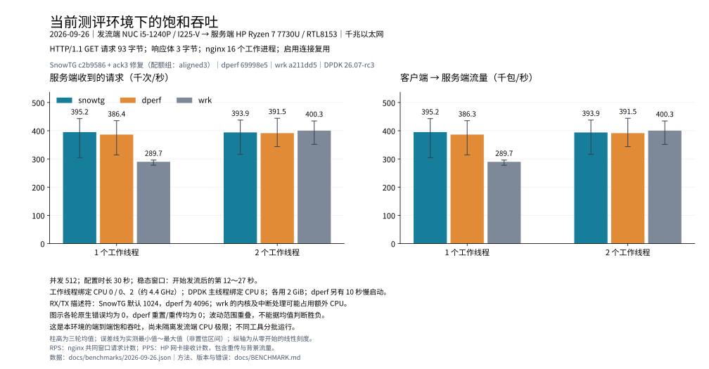

# SnowTG

**基于 DPDK 的用户态 TCP/IP 协议栈与 HTTP/DNS 混合流量发生器。** 从收发包、TCP 状态机到应用层事务调度均在仓库内实现；核心设计是单 owner、per-core reactor 和无锁热路径。

[English](README-en.md) · [使用指南](docs/USAGE.md) · [测评与复现条件](docs/BENCHMARK.md) · [架构与路线图](docs/TODO.md)

- **完整数据路径**：Ethernet / ARP / IPv4 / ICMP / TCP / UDP，BSD 风格 API 与 owner-local 非阻塞接口；HTTP/1.1、DNS 剧本支持混合权重、到达率、并发水位和连接复用。
- **可核验的性能**：本次 NUC → HP 千兆环境，KA 双 worker 三轮均值 **393,900 RPS**，dperf 为 **391,490 RPS**；普通组吞吐相近。
- **可靠性回归**：修复后常规与连续限频的 18 轮共成功 **100,769,044** 次，失败 **0**；固定 16k 短连接三轮均无失败、端口资源延期或 skipped。强 CPU 配额过载不属于此零失败结论。

## 性能对比与容量边界

复用 **2026-09-26 已完成的 60 个最终版本样本**，每个条件重复三轮。以下 RPS 统一采用 **nginx 稳态窗口收到的请求数**，PPS 来自服务端网卡；错误另看客户端全程计数。柱高为均值，误差线为三轮最小值～最大值。



常规组使用 512 并发、约 4.4 GHz，1 / 2 个 worker。三轮范围明显重叠，支持“本环境吞吐相近”，不能据均值的小幅差别判断胜负，也不能把约 40 万 RPS 当作协议栈的绝对极限。wrk 为相同线程数参照，其内核网络处理可能占用额外 CPU。

| 补充场景 | SnowTG | 对照与边界 |
| --- | ---: | --- |
| 固定 16k 短连接，2 worker | 15,999 RPS；74.3 kPPS；零失败 | dperf 16,000 RPS；64.0 kPPS；零异常；这是固定负载验证 |
| 饱和短连接，2 worker | 117,546 RPS；505.7 kPPS；零失败 | 未取得同端口池条件下有效的 dperf 无上限样本，不能推断其上限 |
| KA 每请求客户端发送包数 | 优化前约 3 → 优化后约 1 | 普通 KA 下与 dperf 相近；短连接仍约 4.3～4.64，对照约 4 |

完整环境、逐组范围、双向 PPS、异常计数、版本和方法见[本次测评](docs/BENCHMARK.md)。[逐轮数据](docs/benchmarks/2026-09-26.json)及[绘图脚本](docs/benchmarks/plot.py)随仓库保存；旧的跨平台“吞吐演进”移至[历史性能记录](docs/PERFORMANCE.md#5-历史吞吐图与机器归档)。

## 关键设计与本轮修复

| 问题 / 设计点 | 实现方式 | 结果或边界 |
| --- | --- | --- |
| 多核状态归属 | 每个连接由一个 owner 驱动，per-core reactor、owner-local 队列；按需内存与 Dirty TX 减少空扫描 | 热路径避免共享锁；支持 worker RX/TX |
| 固定 16k 端口耗尽 | 分离 HTTP 完成与 TCP 关闭；短连接收到完整响应后，在原截止时间内等待对端 FIN | 避免不必要的主动关闭与 TIME_WAIT 堆积；三轮各 480,000 次成功，skipped / resource deferred 均为 0 |
| KA 复用失效连接 | 完整响应伴随 EOF/HUP 时禁止复用；复用前检查连接状态，仅在未发送新请求字节前替换失效连接 | 避免误用关闭连接，不自动重放已经发出的请求 |
| 每连接最多 100 次 | 新增 `--max-requests-per-connection N`；默认 `0` 不限，`1` 不复用，`100` 保留旧策略 | 可按目标服务的连接策略配置，计数包含首个请求 |
| 重复 ACK | 合并同一 owner 轮次的 ACK / 接收窗口更新，优先随数据、重传或 FIN 发出；无数据时同轮补纯 ACK | KA 客户端包数约 3 → 1；保留乱序、重复包、FIN 的及时反馈 |
| NIC 暂时发不出去 | TX 队列只提交网卡已接受的包，未发送部分保留 FIFO，下轮重试 | 避免部分发送时直接释放并丢包 |
| 丢包恢复迟缓 | 有有效 RTT 样本后 RTO 下限降至 200 ms，保留初始 1 s、Karn 与退避 | 属于低延迟策略取舍；可用编译宏恢复 1 s 下限 |

本轮代码已通过协议栈、发生器和示例构建、完整测试，以及针对 flow / TCP ACK 的 ASan/UBSan 检查。测试覆盖连接复用、EOF、HTTP 截断、ACK 捎带与回退、TX 部分接受及 FIFO/内存回收。

**后续重点**：CPU 热路径剖析、极端暂停下的 RX 队列与连接恢复、短连接额外 ACK。此次未宣称所有过载失败已消除，也尚未在更强服务端/链路上确定物理单核的无损极限。TLS、更复杂响应与长期丢包/乱序负载仍需要独立验证。

## 快速开始

已配置 DPDK 开发环境时：

```bash
make -C pro-stack
make -C traffic-gen
make -C apps/stack-demo
make -C test test
```

无物理网卡的 Docker 自检：

```bash
docker build -t snowtg .
docker run --rm --network none snowtg
```

Docker 自检使用虚拟网卡，不等同于真实链路性能测试。巨页、VFIO、EAL / CLI 参数、剧本、插件接口与日志说明见[使用指南](docs/USAGE.md)。

## 源码导航

| 目录 | 重点 |
| --- | --- |
| [pro-stack/](pro-stack/) | 协议栈、TCP 状态机、owner 生命周期和收发运行时 |
| [traffic-gen/core/](traffic-gen/core/) | 事务 / flow 生命周期、连接池、调度与统计 |
| [traffic-gen/proto/](traffic-gen/proto/) | HTTP、DNS 应用协议实现 |
| [test/](test/) | 协议、调度、参数与运行时回归 |
| [apps/](apps/) | TCP/UDP echo 示例 |
