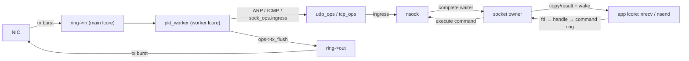

# dpdk-l 用户态协议栈 — 架构与功能状态

本文档描述仓库中**当前现网模块** [pro-stack/](pro-stack/) 的文件架构、已完成能力与协议栈/流量发生器路线图。行号会随代码变动；A 类 `pro-stack` 待办以源码中的 `TODO` 注释为参考，B 类整体设计待办以 [DESIGN-traffic-gen.md](DESIGN-traffic-gen.md) 为准。

总目标：**先做成功能完备的 TCP 协议栈**（可靠性、流控、选项、RST 等），再补强 **ARP / ICMP** 与网络层（分片、路由等），并在此基础上完成可复现的 traffic-gen 闭环。文档中的长期设计一律按高效方案书写；当前低效实现仅作为过渡状态说明。

---

## 一、pro-stack 文件架构

```
pro-stack/
├── main.c              EAL 初始化、NIC RX/TX 主循环、worker 派发、ARP 与 owner timer 调度
├── socket.h / socket.c 统一 socket、fd→handle 表、端点注册表、BSD API 命令入口
├── socket_owner.h / .c 代际句柄、应用命令环、阻塞操作 waiter 与 owner 生命周期
├── sock_ops.h          每协议 ops 向量 + sock_ops_lookup
├── pkt_frame.h / .c    共享 Ethernet+IPv4 组帧 helper (eth_ipv4_build)
├── tcp.h / tcp.c       TCP：表驱动状态机、tcp_ops、编解码/egress、定时器
├── tcp_app.h / .c      TCP echo server / client 应用（config 开关）
├── udp.h / udp.c       UDP：udp_ops、收发、egress
├── udp_app.h / .c      UDP echo 应用（默认关闭）
├── socket_api.h        兼容 shim（#include "socket.h"）
├── arp.h / arp.c       ARP 表 + ARP 包构造/处理
├── icmp.h / icmp.c     ICMP echo reply
├── net_context.h / .c  全局本端身份 g_net（port/ip/mac/mempool）
├── ring.h / ring.c     NIC↔worker 的 in/out 环
├── port.h / port.c     以太网端口初始化
├── list.h              侵入式双向链表宏 LL_ADD/LL_REMOVE（过渡；目标改为哈希表）
├── rbtree.h / .c       通用侵入式红黑树（TCP OFO 索引）
├── config.h            ENABLE_* 开关与常量
├── log.h               分级日志 + IP/MAC 格式化
└── Makefile            产出 build/pro-stack
```


### 核心抽象

**统一 socket** `struct nsock`（[socket.h](pro-stack/socket.h)）：由 packet worker 独占，持有本地地址、协议队列、ops、owner slot/generation 和传输私有状态。应用 fd 表只保存 `{id, generation, owner_lcore, protocol}` 句柄，不保存 `nsock` *；所有 BSD API 经 [socket_owner.c](pro-stack/socket_owner.c) 的 MPSC command ring 提交。UDP bind、TCP bind/listener/4-tuple 仍走 DPDK hash。

**ops 向量** `struct sock_ops`（[sock_ops.h](pro-stack/sock_ops.h)）：`ingress / tx_flush / send / recv / close / connect / listen / accept`。`sock_ops_lookup(proto)` 按 IP 协议号查表；`main.c` 的派发与 worker 循环对协议完全无感。

**表驱动 TCP 状态机**（[tcp.c](pro-stack/tcp.c)）：`tcp_state_ops[TCP_STATUS_MAX]` 每状态一个 handler；状态切换走 `tcp_stream_set_status`。

### 数据流




### 三线程模型

- **main lcore**：NIC RX → `ring->in`；`ring->out` → NIC TX；只管理 ARP 等基础设施 timer。
- **worker lcore（socket owner）**：处理 command ring、`ring->in`、协议状态机、TCP timer 和最终释放；当前仍遍历 socket 调 `ops->tx_flush`（过渡实现）。
- **app lcore**：只持有整数 fd；`tcp_client_entry` / `tcp_server_entry` / `udp_app_entry` 的 API 调用通过 command ring 阻塞等待结果，不直接访问 TCB。


### 接收交付模型（长期目标）

**当前**：UDP 仍在 `recv_buf` 挂整包 `mbuf`；TCP ESTABLISHED 已改为 `tcp_rx_blob`（纯 payload）+ `ofo` 乱序队列，`tcp_recv` 不再剥 L2–L4。

**目标（高效）**：

- **协议层**：校验、按序/乱序重组、更新 ack、回 ACK、重传与窗口；完成后把**已就绪字节流**交给应用。
- **交付给应用**：统一 stream buffer / payload 视图（含拆除态）；FIN_* 状态同样走重组交付。
- **不必**把 RX 数据再包装成发送侧的 `tcp_fragment`——那是 TX 描述符。

极致零拷贝时仍可把底层 buffer 指针交给应用，但应用看到的应是 **payload / 字节流**，而不是自己去解析三层头。

---


## 二、已完成功能


### 基础设施

- DPDK EAL 初始化、单端口 burst 收发、丢包统计（[main.c](pro-stack/main.c)）
- 软件环 `in/out` 单例（[ring.c](pro-stack/ring.c)）
- 全局本端身份 `g_net`（[net_context.c](pro-stack/net_context.c)）
- 分级日志 + IP/MAC 格式化（[log.h](pro-stack/log.h)）
- 编译期功能开关 `ENABLE_*`（[config.h](pro-stack/config.h)）
- `rte_timer`：ARP sweep；TCP SYN_SENT RTO（指数退避）与 TIME_WAIT 2MSL


### socket 层

- 统一 `struct nsock`，UDP/TCP 共用 `g_sock_list` 供过渡性 TX 遍历（[socket.c](pro-stack/socket.c)）
- fd→代际句柄表 O(1) 查找与分配（`NSOCK_FD_MAX=1024`）
- socket 注册表：UDP 本地二元组、TCP 本地 bind、listener 与 TCP 四元组均通过 `rte_hash` 索引
- **单 owner 生命周期**：fd 表保存代际句柄；应用命令不携带裸指针；packet ingress、TCP timer、状态迁移与 `nsock_free` 全部归同一 worker
- 阻塞 `send/recv/connect/accept` 使用 owner-only waiter 队列；owner 遇到 `EAGAIN/EINPROGRESS` 时挂起命令但不阻塞包处理
- `nclose` 原子撤销 fd 后仅发起协议关闭；TCP TCB 可继续经历 FIN/TIME_WAIT，终态由 owner 延迟释放；generation 防止 slot 复用 ABA
- 唯一命名的 recv/send 环 `sock_recv_%u / sock_send_%u`
- BSD 风格 API：`nsocket / nbind / nsend / nrecv / nsendto / nrecvfrom / nclose / nconnect / nlisten / naccept`
- `sock_ops` + `sock_ops_lookup`；TCP 已接线 `connect/listen/accept/close`


### ARP

- ARP 表 `arp_table_instance / arp_lookup / arp_table_add`（[arp.c](pro-stack/arp.c)）
- ARP request 回复、reply 学习；从 TCP/UDP RX 学习对端 MAC
- ARP sweep 定时器周期性扫描 /24（可关）
- 未解析 MAC 时自动发 ARP request 并把待发包回队重试


### ICMP

- ICMP echo request → echo reply（[icmp.c](pro-stack/icmp.c)）


### UDP

- `udp_build_pkt` / `udp_ingress` / `udp_tx_flush` / `udp_send` / `udp_recv` / `udp_close`
- 阻塞 `nrecvfrom` 由 owner recv waiter 实现，transport probe 保持非阻塞并支持部分读语义
- UDP echo 应用（[udp_app.c](pro-stack/udp_app.c)，默认关闭）


### TCP

- `tcp_stream` 嵌入 `nsock.u.tcp`（peer、status、seq/ack、backlog、accept_queue、timer）
- **表驱动状态机**覆盖经典状态（CLOSED … FIN_WAIT_2）
- **被动打开**：LISTEN → SYN_RECV → ESTABLISHED；`tcp_listen` backlog + `accept_queue`；`tcp_accept` 分配 fd
- **主动打开**：CLOSED → SYN_SENT → ESTABLISHED；隐式 bind + 临时端口；SYN RTO + 指数退避
- **控制段 RTO**：SYN_SENT / SYN_RECV（SYN+ACK）与 FIN（FIN_WAIT_1 / LAST_ACK / CLOSING）独立定时重传
- ESTABLISHED：累计 ACK、`tcp_rx_blob` 按序交付；OOO 通过 RB-tree（查找）+ 双向链表（drain）重组，保留重叠裁剪与 FIN；每 TCB 和全局 OFO 内存均有上限
- **发送滑动窗口**：`sndbuf` + `snd_una`/`sent_seq`；按对端通告窗口限制 TX，TX 后数据保留至 ACK；数据 RTO（Go-Back-N）；按 `TCP_DEFAULT_MSS` 切段
- **发送侧应用背压**：本地高水位与对端窗口共同限制写入；阻塞请求停放在 owner waiter 队列，`MSG_DONTWAIT` 返回 `EAGAIN`
- **被动拆除**：ESTABLISHED → CLOSE_WAIT → LAST_ACK → CLOSED
- **主动拆除**：FIN_WAIT_1/2、CLOSING、TIME_WAIT（2MSL 定时器）
- ISN 生成器；统一 mbuf 归属：ingress 一律消费 mbuf
- 演示应用：[tcp_app.c](pro-stack/tcp_app.c)（server / client）


### 共享组帧

- `eth_ipv4_build` 共享 L2/L3；UDP/TCP 仅填 L4（[pkt_frame.c](pro-stack/pkt_frame.c)）

---


## 三、TODO 与路线图

本仓库的待办分为两类：

1. **完善** `pro-stack`：协议正确性、socket 生命周期、网络层与性能扩展；
2. **整体设计与开发**：以流量发生器为目标的事件模型、调度器、L7 插件和可复现实测。

第一类中的位置标注为源码 `TODO`（约数，以注释为准）；第二类的完整设计、
验收口径和分期见 [DESIGN-traffic-gen.md](DESIGN-traffic-gen.md)。

### A. 完善 `pro-stack` 的 TODO

优先级：**完备 TCP（P0/P1）→ ARP/ICMP 与网络层（P2）**。

#### P0 — TCP 正确性（丢包/乱序/窗口下仍可用）

本阶段原有的发送背压与 socket 生命周期并发项均已完成：前者由 `sndbuf` 高水位、对端窗口和 owner waiter 实现；后者采用严格 worker ownership、代际句柄与终态延迟释放。后续压力测试仍需覆盖 fd 快速复用、close/RST/timer 竞态和多应用线程共享 fd。

#### Socket owner 后续 TODO

以下事项是单 owner 架构落地后的剩余工作，详细背景和约束见 [DevLog ARC-002](DevLog.md#arc-002socket-单-owner代际句柄与命令队列)。

##### P0 — 正确性与回归门槛

- [ ] **补齐生命周期并发压力测试**：覆盖 `nclose` 与 SEND/RECV 并发、fd/owner slot 高频复用、SYN_SENT timeout 与 close、RST 与 pending waiter、listener close 与半连接/已 accept child、FIN/TIME_WAIT 回收、UDP pending RECVFROM，以及多 app lcore 共享 fd。
- [ ] **引入动态竞态检查**：在构建环境允许时运行 ASan/UBSan，并补充真实 NIC 长时间流量测试，确认 command、timer 与延迟回收不存在 UAF、double-free 或 waiter 遗失。
- [ ] **把连接上限和缓冲预算配置化**：根据目标并发调整 `NSOCK_FD_MAX` / `NSOCK_ID_MAX`，并为 TCP 发送/接收缓冲设定每连接与全局内存预算；发生器的 1k～1 万并发验收不得依赖固定的默认上限。


##### P1 — 生命周期语义与 owner 边界收尾

- [ ] **定义 TCP 关闭策略**：实现并验证 graceful close、abortive close、`SO_LINGER`，以及 FIN 分配/入队失败时的 RST 或本地终止策略。
- [ ] **完善 command 生命周期与取消**：当前 command 位于调用线程栈上，调用者必须等待 completion；加入超时、线程取消、异步 API 或 coroutine 前，应改为 slab/heap command，并设计引用计数、取消状态和 late completion。
- [ ] **改进 command ring 背压**：当前 ring 满时 app lcore 通过 `rte_pause()` 忙等；评估 per-app ring、控制命令保留容量、eventfd/futex 或高低水位，同时保证 CLOSE 等生命周期命令绝不丢失。
- [ ] **删除 owner 内遗留锁与条件变量**：审计 `sk->mutex` / `sk->cond` 的全部调用点，在确认 SEND、ACK、timer、TX 都只由 owner 执行后移除冗余同步。
- [ ] **收紧跨 lcore 数据结构约束**：修正仍描述 app 直接消费 `recv_buf`、共同生产 `send_buf` 的旧注释，并在确认唯一 producer/consumer 后收紧 DPDK ring flags。


##### P2 — 性能与多 worker 扩展

- [ ] **用 dirty socket queue 替代全量 TX 遍历**：socket 从无发送工作变为有发送工作时入队，worker 只 flush 活跃 socket，消除每轮 O(全部 socket 数) 的 `g_sock_list` 扫描。
- [ ] **扩展为 per-worker socket owner**：将当前单例 `g_owner` 改为按 worker/lcore 分片的 context；结合硬件 RSS 保证同一四元组固定归属同一 worker，并同步分片 slot、协议 hash、timer 与 dirty queue。
- [ ] **分片 socket registry**：单 owner 下将 endpoint hash 转为 owner-local；多 worker 时按 RSS/owner 分片 fd 之外的协议注册表，避免全局 `registry_lock` 回到数据路径。


##### P3 — 兼容字段与文档清理

- [ ] **删除诊断用途的** `nsock->fd`：先把剩余日志迁移为 `{id, generation}`，确认该字段不再参与身份、索引或生命周期后移除。
- [ ] **清理已失真的源码 TODO 与注释**：OFO 已使用 RB-tree，但 `tcp.h` / `tcp.c` / `config.h` 仍保留旧的链表 TODO；同时同步 recv/send ring 的实际 producer/consumer 模型，避免文档与代码误导后续设计。


#### P1 — 完备 TCP（选项、拥塞、校验、API）


| 功能              | 位置                                                                           | 说明 / 目标设计                                                                              |
| --------------- | ---------------------------------------------------------------------------- | -------------------------------------------------------------------------------------- |
| TCP 选项          | [tcp.c](pro-stack/tcp.c) ~2104                                               | 解析/协商 MSS、窗口缩放、SACK、时间戳                                                                |
| 拥塞控制            | —                                                                            | 无 cwnd/ssthresh。目标：至少 Reno（慢启动 / 拥塞避免 / 快重传快恢复）                                        |
| 协商 MSS / 选项驱动分段 | [tcp.c](pro-stack/tcp.c) 选项 TODO                                             | 发送已按 `TCP_DEFAULT_MSS` 切段；目标：握手协商 MSS 后按协商值切                                           |
| RTT → RTO       | —                                                                            | 数据路径固定 RTO + 退避，无 SRTT/RTTVAR                                                          |
| 重复 ACK / 快重传    | —                                                                            | 依赖 ACK 处理与 SACK（可选）                                                                    |
| RX 校验和          | [main.c](pro-stack/main.c)、[tcp.c](pro-stack/tcp.c)、[udp.c](pro-stack/udp.c) | IPv4、TCP 与 UDP RX 已软件校验；IPv4 UDP 的零校验和按 RFC 768 接受                                     |
| socket 选项       | —                                                                            | `SO_REUSEADDR`、非阻塞、`TCP_NODELAY` 等                                                     |
| 多连接应用调度         | [tcp_app.c](pro-stack/tcp_app.c)                                             | 示例 echo server 在一个连接的阻塞 `nrecv` 循环中不会再 `accept`。目标：非阻塞 recv + poll/ready queue，或连接任务调度 |
| 接收交付抽象          | 见上文                                                                          | ESTABLISHED 已用 `tcp_rx_blob`；目标：统一 stream buffer，FIN_* 等状态同样走重组交付                      |


#### P2 — ARP / ICMP / 网络层


| 功能            | 位置                               | 说明 / 目标设计                                               |
| ------------- | -------------------------------- | ------------------------------------------------------- |
| ARP 缓存老化 / 淘汰 | [arp.c](pro-stack/arp.c) ~58     | 表项永不过期。目标：TTL + 容量淘汰；MAC 变更时更新                          |
| 无故 ARP / 冲突检测 | —                                | 无                                                       |
| ARP 解析策略      | [main.c](pro-stack/main.c) sweep | 现状 /24 全扫偏重。目标：按需 ARP + 老化；sweep 降级或限速                  |
| ICMP echo 负载  | [icmp.c](pro-stack/icmp.c) ~80   | reply 应回显请求负载                                           |
| 非 echo ICMP   | [icmp.c](pro-stack/icmp.c) ~94   | destination unreachable / time exceeded 等，并向 UDP/TCP 上报 |
| IP 分片重组       | [main.c](pro-stack/main.c) ~69   | 分片直送 L4。目标：IP 层重组后再交 L4                                 |
| UDP 发送分片      | [udp.c](pro-stack/udp.c) ~204    | RX 校验和已实现；超 MTU 不分片                                     |
| IPv6          | [main.c](pro-stack/main.c) ~62   | 仅 ARP + IPv4                                            |
| 路由 / 多接口      | —                                | 单接口、无路由表                                                |


### B. 整体设计与开发的 TODO

本类工作将协议栈能力组织为可配置、可扩展、可复现的产品闭环；详细架构以
[DESIGN-traffic-gen.md](DESIGN-traffic-gen.md) 为准。

#### P0 — 非阻塞事件模型与最小流量发生器

- [ ] **落地 epoll-like 就绪模型**：提供 nonblocking socket 语义和
  `READ` / `WRITE` / `CONNECTED` / `ERROR` / `HUP` 事件；同一 socket 的
  ready 事件按 `{id, generation}` 合并，避免 fd 复用误唤醒和 ready ring
  被高频事件打爆；同时定义 ready ring 满时的正确性策略（dirty bitmap、
  重新扫描或背压），不得静默丢失 `CONNECTED` / `HUP` 等状态迁移。
- [ ] **完成公开非阻塞 API 闭环**：transport probe 已能返回
  `EAGAIN` / `EINPROGRESS`；补充 socket 级 nonblocking 状态、
  `naccept4(..., SOCK_NONBLOCK)`、`ngetsockopt(SO_ERROR)` 及错误语义，
  使应用可正确处理空 accept queue、异步 connect 成败、短读和短写。
- [ ] **提供 owner-local 热路径**：traffic-gen reactor 与 socket owner 同核，
  通过受控 `try_*` 接口推进 flow；避免 app lcore 经 command ring +
  `pthread_cond_wait()` 同步调用成为高并发瓶颈。
- [ ] **确定 traffic-gen 集成方式**：明确独立二进制、`ENABLE_TRAFFIC_GEN`
  挂入现有入口，或作为 owner worker 内 reactor task 的取舍；Phase A 可保留
  app-lcore 兼容路径，但必须标注其只适合小规模过渡。
- [ ] **完成 Phase A traffic-gen**：剧本加载、CPS token bucket、并发水位、
  flow/transaction 对象池、HTTP/1.1 GET 与 UDP DNS 插件、短连接状态机。
- [ ] **完成可观测性与验收**：按 lcore 统计 CPS、并发、成功率、错误分类及
  字节数；提供 `scenarios/`、启动参数和结果归档；混合剧本稳定运行至少
  5 分钟，并记录可复现环境与实测结果。


#### P1 — 扩展性与工程化

- [ ] **per-core per-reactor 分片**：依赖 A/P2 的 per-worker socket owner、
  registry 分片和 RSS；每个 RSS worker 同时承载协议 owner 和 traffic-gen
  shard，四元组、flow、timer 与 L7 parser 不跨核迁移，指标低频汇总。
- [ ] **定时器与发送路径扩展**：以 timer wheel 支撑事务超时；结合 dirty TX
  queue，避免大量空闲连接时扫描所有 socket。
- [ ] **扩展协议与连接复用**：HTTP keep-alive；Redis 或 MQTT 二选一；补充
  延迟直方图、失败分类和容量/内存预算。


#### P2 — 高阶能力与规模验证

- [ ] **扩展 L7 覆盖面**：可选 HTTPS（小并发或仅握手）和极简 MySQL 客户端。
- [ ] **多 worker 实测爬坡**：按 1k → 1 万 → 10 万并发逐档验证，记录硬件、
  NIC 队列、巨页、剧本参数和瓶颈；未实测前不宣称百万连接能力。
- [ ] **完善产品化入口**：提供启动参数/剧本样例、压测命令、结果报表和 README
  使用说明。

---


## 四、效率目标（用高效方案替换现状）

下列现状可跑通演示，**不是**长期架构；实现完备 TCP 时应一并替换。


| 现状（低效）                                                                                    | 目标（高效）                                                                                                   |
| ----------------------------------------------------------------------------------------- | -------------------------------------------------------------------------------------------------------- |
| fd、UDP bind、TCP listener/4-tuple 已使用数组或 `rte_hash`；ARP 仍为 O(n) 链表，`g_sock_list` 仍供 TX 遍历  | ARP 表改哈希；TX 改为 dirty socket 队列                                                                           |
| worker 每轮遍历全部 socket 调 `tx_flush`                                                         | 仅冲洗有待发数据的 socket：dirty 队列，或 `send_buf` / `sndbuf` 非空时入队                                                  |
| TCP OFO 使用 RB-tree（按 seq）+ 双向链表，插入定位 O(log n)、从 `recv_ack` drain O(1)，并限制节点、每 TCB 字节与全局字节 | 增加可观测性指标；依据压力和乱序距离自适应调节上限                                                                                |
| `tcp_send` → `sndbuf` 仍 memcpy                                                            | （可选）零拷贝 / mbuf 引用计数                                                                                      |
| ARP /24 周期性广播                                                                             | 按需解析 + 缓存老化；全网扫仅作可选调试手段                                                                                  |
| 单 RX/TX queue、单 packet worker                                                             | 多 queue + 硬件 RSS：同一四元组固定归属一个 worker；ARP/ICMP、计时器、TX 和 socket 生命周期按 worker 分片。单 RX queue 或自定义亲和时再使用软件 RSS |


---


## 五、如何扩展（加一个新协议）

1. 写 `xxx.h` 定义私有状态（如有）和 `extern const struct sock_ops xxx_ops`。
2. 写 `xxx.c` 实现 `ingress / tx_flush / send / recv / close`（可复用 `eth_ipv4_build`），定义 `xxx_ops`。
3. 在 [socket.c](pro-stack/socket.c) 的 `sock_ops_lookup` 增加 `case IPPROTO_XXX: return &xxx_ops;`。
4. `nsocket(..., IPPROTO_XXX)` 即可；`main.c` 派发与 worker `tx_flush` 自动生效。

加一个 TCP 新状态/迁移：在 [tcp.c](pro-stack/tcp.c) 的 `tcp_state_ops[]` 加一行并实现 handler，经 `tcp_stream_set_status` 切换即可。

---


## 六、构建与运行

```bash
cd pro-stack && make          # 静态链接 build/pro-stack
./bind-dpdk.sh                # 绑定 DPDK 驱动（按需）
./build/pro-stack -l 0-2 ...  # 当前模型：main + worker + 至少一个 app lcore
```

traffic-gen 的目标模型是 reactor 与 socket owner 同核；在该路径落地前，
上述三类 lcore 分工仍是当前兼容实现，而不是最终高并发部署拓扑。

### TCP 包级日志与排查

默认构建会启用 TCP 包级 `TRACE` 日志（`LOG_LEVEL=LOG_LVL_TRACE`、
`TCP_LOG_PACKETS=1`），运行时可看到 RX/TX 的 SYN、ACK、FIN、RST 与数据段，
以及 ACK 推进、窗口缩放、owner waiter 的 park/wake。若只需调试级别而不输出
每一包：

```bash
cd pro-stack
make clean
make LOG_LEVEL=LOG_LVL_DEBUG TCP_LOG_PACKETS=0
```

进行逐包排查时，使用 `TRACE`：

```bash
cd pro-stack
make clean
make LOG_LEVEL=LOG_LVL_TRACE TCP_LOG_PACKETS=1
```

若只需生命周期、重传和错误日志，关闭逐包输出：

```bash
cd pro-stack
make clean
make TCP_LOG_PACKETS=0
```

构建变量变更不会自动触发重新编译，因此切换日志配置前必须执行
`make clean`。交互终端默认按等级着色；使用 `NO_COLOR=1` 或
`LOG_COLOR=never` 禁用颜色，使用 `LOG_COLOR=always` 强制输出 ANSI
颜色（例如需要在支持颜色的日志查看器中保留颜色时）。结构化字段名
`sock=`、`gen=`、`fd=`、`state=`、`local=`、`peer=`、`event=`、`seq=`、
`ack=`、`win=`、`reason=` 等会以亮洋红色单独高亮，字段值保持普通颜色；
该高亮同样遵从 `NO_COLOR` / `LOG_COLOR` 设置。日志重定向到文件时默认不会
写入 ANSI 转义序列。

常用开关见 [config.h](pro-stack/config.h)：


| 宏                                                 | 默认  | 作用                          |
| ------------------------------------------------- | --- | --------------------------- |
| `ENABLE_TCP_APP`                                  | 1   | 启用 TCP ops / 应用             |
| `ENABLE_TCP_CLIENT`                               | 0   | app lcore 跑 TCP client      |
| `ENABLE_TCP_SERVER`                               | 1   | app lcore 跑 TCP echo server |
| `ENABLE_UDP_APP`                                  | 0   | UDP echo 应用                 |
| `ENABLE_ARP` / `ENABLE_ICMP` / `ENABLE_ARP_SWEEP` | 1   | L2/L3 辅助路径                  |


`TCP_APP_PORT`、`TCP_CLIENT_PEER_IP` 等演示参数同样在 `config.h`。