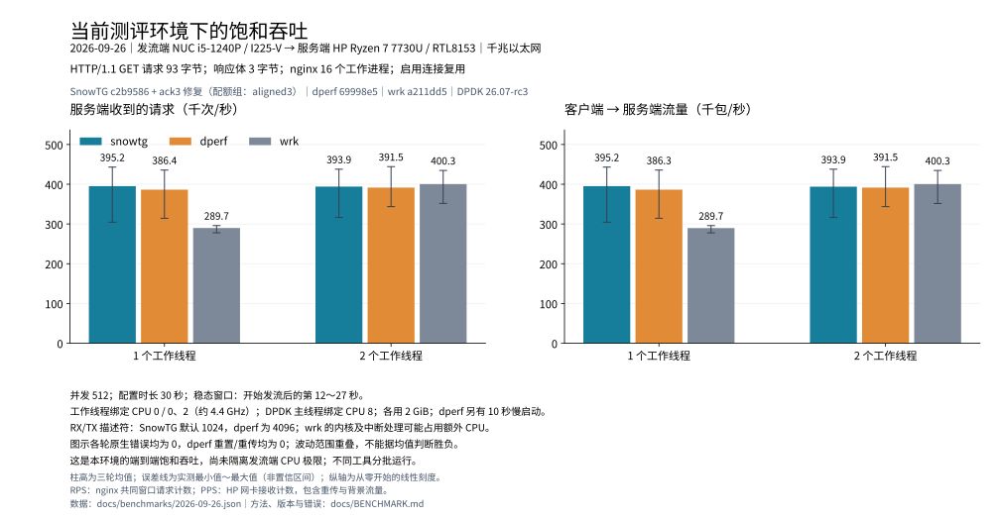
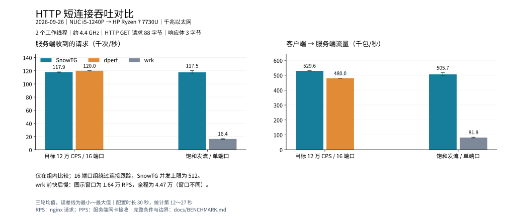

# SnowTG


[](pro-stack/)
[](#使用指南)
[](pro-stack/Makefile)
[](#docker-一键构建与自检)
[](run-sanitizers.sh)

**基于 DPDK 的用户态 TCP/IP 协议栈与 HTTP/DNS/Redis 混合流量发生器。** 从收发包、TCP 状态机到应用层事务调度均在仓库内实现；核心设计是单 owner、per-core reactor 和无锁热路径。

[English](README-en.md) · [使用指南](#使用指南) · [测评与复现条件](docs/BENCHMARK.md) · [架构与路线图](docs/TODO.md)

- **完整数据路径**：Ethernet / ARP / IPv4 / ICMP / TCP / UDP，BSD 风格 API 与 owner-local 非阻塞接口；HTTP/1.1、DNS、Redis 剧本支持混合权重、到达率、并发水位和连接复用。
- **可核验的性能**：NUC → HP 千兆环境下，KA 双 worker 三轮均值 **393,900 RPS**，与 dperf、wrk 相近；提供长短连接对照图、逐轮数据与复现条件。
- **业务压测与验收**：支持多步骤事务、响应变量提取、数据集参数化和步骤断言；通过 JSON/Python/Lua 编写剧本，配置分阶段加压、SLO 验收与基线报告对比。

## 性能对比与容量边界

测评日期为 **2026-09-26**，图示每个条件重复三轮。以下 RPS 统一采用 **nginx 稳态窗口收到的请求数**，PPS 来自服务端网卡；错误另看客户端全程计数。柱高为均值，误差线为三轮最小值～最大值。



常规组使用 512 并发、约 4.4 GHz，1 / 2 个 worker。三轮范围明显重叠，支持“本环境吞吐相近”，不能据均值的小幅差别判断胜负，也不能把约 40 万 RPS 当作协议栈的绝对极限。wrk 为相同线程数参照，其内核网络处理可能占用额外 CPU。



短连接 **12 万 CPS、16 个目标端口**对照：SnowTG **117,916 RPS**，dperf **119,997 RPS**，相差约 **1.7%**。SnowTG 三轮已发起请求失败为 0，但累计 214,461 次计划到达因资源限制延期、未在运行内完成；dperf 累计 16 次 socket 错误。该组绕过服务端连接跟踪；SnowTG 并发上限 512，dperf 短连接模式不支持同样的并发上限，不能称为完全等配置或无损极限对比。

图中单端口组为 SnowTG/wrk 饱和发流对照：**117,546 / 16,350 RPS**；wrk 全程均值为 44,709 RPS，存在前快后慢。两组条件不同，只在组内比较，不据此宣称普遍领先倍数。

环境、异常计数与边界见[测评与复现条件](docs/BENCHMARK.md)；[长短连接逐轮数据](docs/benchmarks/2026-09-26.json)、[16 端口短连接数据](docs/benchmarks/2026-09-26-short.json)及[绘图脚本](docs/benchmarks/plot.py)随仓库保存。其他环境的测量见[历史性能记录](docs/PERFORMANCE.md#5-历史吞吐图与机器归档)。

## 核心架构

| 设计 | 实现方式 |
| --- | --- |
| 连接状态归属 | 每个连接由单一 owner 驱动，per-core reactor 与 owner-local 队列减少跨核同步和共享锁竞争 |
| 多核收发 | 支持 worker RX/TX 与 RSS 分流；按需分配内存，通过 Dirty TX 减少发送路径的空扫描 |
| 连接生命周期 | 分离应用事务完成与 TCP 关闭，统一管理连接复用、超时及资源回收；复用次数可配置 |
| 报文发送 | 合并同轮 ACK 与窗口更新，支持数据捎带确认；TX 背压保留未发送报文并按序重试 |
| 业务扩展 | 协议栈与流量调度、应用协议分层；通过剧本配置负载，通过协议插件扩展应用层能力 |

配置与接口见[使用指南](#使用指南)，架构细节及开发计划见[架构与路线图](docs/TODO.md)。

## 使用指南

在仓库根目录执行以下命令。可先用 Docker 完成无物理网卡自检，再配置专用网卡运行真实负载。

- [构建](#构建)
- [Docker 一键构建与自检](#docker-一键构建与自检)
- [运行示例协议栈](#运行示例协议栈)
- [运行 traffic-gen](#运行-traffic-gen)
- [脚本剧本、SLO 验收与报告](#脚本剧本slo-验收与报告)
- [添加应用层协议插件](#添加应用层协议插件)
- [日志排查](#日志排查)

### 构建

构建前需安装 DPDK 及项目依赖，并准备可用的巨页和 DPDK 网卡。各目标可独立构建：

```bash
# 协议栈静态库：pro-stack/build/libpro-stack.a
make -C pro-stack

# TCP/UDP echo 示例：apps/stack-demo/build/stack-demo
make -C apps/stack-demo
# 非阻塞 TCP/UDP、nepoll 与异步 connect 示例
make -C apps/socket-demo

# 混合流量发生器：traffic-gen/build/traffic-gen
make -C traffic-gen

# 构建并运行测试
make -C test
```

需要检查内存或未定义行为时，可在独立构建目录运行 ASan/UBSan：

```bash
./run-sanitizers.sh
# 可选：CC=clang JOBS=8 ./run-sanitizers.sh
```

### Docker 一键构建与自检

安装 Docker Engine 后，在仓库根目录执行（需要至少两个可用 CPU）：

```bash
docker build -t snowtg . && docker run --rm --network none snowtg
```

镜像基于 Ubuntu 26.04，下载并校验 SHA-256 后从源码构建 DPDK 26.07，再编译
`traffic-gen` 和 `stack-demo`，并在构建时执行 `make -C test`；任一步骤失败都会
终止构建。固定 DPDK 版本是为了满足重复 IPv4 分片重组等回归测试的行为要求。
`.dockerignore` 排除宿主机编译产物和压测数据，避免混用本机 DPDK。
镜像内使用共享 DPDK 库，默认包含 null、pcap、AF_PACKET、VMXNET3、virtio、
Intel e1000/igc PMD，覆盖项目现有的 VM 和 NUC 网卡。保留构建工具和测试，方便
容器内复测。其他网卡可通过 `--build-arg 'DPDK_DRIVERS=bus/*,common/*,mempool/*,net/*'`
启用全部可构建的网络驱动；如使用 mlx5，还需在 Dockerfile 中添加其开发依赖。
默认以 4 个任务编译，可用
`docker build --build-arg JOBS=8 -t snowtg .` 调整。DPDK 使用 generic CPU 配置，
避免将构建机独有的指令集带入镜像；首次编译耗时较长，后续构建可复用缓存。

默认启动执行现有的 `test/test_lcore_layout.py`：自动选择两个可用 CPU，使用
`net_null` 虚拟网卡、256 MiB 普通内存和一秒 DNS 剧本，检查程序退出状态及最终
CSV 记录，成功输出 `PASS` 后退出。它不需要巨页、特权或物理网卡；虚拟网卡没有
真实 DNS 对端，因此这只验证启动和收尾流程，不代表真实请求成功或性能测试通过。
可用 CPU 中编号小于 128 的不足两个时，脚本输出 `SKIP`，不算完成启动验证。

```bash
# 在已构建的镜像中重跑全部单测
docker run --rm --network none snowtg make -C test

# 查看 EAL 参数；也可以用同样方式启动 stack-demo
docker run --rm snowtg traffic-gen --help
```

真实发流需要 Linux 宿主机先准备巨页、启用 IOMMU，并使用
`bind-dpdk.sh` 将**专用压测网卡**绑定到 `vfio-pci`。Docker 不负责配置宿主机
内核或解绑网卡，详见 [DPDK 容器运行说明](https://doc.dpdk.org/guides/linux_gsg/build_sample_apps.html#running-an-application-in-a-container)。
下面示例假定巨页挂载在 `/dev/hugepages`，PCI 地址为 `0000:64:00.0`，
对应的 IOMMU group 为 `17`；运行前替换这些值、CPU 编号、本地 IP，并修改剧本的
`peer.ip` / `peer.port`。可用
`readlink /sys/bus/pci/devices/0000:64:00.0/iommu_group` 查询 group。

```bash
mkdir -p docker-results
docker run --rm --init --network none \
  --device /dev/vfio/vfio --device /dev/vfio/17 \
  --cap-add IPC_LOCK --ulimit memlock=-1:-1 \
  --mount type=bind,src=/dev/hugepages,dst=/dev/hugepages \
  --mount "type=bind,src=$(pwd)/traffic-gen/scenarios,dst=/scenarios,readonly" \
  --mount "type=bind,src=$(pwd)/docker-results,dst=/results" \
  snowtg traffic-gen -l 0-1 -a 0000:64:00.0 \
  --huge-dir /dev/hugepages --file-prefix snowtg -- \
  --workers 1 --local-ip 192.168.21.2 --port-id 0 \
  --stats-csv /results/stats.csv /scenarios/test/mix-http-dns.json
```

这里的流量直接走 VFIO 网卡，不经过 Docker 端口映射。结果保存在宿主机
`docker-results/stats.csv`；多实例应使用不同的网卡、CPU 和 `--file-prefix`。
如果使用 UIO 驱动，需按设备另行配置透传，以上命令仅覆盖 VFIO。

### 运行示例协议栈

按需先将专用压测网卡绑定到 DPDK 驱动，再启动示例程序。脚本支持网卡名或 PCI 地址，默认驱动为 `vfio-pci`：

```bash
./bind-dpdk.sh --status
./bind-dpdk.sh --dry-run enp100s0          # 仅预览，不改变网卡
./bind-dpdk.sh enp100s0                    # NUC：VFIO，需要可用的 IOMMU
# 没有可用 VFIO 的实验虚拟机：显式选择 UIO
./bind-dpdk.sh --driver uio_pci_generic ens160
# 也支持 --driver igb_uio，需事先安装对应模块

./apps/stack-demo/build/stack-demo -l 0-2 ...
```

以登录用户运行脚本，绑定时自动调用 `sudo`；无参数只显示状态。DPDK 工具从
`DPDK_DEVBIND`、`PATH`、`DPDK_DIR/usertools` 或项目相邻的 `../dpdk/usertools`
查找，也可用 `--devbind /path/to/dpdk-devbind.py` 指定。UIO 需要网卡/驱动支持，
不提供 VFIO 的 IOMMU 隔离；脚本不会在 VFIO 失败后自动切换驱动。

脚本默认拒绝解绑有地址或路由的网卡；确认它是专用压测口后可加 `--force`。
当前 SSH 回程使用的网卡仍会被拒绝，需通过独立管理网卡或本地控制台操作。
恢复内核驱动时使用 PCI 地址，例如 NUC 的
`./bind-dpdk.sh --driver igc 0000:64:00.0`，或本 VM 的
`./bind-dpdk.sh --driver vmxnet3 0000:03:00.0`；地址、路由和网卡设置需另行恢复。

TCP/UDP echo 示例及本地地址等编译期开关位于 [`pro-stack/config.h`](pro-stack/config.h)。常用开关包括 `ENABLE_TCP_APP`、`ENABLE_TCP_CLIENT`、`ENABLE_TCP_SERVER`、`ENABLE_UDP_APP`、`ENABLE_ARP` 和 `ENABLE_ICMP`。

### 运行 traffic-gen

DPDK EAL 参数写在 `--` 之前，traffic-gen 参数与 scenario 路径写在 `--` 之后：

```bash
./traffic-gen/build/traffic-gen -l 0-1 -- \
  --workers 1 \
  --local-ip 192.168.21.2 \
  --port-id 0 \
  --stats-csv traffic-gen/results.csv \
  traffic-gen/scenarios/test/mix-http-dns.json
```

完整应用参数为：

```text
traffic-gen [EAL 参数] -- [--workers N] [--socket-id-max N]
            [--max-requests-per-connection N]
            [--stats-csv PATH] [--latency-csv PATH] [--mtu BYTES]
            [--dataplane-csv PATH] [--metrics-sample N]
            [--rx-mode main|worker|auto] [--tx-mode main|worker|auto]
            [--local-ip IPv4] [--port-id N] [scenario.json]
```

- `--workers`：协议栈 owner/reactor worker 数，默认为 `1`。
- `--max-requests-per-connection`：每条 TCP 连接最多承载的请求数（含首次请求），默认 `0` 表示不设次数上限；`1` 禁止复用，`100` 表示每条连接最多承载 100 次请求。仍尊重响应的 `Connection: close`、EOF 和空闲超时；该参数不改变 TCP TIME_WAIT。Python/Lua 启动器可在 EAL 分隔符后的应用参数中透传。
- TCP 顺序数据确认与应用读取后的窗口更新在同一 owner 轮次合并，优先随下一条数据发送，也可由携带最新确认和窗口的 FIN 等控制包完成；没有可发送数据时立即发纯 ACK。主动握手的最终 ACK 可随首个请求发送；没有请求时仍在同一处理轮次发出。SYN/SYN+ACK、FIN、重复及乱序段的确认保留控制路径，不增加延迟 ACK 定时器。
- TCP 数据重传在获得有效 RTT 样本后使用 200 ms 的 RTO 下限（与 Linux 默认策略一致），便于在短 Keep-Alive 空闲超时之前恢复丢包。首次采样前仍为 1 s，保留 Karn 保护和指数退避。这是低于 RFC 6298 建议的 1 s 下限的策略取舍；需要保守下限时可在构建中定义 `TCP_RTO_MIN_MS=1000`。
- `--socket-id-max`：每个 owner 的 socket 容量；省略时启动计算 `max(16384, 2 × ceil(全局并发 / active_shards))`。
  可显式降低默认值，但须至少为 `max(4096, 2 × ceil(全局并发 / active_shards))`；运行中不扩容。
- `--stats-csv`：将周期统计写入指定 CSV 文件。
- `--latency-csv`：按阶段、协议和类别输出延迟直方图及 P50/P90/P95/P99/P99.9，涵盖调度、建连、首字节、完成和排空。
- `--dataplane-csv`：输出 Main 阶段计时、轮询/收发计数和 NIC 统计增量；与 worker CSV 使用不同文件。
- `--metrics-sample`：每 N 轮采样一次阶段计时，默认 `1024`；`0` 只保留计数，未指定数据面 CSV 时关闭阶段计时。周期字段只覆盖采样轮次，不能直接除以全量包数。
- `--rx-mode`：默认 `auto`；RSS 配置成功且 RX queues 足够时由 worker 独占收包，否则由 Main 软件分流；单 worker 可直接 RX。显式 `worker` 在条件不足时报错，`main` 用于集中 RX 对照。错队列报文经 MP/SC ring 回到 socket owner；ARP 回复和分片重组由 worker 0 负责。
- `--tx-mode`：默认 `auto`；TX queues 足够时每个 worker 独占一个队列，否则回退 Main TX；显式 `worker` 在队列不足时报错。worker 每轮最多发送 4 个 burst。运行期间 NIC 未接收的包留在原 ring 队首，下轮继续发送；退出时尽力排空并统计未发送包的释放。
- `--stats-csv` 包含逐 worker 的 `nic_rx_packets/rx_burst_calls/rx_empty_bursts/rx_full_bursts/rx_handoffs/rx_handoff_drops`。RSS 配置成功不保证虚拟网卡后端实际分流；若流量集中进入 RXQ0，可使用 `--rx-mode main --tx-mode worker`。FDIR 需要驱动和硬件支持；环境相关的验证与对照见 [性能记录](docs/PERFORMANCE.md)。
- `--mtu`：设置 IPv4 MTU。
- `--local-ip`：设置协议栈的本机 IPv4 地址，默认为 `192.168.21.2`。
- `--port-id`：选择 EAL 枚举出的 DPDK Ethernet port id，默认为 `0`。
- `scenario.json`：压测剧本；示例位于 [`traffic-gen/scenarios/`](traffic-gen/scenarios/)。

`--local-ip` 和 `--port-id` 配置的是流量发生器本端。scenario 中每个 class
的 `peer.ip` 和 `peer.port` 仍用于配置目标服务地址和服务端口。

### 脚本剧本、SLO 验收与报告

统一入口 `python3 traffic-gen/snowtg.py` 支持 `.json`、`.py`、`.lua`。需要 Python 3.8+；
Lua 剧本另需 Lua 5.3/5.4（可用 `SNOWTG_LUA` 指定解释器）。脚本仅在启动时生成配置，不参与收发包。
直接修改 [Python 示例](traffic-gen/scenarios/test/acceptance-http-dns.py) 或
[Lua 示例](traffic-gen/scenarios/test/acceptance-http-dns.lua) 即可：

- `scenario` 配置全局并发，`http` / `dns` / `redis` 定义带权重的流量类别。
- `phase` 组合预热、爬坡、稳态、突发和降载；提供 `start` 时线性变速。当前支持开放到达模型。
- `assertion` 设置成功率、延迟分位数、分配失败数和排空等 SLO，可按阶段、类别筛选。
  `success_rate` 分母为计划请求数；`latency_ms` 默认统计成功事务的完成延迟。

以下在项目根目录运行，以 NUC 为例；按机器替换 CPU、PCI、本机 IP。
示例目标为 `192.168.10.234:8888/1053`，可通过 `SNOWTG_PEER` 修改 IP，
用 `SNOWTG_SERVICE_VERSION` 填写实测服务版本。

```bash
python3 traffic-gen/snowtg.py run --output debug/run1 \
  traffic-gen/scenarios/test/acceptance-http-dns.lua -- \
  -l 4,0,2 --main-lcore 4 -a 0000:64:00.0 -m 512 -- \
  --workers 2 --local-ip 192.168.10.86

# 将上面的输出目录换成 debug/run2 再测，然后比较
python3 traffic-gen/snowtg.py compare debug/run1/result.json debug/run2/result.json

# 离线生成含基线差异的报告
python3 traffic-gen/snowtg.py report debug/run2/result.json \
  --baseline debug/run1/result.json --output debug/comparison.html
```

`run` 自动保存 CSV 和日志；`result.json` 记录配置、环境/构建信息与验收结果，`report.html` 展示报告。
输出目录必须是新目录，无需另传 CSV 路径。返回码：`0` 验收通过、`2` 关键 SLO 未达标、`1` 运行无效。

错误原因分别记录在 CSV 的 `error_*` 列、`result.json.error_reasons` 和 HTML 中，包括建连/响应超时、RST、提前 EOF、HTTP 状态拒绝、DNS RCODE、Redis 错误响应和解析失败。可用 `assertion("error_reset", "==", 0)` 设置整次运行的门禁；原因计数不接受阶段/协议筛选，未记录细分原因的旧结果不会补成零。
运行时也可在剧本路径前加 `--baseline PATH`；仅导出配置用 `--emit-json PATH`（不带 `run`）。
比较会检查负载及环境是否可比；单次运行不测定最大可持续负载，容量搜索见下节。`debug/` 下的结果不进入 Git。

### 最大可持续负载与容量回归

`capacity` 接受 JSON/Python/Lua 的固定 `duration_sec` / `target_cps` 剧本，要求至少一个关键 SLO，
不接受 `phases`。例如保存以下内容为 `capacity.py`，按实际部署修改目标地址：

```python
from snowtg import scenario, http, assertion
plan = scenario('http-capacity', duration=30, cps=100, concurrency=256,
    classes=[http('http', '192.168.10.234', 8888, keepalive=True)],
    assertions=[assertion('success_rate', '>=', .999),
                assertion('latency_ms', '<', 20, quantile=.99)])
```

```bash
python3 traffic-gen/snowtg.py capacity --output debug/capacity-a \
  --minimum 100 --maximum 10000 --precision 25 --repeats 3 \
  capacity.py -- -l 4,0,2 --main-lcore 4 -a 0000:64:00.0 -m 512 -- \
  --workers 2 --local-ip 192.168.10.86

# 用相同条件生成 debug/capacity-b 后，允许容量最多下降 10%
python3 traffic-gen/snowtg.py compare \
  debug/capacity-a/result.json debug/capacity-b/result.json \
  --max-capacity-drop-percent 10 --output debug/capacity-comparison.json
```

也可在 `capacity` 的剧本路径前直接传 `--baseline debug/capacity-a/result.json
--max-capacity-drop-percent 10`，搜索完成后执行相同门禁。默认允许下降 5%，范围 `[0,100)`；
`--timeout` 是每个测量轮次的墙钟上限。每个负载重复测量全部通过才算通过，逐级翻倍后区间搜索；
无效测量立即中止并保存已有轮次，不当作服务过载。

输出目录内的 `result.json` 使用 `kind: "capacity"`，保存场景、构建/环境、搜索配置、逐轮结果路径、
`capacity` 区间及 `summary`；每轮原始 CSV、日志和单次结果保存在 `cps-<速率>-r<轮次>/`。
`report.html` 支持离线查看，也可使用 `snowtg.py report` 重新生成。

| 搜索状态 | 容量字段与含义 | 无基线退出码 |
| --- | --- | --- |
| `bracketed` | `[passed_cps, failed_cps)`；`summary.maximum_sustainable_cps` 为通过端点的估计值，区间宽度不超过 `precision` | 0 |
| `lower_bound_only` | 上限仍通过；仅 `summary.sustainable_cps_lower_bound` 有值，最大容量为 `null` | 0 |
| `below_minimum` | 最低负载失败，没有通过端点，最大容量为 `null` | 2 |
| `invalid` | 测量无效/中断或轮次间环境、构建变化，容量字段为 `null` | 1 |

容量比较检查相同工作负载（忽略被搜索替换的 `target_cps`）、SLO、数据集、环境、运行参数、重复次数和超时；
服务版本可以变化。门禁使用整个区间而非只比较两个估计值：设允许下降比例为 `d`，
候选通过端点 ≥ 基线失败端点 × `(1-d)` 才返回 **0**；候选失败端点 ≤ 基线通过端点 × `(1-d)`
返回 **2**。区间重叠、缺少必要边界、不可比或无效结果返回 **1**（无法判定），可提高搜索上限或缩小精度。
因此，两次都只报告相同下界不足以证明容量没有下降。

CPS 表示计划的事务启动速率，不等同成功 RPS 或 TCP 建连速率。搜索假设 SLO 随负载单调变化，
只证明给定持续时间和重复次数下的结果；单次 `run` 的 `maximum_sustainable_cps` 仍为 `null`。
本地检查：`make -C test test-snowtg-capacity`；已有 native binary 时运行
`make -C test test-capacity-cli` 验证 `net_null` 编排，不代表真实服务容量验收。

### Redis 基础读写长连接

Redis 使用 RESP2，支持普通 class 的 `PING`、`GET`、`SET`。每个连接只有一个在途请求，
默认复用连接；同一 worker/class 内复用，不同 class 不共享连接。JSON 示例：

```json
{
  "name": "redis-set", "weight": 1, "transport": "tcp",
  "peer": {"ip": "198.18.0.2", "port": 6379},
  "redis": {"command": "SET", "key": "snowtg:key", "value": "hello", "keepalive": true}
}
```

`command` 必填且大小写不敏感。PING 不接受 key/value；GET 必须有 key，不能有 value；
SET 必须有 key/value。键和值支持空字符串、UTF-8 和 JSON 转义，拒绝内嵌 NUL。
编码后的完整请求最多 1024 字节，超限在启动时拒绝。GET 按长度流式消费响应，支持二进制值，
上限 512 MiB；RESP 头行正文最多 1024 字节。GET 的空值、null（键不存在）均计成功，
不做值断言；PING 必须收到 PONG，SET 必须收到 OK。Redis `-ERR`、`-WRONGTYPE` 等响应
计入 `error_redis_error`，帧格式错误计入 `error_parse`，截断/超时/RST 使用现有原因。

Python：`redis("get", "198.18.0.2", command="GET", key="snowtg:key")`；
Lua：`tg.redis("get", "198.18.0.2", nil, {command="GET", key="snowtg:key"})`。
helper 默认端口 6379，原生 JSON 的 `peer.port` 仍必填。
[JSON](traffic-gen/scenarios/test/redis-mixed.json)、
[Python](traffic-gen/scenarios/test/redis-mixed.py)、
[Lua](traffic-gen/scenarios/test/redis-mixed.lua) 示例包含 Redis/HTTP/DNS 混合负载，运行前修改目标地址。
各 class 独立调度，示例不保证 SET 先于 GET；键预置及内容验证由测试准备阶段完成。

每次命令消耗一次计划到达，复用现有成功 RPS、字节数、连接创建/复用和延迟直方图，
支持 `assertion("success_rate", ">=", 0.99, protocol="redis")`。
完成延迟是客户端准入至完整响应的时间；新连接包含建连，复用连接没有建连样本；
`scheduled_complete` 另包含调度等待。GET null 计入成功吞吐，这不是缓存命中率。

请求超时沿用 5 秒，空闲超时 30 秒，并遵守现有每连接请求数上限。`keepalive=false`
时完整响应后由客户端关闭。断线结束当前请求，后续到达重新建连；只有发送前确认失效的
空闲连接可安全替换，已经发送的请求不会自动重放。PING 是普通受调度命令，不是后台心跳。
本版本不支持 AUTH、SELECT、RESP3、pipeline、工作流步骤、集群重定向、TLS 或 Pub/Sub。

本地回归：

```bash
make -C test test-redis-client test-redis-scripts test-flow-tcp
make -C test test-redis-cli
make -C test test-redis-client BUILD_DIR=build/redis-sanitizers SANITIZERS=address,undefined
make -C test test-flow-tcp BUILD_DIR=build/redis-wheel OWNER_TIMER_BACKEND=wheel
```

真实联调脚本验证 PING、SET 后 GET、GET miss、短连接、连接复用、报告及资源归零。
它使用唯一测试键并在正常用例结束后删除该键；需要可从控制主机和发压网口访问的无认证 Redis。
可选故障对端验证错误响应、畸形帧、截断、RST、超时和前四次断线后的恢复，检查请求数以排除重放。
在被测主机上启动故障对端：

```bash
python3 test/redis_peer.py --bind 198.18.0.2 --port 6380
```

在发压主机上使用已准备好的 AF_PACKET 接口（替换 CPU、地址和 `TEST_IFACE`）：

```bash
python3 test/test_redis_live.py --peer 198.18.0.2 --port 6379 --fault-port 6380 \
  debug/redis-live -- -l 0,1,2 --main-lcore 2 -m 256 --no-huge --no-pci \
  --vdev=net_af_packet0,iface=TEST_IFACE -- --workers 2 --local-ip 198.18.0.1
```

`redis_peer.py` 是可控测试对端，不替代 Redis；恢复用例模拟断线后的服务恢复，不重启真实服务。
目前已通过本地协议、flow、脚本/报告及双 worker `net_null` 回归；真实 Redis 与网络故障联调仍待验收。
旧 HTTP/DNS 报告缺少新增错误列时仍可读取；新旧结果错误原因覆盖不一致时，基线比较保留“不可比”判定。

### 资源趋势与归零验收

`workers.csv` 的 `resources_version=1` 表示提供完整资源快照；每个
`res_<资源>_{capacity,current,peak,exhausted,unavailable,busy,limit,before_force}`
字段分别记录容量、当前占用、生命周期峰值、耗尽、不可用、后端忙、队列限制及强制回收前占用。
失败为 64 位累计计数，采样不清零；不同资源层的原因可能描述同一次操作，不可相加为失败请求数。
`unavailable` 对池表示未初始化，对 transaction 表示协议上下文初始化失败；
UDP `limit` 是已有队列丢弃总数（可能与分配失败重叠），ready-event `limit` 表示 ready ring 满。
OFO 的接收窗口、段数/字节数/owner 限额、分配及压力丢弃仍使用已有 `ofo_drop_*` 字段。

| 资源 | 占用单位与范围 |
| --- | --- |
| `tcp_tx_chunk/rx_blob/ofo_seg/fragment/sack_range/payload` | 六类 TCP 池对象；payload 容量为块数，不是字节数 |
| `udp_rx_node/socket_slot/ready_event/timer` | UDP 队列节点、已占 socket slot、已领取事件、已挂载 timer |
| `flow/transaction/workflow` | 连接 flow、已初始化网络 transaction 上下文、已领取业务事务对象；三者独立统计 |
| `time_wait` | TIME_WAIT socket，容量沿用 socket slot 上限 |
| `tcp_sndbuf_bytes/tcp_unacked_bytes` | 保留的发送字节（未发送及未确认）/已发送未确认字节；重传不重复增加占用 |
| `ofo_segments/ofo_bytes` | 已接纳的乱序段数与字节数；容量分别沿用 OFO 池与 owner 字节限额 |

没有独立固定预算的队列 gauge 的 capacity 为 0；未启用的应用池容量也为 0。
transaction 容量沿用 flow 池：只要上下文仍持有就计数；当前 keep-alive 完成时会 reset
上下文，因此空闲连接通常表现为 flow 非零、transaction 为零。业务 workflow 与网络步骤不混计。

快照仅由 owner 获取，周期沿用 `report_interval_sec`（默认 1 秒）。
同一 worker 的新资源字段取最新累计值，跨 worker 容量/当前值/失败求和，
峰值为**最大单 worker 的生命周期高水位**，不是同时刻总峰值。
`result.json.resources` 保存每个 worker 的资源最终状态、失败原因和时间序列；
HTML 展示资源表及当前占用曲线，旧结果缺少这些指标时显示“未记录”，不会补零。

完整资源验收要求每个 worker 的最终快照完整、趋势无统计丢样，且所有上述资源在
**池和 timer engine 销毁之前**正常归零。容量、历史峰值与累计失败无需归零。
结果区分 `passed`（正常排空）、`forced_zero`（强制回收后归零）、
`residual`（仍有残留）、`incomplete`（证据不完整）；后三者的新运行均返回 `1`。
强制回收前的占用保存在 `before_force`，不会用销毁池后的零值替代验收证据。
共享 mbuf、NIC 描述符、IPv4 重组及进程全部堆内存不在这项归零结论内。

在已准备好的双机环境运行数小时混合长测（替换 CPU、PCI 和 IP，输出目录必须不存在）：

```bash
SNOWTG_PEER=192.168.10.234 SNOWTG_DURATION=21600 \
SNOWTG_SERVICE_VERSION=my-service-version \
python3 traffic-gen/snowtg.py run --output debug/mixed-soak-6h \
  traffic-gen/scenarios/test/mixed-soak.py -- \
  -l 4,0,2 --main-lcore 4 -a 0000:64:00.0 -m 512 -- \
  --workers 2 --local-ip 192.168.10.86
```

该剧本按 5 秒采样。以上是待执行命令，不代表已完成六小时验收。
本地故障闭环可运行 `make -C test test-resource-cli`；
时间轮版本使用 `make -C test test-resource-cli BUILD_DIR=build/resource-wheel OWNER_TIMER_BACKEND=wheel`。
该测试专用二进制通过链接包装模拟 TCP 关闭停滞及池对象残留，并缩短 drain guard；
生产二进制没有这些故障开关。keep-alive、部分 ACK、重传和 OFO 使用现有 C 回归验证。

### 添加应用层协议插件

当前插件机制是源码接入和编译期静态注册，不会在运行时加载 `.so`。一个应用层插件由
两部分组成：[`tg_proto_ops`](traffic-gen/proto/proto.h) 处理请求/响应字节，
[`tg_proto_scenario`](traffic-gen/proto/registry.h) 把 scenario 中的协议对象编译成
不可变配置。HTTP、DNS 和 Redis 实现分别位于
[`traffic-gen/proto/http/`](traffic-gen/proto/http/)、
[`traffic-gen/proto/dns/`](traffic-gen/proto/dns/) 和
[`traffic-gen/proto/redis/`](traffic-gen/proto/redis/)，可以直接作为模板。

以新增协议 `myproto` 为例，建议创建以下文件：

```text
traffic-gen/proto/myproto/
├── myproto_client.c
├── myproto_client.h
├── myproto_scenario.c
└── myproto_scenario.h
```

#### 1. 实现字节协议接口

在 `myproto_client.h` 中定义 class 的不可变配置，并导出操作表：

```c
#include "../proto.h"

struct tg_myproto_config {
        /* 必须拥有自身数据，不能引用 scenario JSON 的临时缓冲区。 */
        char request_value[128];
};

extern const struct tg_proto_ops tg_myproto_ops;
```

在 `myproto_client.c` 中实现回调并初始化操作表：

```c
#include "myproto_client.h"
#include "../../core/txn.h"

static int my_config_clone(const void *source, void **destination);
static void my_config_free(void *config);
static int my_init(struct tg_txn *txn);
static int my_build_request(const void *config, uint8_t *buffer,
                            size_t capacity, size_t *length_out);
static enum tg_proto_result my_on_rx(struct tg_txn *txn,
                                     const uint8_t *data, size_t length);
static enum tg_proto_result my_on_eof(struct tg_txn *txn);
static void my_reset(struct tg_txn *txn);

const struct tg_proto_ops tg_myproto_ops = {
    .name = "myproto",
    .config_clone = my_config_clone,
    .config_free = my_config_free,
    .init = my_init,
    .build_request = my_build_request,
    .on_rx = my_on_rx,
    .on_eof = my_on_eof,
    .reset = my_reset,
};
```

实现时遵守以下约定：

- `class_config` 在运行热路径上只读；只要配置非 `NULL`，就必须同时实现
  `config_clone` 和 `config_free`，用于多 worker 分片复制和销毁。
- `init` 可为每个事务分配解析状态并写入 `txn->proto_ctx`；`reset` 必须释放该状态。
- `build_request` 将单次请求序列化到调用方缓冲区，检查容量并填写实际长度。
- TCP 的 `on_rx` 必须支持任意拆分和合并的字节块；UDP 的 `on_rx` 每次收到一个完整
  数据报。插件只解析应用数据，不直接调用 `owner_io_*` 或管理 socket。
- `on_rx`/`on_eof` 返回 `TG_PROTO_MORE`、`TG_PROTO_COMPLETE` 或
  `TG_PROTO_FAILED`。只有响应完整且允许复用 TCP 连接时，才把
  `txn->connection_reusable` 设为 `true`。
- 如需跟踪已被传输层接受的请求字节，可额外实现可选的 `on_tx_accepted`。

#### 2. 编译 scenario 协议对象

实现与 `tg_http_scenario_compile()` 类似的 compiler。它应当：

1. 使用 [`scenario_json.h`](traffic-gen/core/scenario_json.h) 的辅助函数校验
   `myproto` 对象，只接受已声明字段。
2. 分配并完整复制 `tg_myproto_config`，不能保留 JSON token 或文本指针。
3. 设置 `class_plan->proto` 和 `class_plan->proto_config`。
4. 调用 `build_request`，把请求预编译到 `class_plan->request_template`，并设置
   `request_template_len`；请求不能超过 `TG_PLAN_REQUEST_TEMPLATE_CAP`。
5. 任一步骤失败时释放已分配配置、清空所有权字段并设置合适的 `errno`。

然后在 [`registry.c`](traffic-gen/proto/registry.c) 中包含新头文件，并向静态表添加：

```c
{
    .schema_key = "myproto",
    .ops = &tg_myproto_ops,
    .transport = TG_TRANSPORT_TCP, /* 或 TG_TRANSPORT_UDP */
    .compile = tg_myproto_scenario_compile,
},
```

一个 class 必须只包含一个已注册协议键，而且 `transport` 必须与注册项一致。

#### 3. 接入构建并使用

把 `myproto_client.c` 和 `myproto_scenario.c` 加入
[`traffic-gen/Makefile`](traffic-gen/Makefile) 的 `SRCS`。scenario 随后可以这样使用：

```json
{
  "name": "myproto-example",
  "duration_sec": 30,
  "max_concurrency": 100,
  "target_cps": 20,
  "classes": [
    {
      "name": "my-request",
      "weight": 1,
      "transport": "tcp",
      "peer": { "ip": "192.168.21.106", "port": 9000 },
      "myproto": { "request_value": "hello" }
    }
  ]
}
```

建议为插件单独添加协议单测，覆盖请求构造、分片响应、非法响应、EOF 和 reset；同时在
scenario 测试中覆盖合法配置、未知字段、错误 transport 以及配置 clone/free。完成后运行：

```bash
make -C traffic-gen
make -C test
```

### 日志排查

默认构建只保留 TCP/ARP 的警告和错误，避免高 CPS 场景产生大量逐包日志。切换日志编译变量前应先清理旧产物：

```bash
make -C pro-stack clean

# TCP 生命周期与重传日志，不输出逐包日志
make -C pro-stack LOG_LEVEL=LOG_LVL_DEBUG \
  TCP_LOG_INFO_ENABLED=1 TCP_LOG_PACKETS=0

# ARP 调试日志
make -C pro-stack LOG_LEVEL=LOG_LVL_DEBUG ARP_LOG_ENABLED=1

# TCP 逐包日志
make -C pro-stack LOG_LEVEL=LOG_LVL_TRACE \
  TCP_LOG_INFO_ENABLED=1 TCP_LOG_DEBUG_ENABLED=1 \
  TCP_LOG_TRACE_ENABLED=1 TCP_LOG_PACKETS=1
```

使用 `NO_COLOR=1` 或 `LOG_COLOR=never` 可关闭日志颜色。更完整的故障排查说明见 [`docs/DEBUG.md`](docs/DEBUG.md) 和 [`docs/ERROR.md`](docs/ERROR.md)。

## 源码导航

| 目录 | 重点 |
| --- | --- |
| [pro-stack/](pro-stack/) | 协议栈、TCP 状态机、owner 生命周期和收发运行时 |
| [traffic-gen/core/](traffic-gen/core/) | 事务 / flow 生命周期、连接池、调度与统计 |
| [traffic-gen/proto/](traffic-gen/proto/) | HTTP、DNS、Redis 应用协议实现 |
| [test/](test/) | 协议、调度、参数与运行时回归 |
| [apps/](apps/README.md) | 阻塞/非阻塞 TCP/UDP echo、nepoll 与异步 connect 示例 |

公开应用接口的非阻塞模式、socket 选项、`nepoll_*` 和 command 生命周期见 [公开 socket API](docs/SOCKET_API.md)。
