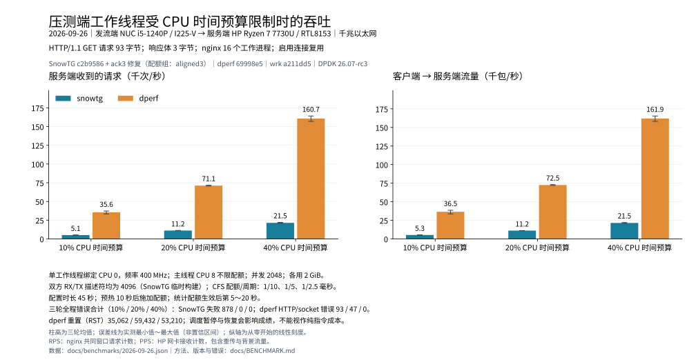

# SnowTG / dperf / wrk：同环境对照与容量边界

本页复用 2026-09-26 已完成的最终版本测量，不代表新增一轮测试。共 **60 个有效样本、每个条件三轮**；原临时报告和完整日志仍保留在实验工作区。本次按要求将核验后的摘要、逐轮数据和图表加入仓库。

## 结论

- 普通 KA 双 worker：SnowTG **393,900 RPS**、dperf **391,490 RPS**、wrk **400,314 RPS**。三轮波动范围重叠，且按工具分批运行，无法据均值微小差异判断胜负。
- CPU 时间受限：20% / 40% 预算下，dperf 的请求吞吐约为 SnowTG 的 **6.37 / 7.49 倍**；同时存在 RST/重传。普通组接近不代表 CPU 效率相同。
- 固定 16k 短连接：SnowTG 三轮各 480,000 次成功，失败、skipped、资源延期均为 0。它是固定到达率回归，不是最大 CPS。
- 常规与连续限频的 SnowTG 默认配置 18 轮累计成功 **100,769,044**、失败 **0**，TX / 软件 RX 丢弃、统计丢失及退出残留均为 0。强配额过载组不包含在此结论中。




## 环境和负载

| 项目 | 本次设置 |
| --- | --- |
| 发流端 | Intel NUC12WSKi5，i5-1240P，12 核 / 16 线程，15.6 GiB；I225-V，DPDK / VFIO |
| 服务端 | HP 15-fc0xxx，Ryzen 7 7730U，8 核 / 16 线程，约 15 GiB；RTL8153 USB 3 千兆网卡，1 RX / 1 TX |
| 网络 | 192.168.10.86 → 192.168.10.234；实测协商 1 Gbps，全程监测链路；不能按 I225-V 标称 2.5 Gbps 解读 |
| nginx | 16 workers，软件 RPS 掩码 5155；keepalive_timeout 1 s，keepalive_requests 1,000,000,000；响应体 `ok\n`，3 B |
| HTTP | HTTP/1.1 GET `/`；KA 请求 93 B，短连接请求 88 B；相同 Host、请求内容和服务端 |
| CPU 布局 | 单 worker CPU 0，双 worker CPU 0、2；DPDK main CPU 8；普通组约 4.4 GHz |
| 容量 | 普通组并发 512；DPDK 各 2 GiB；单源 IP、源端口 49152～65535，共 16,384 个 |
| 网卡描述符 | 普通组 SnowTG 默认 RX/TX 各 1024，dperf 各 4096；CPU 配额组统一 4096 |
| 发流策略 | SnowTG 饱和组 target_cps=1,000,000、无限复用；dperf KA cps=8000、cc=512、keepalive=0us；固定短连接双方 cps=16000 |

相同链路、请求、服务端、并发与 worker 数构成共同条件；普通组描述符默认值、应用调度方式及内核网络成本并非完全相同。wrk 的线程固定在对应 CPU，但 IRQ/软中断可使用额外 CPU，所以不加入 DPDK worker 的严格配额比较。dperf 使用 HTTP_PARSE 构建、`protocol http`，不是绕过 HTTP 解析的 TCP 负载。

### 时间窗口与错误口径

普通组配置时长 30 s，共同稳态窗口为发流起点后 **12～27 s**。dperf 另有 10 s slow-start，实际进程运行时间包含初始化和收尾，不等于配置时长。每条件三轮，报告均值及 min～max，不把范围当作置信区间。最新 SnowTG 与未变化的 dperf 对照按工具批次运行，并非完全随机交错。

**RPS 是 nginx 收到的请求速率**，扣除监控请求；不是客户端成功完成速率。PPS 为 HP 网卡硬件计数，RX 对应客户端→服务端，TX 对应服务端→客户端，包含少量背景流量与重传。正常 KA 每请求约一个客户端包，RPS 与 PPS 接近是结果，不是用 RPS 换算 PPS。

错误是各工具的**全程原生计数**，包括热身和收尾，运行时长/定义不同，不能直接比较失败率。SnowTG 使用 fail；wrk 使用 status/connect/read/write/timeout；dperf 同时查看 httpErr、skErr、rstRx、pushRt、tcpDrop、imissed。其 RST 关闭不增加 HTTP/socket error，httpGet 也可能包括 PUSH 重传；不能把 RST 与 error 简单相加当成精确失败事务数。

SnowTG 原生 success / 配置 duration、dperf 原生日志 seconds 12～26 的 http2XX 均值、wrk 全程 Requests/sec 的窗口不同，仅保留在数据中供复核，不混入图表。饱和发流的 skipped 表示超过容量的计划到达被跳过，不能当成网络失败；固定 16k 组则要求 skipped 为零。

### 如何限制客户端 CPU

先测单 worker 连续 400 / 800 MHz，再测 **400 MHz + CFS v1 时间配额**。配额组在连接热身后使用 2048 并发，并将两工具 RX/TX 描述符统一为 4096；SnowTG 是临时 `aligned3` 构建，仓库默认 1024 不变。该构建另在退出时打印 NIC 计数，不在热路径添加采样逻辑。

配置 duration=45 s，dperf 另有 slow-start。就绪后等待 10 s，将 CPU 0 上的 worker TID 加入单独 cgroup，main 不限；取配额生效后 **5～20 s** 为共同窗口。10% / 20% / 40% 的 quota/period 分别为 1000/10000、1000/5000、1000/2500 μs。三轮中第二轮反转工具顺序。

20% 组实际 worker CPU 时间为 SnowTG / dperf **0.198 / 0.201 核**，40% 为 **0.388 / 0.389 核**，以 cpuacct.usage 为准。预算翻倍 RPS 分别增长 1.92 / 2.26 倍；40% 组服务端最忙逻辑 CPU 的窗口平均占用约 9.1% / 48.7%，带宽低于 256 Mbps。这支持客户端 CPU 时间预算成为主要限制，但调度暂停、队列溢出和连接恢复仍参与结果，不能解释成纯指令成本或独占物理核的无损极限。

## 全部正式组结果

下表错误均为三轮全程合计，RPS 和 PPS 为三轮共同窗口均值；PPS 单位为千包/秒。逐轮值见 [JSON](benchmarks/2026-09-26.json)。

| 条件 | 工具 | RPS 均值（min～max） | 客户端→服务端 kPPS | 服务端→客户端 kPPS | 原生错误 / RST |
| --- | --- | ---: | ---: | ---: | --- |
| 固定 16k 短连接 / 2w | snowtg | 15,999（15,999～15,999） | 74.3 | 80.0 | 0 |
| 固定 16k 短连接 / 2w | dperf | 16,000（16,000～16,001） | 64.0 | 80.0 | 0 / RST 0 |
| KA / 2w | snowtg | 393,900（316,295～437,762） | 393.9 | 393.9 | 0 |
| KA / 2w | dperf | 391,490（343,626～444,217） | 391.5 | 391.5 | 0 / RST 0 |
| KA / 2w | wrk | 400,314（351,630～434,569） | 400.3 | 400.3 | 0 |
| KA / 1w | snowtg | 395,202（304,370～443,113） | 395.2 | 395.2 | 0 |
| KA / 1w | dperf | 386,352（314,360～435,593） | 386.3 | 386.3 | 0 / RST 0 |
| KA / 1w | wrk | 289,737（277,734～295,912） | 289.7 | 289.7 | 0 |
| KA / 400 MHz | snowtg | 77,902（77,738～78,017） | 77.9 | 77.9 | 0 |
| KA / 400 MHz | dperf | 450,187（444,824～453,044） | 450.2 | 450.2 | 0 / RST 0 |
| KA / 800 MHz | snowtg | 139,163（137,513～142,457） | 139.2 | 139.2 | 0 |
| KA / 800 MHz | dperf | 395,768（339,837～438,789） | 395.7 | 395.7 | 0 / RST 0 |
| KA / 10% 配额 | snowtg | 5,142（5,122～5,177） | 5.3 | 5.4 | 878 |
| KA / 10% 配额 | dperf | 35,567（33,397～37,262） | 36.5 | 38.2 | 93 / RST 35,062 |
| KA / 20% 配额 | snowtg | 11,166（11,153～11,189） | 11.2 | 11.2 | 0 |
| KA / 20% 配额 | dperf | 71,131（70,643～71,587） | 72.5 | 74.2 | 47 / RST 59,432 |
| KA / 40% 配额 | snowtg | 21,464（20,864～22,074） | 21.5 | 21.5 | 0 |
| KA / 40% 配额 | dperf | 160,670（156,941～164,083） | 161.9 | 163.4 | 0 / RST 53,210 |
| 饱和短连接 / 2w | snowtg | 117,546（116,177～120,094） | 505.7 | 587.9 | 0 |
| 饱和短连接 / 2w | wrk | 16,350（15,667～16,840） | 81.8 | 81.7 | 0 |

### 过载与未测得的极限

| 条件 | SnowTG | dperf | 解释 |
| --- | --- | --- | --- |
| 10% 配额，2048 并发，三轮 | fail 878；NIC missed 14,338 | HTTP/socket error 93；RST 35,062；PUSH 重传 40,521 | 两者均出现稳定性问题；保留全部样本 |
| 20% 配额，2048 并发，三轮 | fail / NIC missed 均为 0 | HTTP/socket error 47；RST 59,432；PUSH 重传 61,503 | dperf 吞吐更高，但不是零异常 |
| 40% 配额，2048 并发，三轮 | fail / NIC missed 均为 0 | HTTP/socket error 0；RST 53,210；PUSH 重传 53,863 | 原生 error=0 不能代替重传/重置检查 |
| 20% 配额、2048 并发，SnowTG 默认 1024 描述符，单轮诊断 | 9,477 RPS；fail 2,645；NIC missed 151,764 | — | 与 4096 描述符对照说明接收队列容量影响过载恢复 |
| 20% 配额、4096 并发、4096 描述符，单轮诊断 | 6,209 RPS；fail 8,636 | 79,574 RPS；socket error 443；RST 60,714 | 增加并发会放大排队与恢复压力；不纳入正式三轮均值 |

正式配额组 dperf 的 RST/PUSH 重传在稳态窗口内仍持续出现，不能全部归因于热身或退出。NIC missed 只计 rx_missed_errors（dperf 为 imissed），不重复累加同义或重叠计数。

400 MHz 连续限频时 dperf 仍达约 450k RPS，服务端最忙 CPU 约 90.4%，因此仅降频不足以同时隔离两者的发流 CPU 瓶颈。普通组的最大单轮值只是**测得值**，不是协议栈能力上限；没有将单次峰值取代三轮均值。

短连接饱和组 SnowTG 均值 117,546 RPS、客户端约 4.30 包/请求；固定 16k 时约 4.64，对照 dperf 约 4。dperf 受本次单 IP、小端口池的启动容量校验限制，没有同模型的无速率上限短连接有效样本。wrk 不提供原生固定到达率控制，因此没有固定 16k 组。wrk 饱和短连接共同后段窗口为 16,350 RPS，但原生全程均值为 44,709 RPS，存在早快后慢；本次未确定唯一根因，不能用后段窗口宣称 SnowTG 普遍快七倍。

## 版本、证据与复现

| 工具 / 构建 | 版本与说明 | 二进制 SHA-256 |
| --- | --- | --- |
| SnowTG `ack3` | 基于 `c2b9586618f600987ca6d915af676502ed6b35ac` 的本轮未提交修复快照；源码哈希清单见下方 | `d7e80d68a2cb04b234f006718b1fbc6f796872ac6410848407ed2078aaeaedbe` |
| SnowTG `aligned3` | 同一修复版，仅临时调整描述符为 4096 及退出 NIC 统计 | `b49f356827cf4da1361d2b8b481b78f3d3424579f1201164f2d8b16a94b7e0a8` |
| dperf | `69998e55f0d9e968e3d53dcb7e1b32d8094144e8`；仅去除错误的重复 payload 路径启动检查，不修改 TCP / 统计热路径 | `57e21e3b1638ab683d096b9e204206977d72d344fb4230afc7d9f1d09b3a1bad` |
| wrk | `a211dd5a7050b1f9e8a9870b95513060e72ac4a0` | `560fea75fc1662fb5a591a3cefe3ba205b1d6d683cc6cbb8bd61c71cdd9911d8` |

提交前 review 另补充了普通 HTTP 调度路径的保护：只有发送前检测到 `ESTALE` 才替换连接，其他复用发送失败直接报告，避免部分发送后自动重放。本页硬件结果对应此前归档快照，不包含这项边界修复的重新测量。

两个 DPDK 工具均使用私有安装的 DPDK 26.07-rc3。wrk Lua 只配置线程亲和性、静态请求头和结束统计，没有逐请求 Lua 回调。

[逐轮数据](benchmarks/2026-09-26.json)保留全部 60 个正式样本的指标、工具原生计数、实验 ID 与原始文件哈希；[源码清单](benchmarks/2026-09-26-source-sha256.json)标识被测 SnowTG 快照。仓库未打包大体积抓包、逐秒日志和二进制，哈希用于后续核对，不等同于随仓库提供完整原始证据。完整日志位于原实验机 `/home/snow/snowtg-fix-20260926/compare/`，先前临时报告位于 `/home/snow/snowtg-compare-20260926/SnowTG-wrk-dperf-临时对比.md`。

重绘中英文图表使用随仓库提供的数据及 matplotlib，无需实验机器。中文绘图还需要 Noto Sans CJK SC 字体；可安装该字体，或通过 `--cjk-font /path/to/NotoSansCJKsc-Regular.otf` 指定已有字体文件。SVG 内嵌字形，阅读图片无需安装字体：

```bash
python3 docs/benchmarks/plot.py
```

硬件复测按前述环境设置服务端、绑定 CPU / NIC、核对 1 Gbps 链路后再运行。代表性普通 KA 配置如下，路径和端口须按实际机器替换；双方必须指向同样的响应端点。启动前以实际 HTTP 请求验证端点就绪。

```text
# dperf：HTTP_PARSE 构建；keepalive.http 为与 SnowTG 完全一致的 93 B 请求
mode client
cpu 0
protocol http
duration 30s
socket_mem 2048
port 0000:64:00.0 192.168.10.86 192.168.10.234
client 192.168.10.86 1
server 192.168.10.234 1
listen 19511 1
cps 8000
cc 512
keepalive 0us
client_port_range 49152 65535
payload_file /path/to/keepalive.http
rss
slow_start 10
```

SnowTG 剧本：

```json
{
  "name": "compare-keepalive",
  "duration_sec": 30,
  "max_concurrency": 512,
  "target_cps": 1000000,
  "report_interval_sec": 1,
  "classes": [{
    "name": "http_get", "weight": 1, "transport": "tcp",
    "peer": {"ip": "192.168.10.234", "port": 19511},
    "http": {"method": "GET", "path": "/", "host": "snowtg-wrk-dperf-benchmark.internal.example", "keepalive": true}
  }]
}
```

```bash
# 普通单 worker；需要已准备好巨页和 VFIO 的权限环境
traffic-gen/build/traffic-gen -l 8,0 --main-lcore 8 -a 0000:64:00.0 \
  --file-prefix snowtg-benchmark -m 2048 -- --workers 1 \
  --max-requests-per-connection 0 --socket-id-max 16384 \
  --rx-mode worker --tx-mode worker --local-ip 192.168.10.86 scenario.json
```

HTTP 原始请求为以下内容，**每行使用 CRLF，最后再加一个空行**；KA 总计 93 B：

```http
GET / HTTP/1.1
Host: snowtg-wrk-dperf-benchmark.internal.example
Connection: keep-alive

```

复测时同步采集 nginx 请求计数、双向 NIC 包/字节计数、worker CPU 时间/频率、链路速度及客户端全程错误；以共同稳态窗口计算速率，至少重复三轮。端点未就绪或链路异常的预检不得计入正式样本。压测已在原任务结束时停止，两台机器的网卡、频率、nginx、巨页及临时 cgroup 均已恢复。
