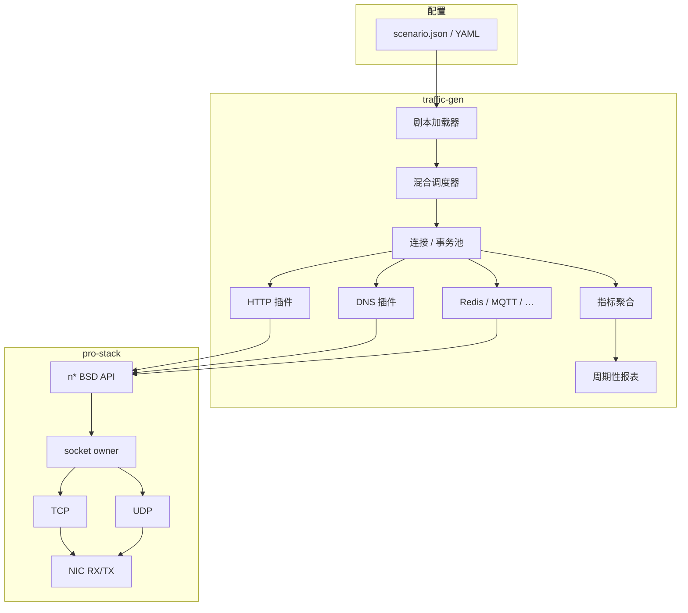

# 混合流量发生器设计文档

本文档描述在现有 [`pro-stack/`](pro-stack/) 用户态协议栈之上，建设**可演示、可度量、可写进简历**的混合流量发生器（Traffic Generator）的目标、架构与分期。  
定位是**作品级产品化**：完整闭环 + 硬指标 + 清晰架构叙事；不与商业流量仪表或 TRex 等对标竞争。

相关现状见 [README.md](README.md)；并发与 owner 约束见 [DevLog.md](DevLog.md)。

---

## 1. 目标与非目标

### 1.1 目标

| 维度 | 说明 |
|------|------|
| 作品形态 | 基于自研 DPDK TCP/UDP 栈的多协议混合流量发生器 |
| 可运行 | 文档可复现：环境、巨页、绑核、一场压测怎么跑 |
| 可配置 | 剧本驱动（并发、速率、协议占比、目标地址），少改编译宏 |
| 可度量 | 输出 CPS、并发保持、成功率、RPS/QPS、重传、资源占用 |
| 可讲述 | README/本文有架构图、模块边界与明确取舍 |

**一句话作品描述（简历可用）：**

> 基于 DPDK 自研用户态 TCP/UDP 栈，实现多协议混合流量发生器；支持剧本编排与指标采集，单机在指定硬件上实测达到并发 X / CPS Y（以实测为准写入简历）。

### 1.2 非目标（刻意不做或后置）

- 不追求替代 Linux 网络栈或通用 `LD_PRELOAD` 兼容层  
- 不实现完整 MySQL/Redis/MQTT 服务端语义，只做**压测用客户端子集**  
- 第一期不做完整 HTTPS（TLS）百万级；可作后续扩展  
- 不承诺未经实测的「100 万连接」作为对外数字；百万级仅作为**架构愿景与容量规划上限**  
- 不做 LLM 现场编协议；「智能」先指**可配置流量模型与混合调度**

### 1.3 成功标准（简历向）

满足以下即可视为 Phase A 完成：

1. 能按剧本同时打出 **HTTP + DNS** 混合流量，持续跑不少于 5 分钟不崩溃。  
2. 终端（或日志）周期性输出：并发、CPS、成功率、错误分类、重传计数。  
3. 在固定硬件配置下给出**可复现**的实测表（见 §8）。  
4. 架构说明能讲清：协议栈 owner 模型如何支撑大量短连接客户端。

---

## 2. 与现有协议栈的关系

流量发生器是栈之上的**应用与编排层**；栈继续作为传输引擎，而不是被替换。

```text
┌─────────────────────────────────────────────────────────┐
│  traffic-gen（新建）                                      │
│  剧本解析 · 混合调度 · L7 插件 · 指标聚合 · 控制台输出      │
└───────────────────────────┬─────────────────────────────┘
                            │ nsocket / nconnect / nsend /
                            │ nrecv / nsendto / nclose …
┌───────────────────────────▼─────────────────────────────┐
│  pro-stack（现有）                                        │
│  socket owner · TCP/UDP · ARP/ICMP · NIC RX/TX           │
└─────────────────────────────────────────────────────────┘
```

### 2.1 复用

- BSD 风格 API：`nsocket` / `nbind` / `nconnect` / `nsend` / `nrecv` / `nsendto` / `nrecvfrom` / `nclose`  
- 单 owner 模型：应用 lcore 只持 fd，经 command ring 访问 TCB（[ARC-002](DevLog.md#arc-002socket-单-owner代际句柄与命令队列)）  
- TCP：握手、滑动窗口、OFO、控制段/数据 RTO、主动/被动拆除  
- UDP：DNS 等数据报场景  
- 基础设施：`g_net`、ARP、mempool、in/out ring

### 2.2 栈侧必须补强的能力（发生器依赖）

发生器不是「再写一个 echo」，对栈有刚性依赖。按优先级：

| 优先级 | 能力 | 原因 |
|--------|------|------|
| P0 | 非阻塞 / 事件就绪模型（或等价 ready 队列） | 单连接阻塞 `nrecv` 无法驱动海量并发客户端 |
| P0 | 连接生命周期在高压下正确（close/RST/fd 复用） | 短连接压测会剧烈锻炼 close 路径 |
| P0 | 每连接内存可控（小默认窗口 / 按需缓冲） | 规模数字由内存决定，不能按 64KB/连接满配 |
| P1 | dirty TX 队列（替代全表 `tx_flush`） | 活跃连接比例低时避免 O(全部 socket) |
| P1 | 连接/定时器规模扩展（timer wheel、提高 fd/slot 上限） | 从演示规模迈向数万并发 |
| P2 | 多 queue + RSS + per-worker owner | 冲更高 CPS/并发时再上 |
| P2 | RX 校验、MSS 协商、基础拥塞控制 | 打真实对端、跨较复杂链路时需要 |

### 2.3 架构决策：per-core per-reactor

发生器的目标运行模型采用 **per-core per-reactor**：一个 RSS packet
worker lcore 同时运行该核的协议栈 owner 和 traffic-gen reactor。该 reactor
管理本核的 flow/transaction 状态机、CPS 调度、超时和就绪事件。

```text
RSS 四元组 → packet-worker lcore
                    ├→ socket / TCP owner
                    ├→ traffic-gen reactor（flow shard）
                    ├→ 本核 timer / TX flush
                    └→ 本核指标
```

同一连接的 TCP 状态、应用 flow、L7 parser 以及定时器必须固定在同一个
lcore；不得在热路径迁移。这样 RX/TX、协议状态机和发生器状态机均不需要
跨核锁。跨核通信只用于控制面（启动、停止、剧本更新）和指标汇总。

现有单 owner + app command-ring 模型可作为兼容路径，但不应成为发生器的
最终热路径：一次 `nrecv` / `nsend` 若需要跨核提交命令并等待
`pthread_cond_wait()`，即使带有 `MSG_DONTWAIT` 也仍有一次同步 RPC 成本。
最终需要提供仅限 owner lcore 调用的 `try_*` 路径，或让发生器 reactor
直接作为 owner worker 循环中的任务运行。

该模型借鉴 mTCP/F-Stack 的“非阻塞 socket + readiness event”语义，以及
Seastar 的“每核 reactor + 连接 ownership”原则；本项目不依赖 Linux 内核
`epoll` 或 `io_uring`。由于 fd 属于用户态协议栈，以下的 `npoll` / ready
queue 是 **epoll-like** 接口，而非内核 epoll fd。

栈的完备 TCP 选项/SACK 等仍按 [README.md](README.md) 路线图推进，但**发生器 Phase A 不以其为门禁**。

### 2.4 线程模型：过渡路径与目标

当前可保持三层 lcore 分工，以便在不破坏 owner 边界的前提下尽快完成
Phase A：

| lcore | 职责 |
|-------|------|
| main | NIC RX→`ring->in`，`ring->out`→TX；ARP 等基础设施 timer |
| worker（owner） | command ring、入包、TCP/UDP 状态机、TCP timer、`tx_flush` |
| app（traffic-gen） | 读剧本、驱动连接状态机、调用 `n*` API、聚合本地指标 |

该过渡实现的约束：

- app **永不**直接解引用 `nsock *` / TCB。  
- 阻塞 API 不得拖死调度：海量连接场景下 app 侧应以 **非阻塞 + 就绪通知** 为主（栈侧提供能力后，发生器不再用「一连接一阻塞线程」模型）。
- app 与 owner 跨核时，ready event 只表示“值得尝试”；不能掩盖
  `socket_owner_call()` 本身的同步等待成本。

目标模型以 §2.3 为准：reactor 与 owner 同核，应用 flow 只经受控的
owner-local `try_*` 接口访问 socket 状态，不向普通 app 暴露 `nsock *`。

---

## 3. 总体架构



### 3.1 核心概念

| 概念 | 含义 |
|------|------|
| **Scenario（剧本）** | 一次压测的声明式描述：目标、协议权重、并发、时长、限速 |
| **Traffic class** | 一种 L7 行为（如 `http_get`、`dns_query`），绑定传输（TCP/UDP）与插件 |
| **Connection / Flow** | 一条传输流；TCP 短连接可「一事务一连接」，也可 keep-alive 复用 |
| **Transaction** | 一次 L7 往返（请求→响应判定成功/失败） |
| **Scheduler** | 按目标 CPS/并发/权重决定何时发起新事务 |
| **Plugin** | 无传输细节的 L7 编解码与成功判定 |

---

## 4. 模块设计

当前目录与后续扩展边界：

```text
traffic-gen/
├── main_tg.c              # EAL、NIC 与 owner-worker 入口
├── Makefile
├── core/
│   ├── reactor.h/.c        # owner-local tick 与 ready-event bridge
│   ├── flow.h/.c           # TCP transport、handle map 与生命周期
│   ├── flow_pool.h/.c      # 预分配 owner-local flow pool
│   └── txn.h/.c            # 一次 L7 请求/响应事务
├── proto/
│   ├── proto.h             # 编译期注册的 L7 插件接口
│   └── http/
│       └── http_client.h/.c # llhttp 驱动的 HTTP request/response 插件
├── scenario.h/.c           # 后续：剧本加载与校验
├── scheduler.h/.c          # 后续：混合调度、限速、并发水位
├── stats.h/.c              # 后续：per-lcore 计数与汇总
└── report.h/.c             # 后续：周期性报表
```

与 `pro-stack` 的集成方式二选一（实现时定一种即可）：

- **A（推荐）**：`pro-stack` 链成库/对象集，`traffic-gen` 作为各 owner worker
  上的 reactor 任务运行，替换或并列于 `tcp_app` / `udp_app`。  
- **B**：在现有 `main.c` 中用 `ENABLE_TRAFFIC_GEN` 挂载入口（适合早期原型）。

### 4.1 剧本（Scenario）

示例（JSON 示意，字段名实现时可微调）：

```json
{
  "name": "mix-http-dns-demo",
  "duration_sec": 300,
  "max_concurrency": 10000,
  "target_cps": 5000,
  "classes": [
    {
      "name": "http_get",
      "weight": 70,
      "transport": "tcp",
      "peer": { "ip": "192.168.21.105", "port": 80 },
      "http": {
        "method": "GET",
        "path": "/",
        "host": "example.local",
        "keepalive": false
      }
    },
    {
      "name": "dns_a",
      "weight": 30,
      "transport": "udp",
      "peer": { "ip": "192.168.21.1", "port": 53 },
      "dns": {
        "qname": "www.example.local",
        "qtype": "A"
      }
    }
  ]
}
```

校验规则（加载期失败即退出）：

- `weight` 之和 > 0；`max_concurrency` / `target_cps` 在编译或运行上限内。  
- TCP class 必须能 `connect`；UDP class 走 `sendto`/`recvfrom`。  
- 对端地址与本地 `g_net` 同网或路由策略在文档中写明（第一期可要求二层直达 + ARP）。

worker 数表示物理 owner/RX worker 数，不按 class 或协议静态切分。实际参与发车的
scheduler shard 数为 `min(workers, target_cps, max_concurrency)`；每个 active shard
保留完整 class 集合，CPS 与并发按商和余数分片，未参与发车的 worker 仍可处理被动
收包。class `weight` 控制跨 shard 的尝试选择比例，不等价于成功请求比例。

### 4.2 混合调度器

职责：

1. 维护当前并发（进行中的事务/连接数）≤ `max_concurrency`。  
2. 按 `target_cps` 做令牌桶或固定间隔发车。  
3. 按 `weight` 做加权随机或加权轮询，选择 traffic class。  
4. 从对象池取 `flow`/`transaction`，交给对应插件推进状态机。

第一期算法建议（简单可讲）：

- **发车**：每 tick（如 1ms）根据令牌桶尝试 `min(可用并发, 令牌数)` 次 `start_transaction`。  
- **选类**：前缀和 + 随机数，或确定性 WRR（便于复现实验）。  
- **结束**：达到 `duration_sec` 后停止发车，等待 in-flight 排空或超时强杀并计入失败。

每个分片使用由 plan 计算出的 WRR 初始 phase，避免低 CPS 场景下所有 worker 从同一个
class 前缀同时开始。该 phase 只消除启动同步偏斜；失败率、响应时延和并发占用仍会
影响各 class 的实际成功数量。

### 4.3 连接 / 事务状态机（TCP 类）

客户端事务推荐状态（插件可挂接）：

```text
IDLE → CONNECTING → SENDING → RECVING → CLOSING → IDLE
         │            │         │          │
         └────────────┴─────────┴──────────┴→ FAILED → IDLE
```

- `CONNECTING`：`nconnect`（`EINPROGRESS` 时挂起，就绪后继续）。  
- `SENDING` / `RECVING`：非阻塞 `nsend`/`nrecv`，短读拼缓冲直至满足 L7 判定。  
- `CLOSING`：`nclose`；短连接默认不复用。  
- keep-alive（HTTP 后期）：`RECVING` 成功后回到 `SENDING` 或空闲复用池。

UDP 类更简单：

```text
IDLE → SENDING → RECVING → IDLE
         └──────────┴→ FAILED → IDLE
```

超时：每事务 `response_timeout_ms`（剧本字段，默认如 5s）；超时记失败并回收。

### 4.4 L7 插件接口

`core/flow.c` 拥有 socket、非阻塞 I/O、ready event 和回收顺序；
`tg_txn` 持有一次请求/响应的字节与插件引用；插件只处理字节流或数据报，
不得调用 `owner_io_*`。当前短连接模型中一个 flow 嵌入一个 txn；HTTP
keep-alive 后可扩展为一个 flow 串行承载多个 txn。

统一 C 接口：

```c
struct tg_proto_ops {
    const char *name;

    /* 复制/释放 immutable class 配置，供 plan 分片和清理使用。 */
    int (*config_clone)(const void *source, void **destination);
    void (*config_free)(void *config);

    /* 初始化插件私有 transaction state。 */
    int (*init)(struct tg_txn *txn);

    /* 根据 class 配置构造请求字节。 */
    int (*build_request)(const void *class_cfg,
                         uint8_t *buf, size_t buf_cap,
                         size_t *request_len_out);

    /* 传输层已接收发送字节、收到响应字节或看到 EOF 时的通知。 */
    void (*on_tx_accepted)(struct tg_txn *txn, size_t bytes);
    enum tg_proto_result (*on_rx)(struct tg_txn *txn,
                                  const uint8_t *data, size_t len);
    enum tg_proto_result (*on_eof)(struct tg_txn *txn);
    void (*reset)(struct tg_txn *txn);
};
```

返回值 `TG_PROTO_MORE`、`TG_PROTO_COMPLETE` 和 `TG_PROTO_FAILED` 分别表示
继续接收、事务完成和协议失败。HTTP 插件使用 vendored llhttp 9.4.3（MIT）解析
字节流；`proto_ctx` 持有每事务独立的 parser state，llhttp callback 负责 HTTP
framing，插件在 headers complete 阶段要求 HTTP/1.0 或 HTTP/1.1 的 2xx status。

class 的协议配置由具体插件拥有并通过 `proto_config` 传递；`tg_class_plan` 不保存
HTTP method/path 等协议专用字段。分片时调用 `config_clone`，计划结束时调用
`config_free`，因此配置不能借用 JSON 输入缓冲区或另一个 shard 的地址。

当前支持 `Content-Length`、chunked 与 EOF-delimited response body，并在完整 message
后完成短连接事务。保持严格解析，不启用 llhttp 的 lenient flags。暂不支持
HTTP upgrade、response pipeline 或在同一 flow 上复用下一个 keep-alive transaction。

### 4.5 协议子集范围

| 协议 | 阶段 | 子集范围 | 成功判定（示例） |
|------|------|----------|------------------|
| HTTP/1.x | Phase A | `GET`/`POST` 固定模板；llhttp 解析 Content-Length、chunked 与 EOF body | `HTTP/1.0`/`1.1` 2xx 且完整 message |
| DNS | Phase A | 单问题 A/AAAA 查询（UDP） | 响应 QR=1 且 rcode=0 |
| Redis | Phase B | `PING` / 简单 `GET`/`SET`（RESP） | `+PONG` 或批量回复完整 |
| MQTT | Phase B | CONNECT + PINGREQ 或单次 PUBLISH | CONNACK / PUBACK |
| MySQL | Phase C | 握手 + 简单 query（慎选范围） | OK 包 |
| HTTPS | Phase C | 可选：仅握手；或 mbedTLS 小并发 | 握手完成 / HTTP over TLS |

原则：**宁可子集小而判定清晰**，也不要实现完整协议栈式客户端。

### 4.6 指标

**per-lcore 计数（避免原子风暴），汇报线程汇总：**

| 指标 | 含义 |
|------|------|
| `txns_started` / `txns_done` | 事务开始/结束 |
| `txns_success` / `txns_fail` | 成功/失败 |
| `fail_connect` / `fail_timeout` / `fail_proto` / `fail_reset` | 失败分类 |
| `cps_connect` | 完成 TCP 握手的速率 |
| `concurrency` | 当前 in-flight |
| `bytes_tx` / `bytes_rx` | 应用层字节 |
| `http_rps` / `dns_qps` | 分协议完成速率 |

协议栈侧可另暴露（若易取）：重传次数、OFO 命中、ARP miss——作为「栈健康」附录指标，不作为 L7 成功条件。

报表：每隔 `report_interval_sec`（默认 1s）打一行；结束时打印摘要与分协议表。

---

## 5. 规模与容量规划

### 5.1 数字怎么写

| 层级 | 含义 | 简历写法 |
|------|------|----------|
| 愿景 | 架构按百万连接预留（分片、池化、timer wheel） | 「架构按百万级连接设计」 |
| 承诺 | 仅写**本机实测**稳定档位 | 「在 … 配置下稳定 1 万 / 10 万并发」 |
| 爬坡 | 1k → 1万 → 10万 → … | 每档有复现命令与结果表 |

禁止：未测先写「支持 100 万 TCP 连接」。

### 5.2 内存预算（设计约束）

百万级不可按「每连接满 `TCP_SNDBUF_SIZE`」线性放大。发生器场景默认策略：

1. **小初始窗口 / 小 sndbuf 默认**（压测请求通常很小）。  
2. **对象池**：`tg_flow` / `tg_txn` 预分配，禁止热路径 `malloc`。  
3. **TCP 缓冲按需**：owner-local fixed chunk 仅在未 ACK payload 存在时占用，
   ACK 后归还；空闲或 TIME_WAIT socket 不持有完整发送缓存。
4. 提高规模前先算：`N * (TCB + 平均缓冲 + 事务 ctx)` ≤ 可用巨页内存的 60%。

栈侧需配合：可配置 `TCP_SNDBUF`、chunk pool 与连接上限；pool low/high water
必须反馈为 scheduler 背压和资源指标。`NSOCK_FD_MAX` / `NSOCK_ID_MAX` 随目标上调并有文档说明。

### 5.3 定时器

连接多时，SYN/数据 RTO、事务超时不能依赖「每连接频繁改定时器 + 全局遍历」。

- Phase A：沿用现有 `rte_timer`，控制并发在可承受范围。  
- Phase B+：引入 **timer wheel**（事务超时 + TCP RTO 分层），作为冲 10 万+ 的前置。

### 5.4 多核扩展（预留）

与 README「per-worker owner + RSS」一致，最终采用 **每个 worker 一个
traffic-gen reactor/shard**：

- 同一四元组固定在同一 worker。  
- 每个 worker 同时拥有 socket/TCP owner、发生器调度器、flow 对象池、
  timer 和 ready queue；flow 不跨 worker 迁移。  
- 全局 `target_cps`、`max_concurrency` 在启动时按 shard 分配；允许控制面
  做低频再平衡，但不得把全局原子计数器放入每连接热路径。  
- 指标 per-lcore 维护，汇报线程仅周期性聚合。  
- RX 侧依赖 RSS 保持四元组亲和；TX、ACK、RTO 与对应 flow 在同核完成。

Phase A 可先实现单 worker + 单 reactor，验证事件语义和状态机；模块边界
不得写死全局单例（现有 `g_owner` 仅为过渡）。多核阶段以 shard 复制而非
共享 socket 表的方式扩展。

---

## 6. 事件模型（发生器能否上规模的关键）

现状：示例应用以阻塞 `nrecv` 为主，无法驱动海量并发。

### 6.1 目标语义

为 traffic-gen 提供 **非阻塞 socket + epoll-like readiness** 语义：

1. socket/flow 标记为 nonblocking；`nrecv` / `nsend` / `nrecvfrom` /
   `nsendto` 使用 `MSG_DONTWAIT`。不能立即推进时返回 `-1/EAGAIN`，而不是
   park 调用者。  
2. 非阻塞 `nconnect` 启动握手后返回 `-1/EINPROGRESS`；握手完成后报告
   `TG_EV_CONNECTED` 或 `TG_EV_ERROR`。  
3. 非阻塞 `naccept4(..., SOCK_NONBLOCK)` 在 accept queue 为空时返回
   `-1/EAGAIN`。  
4. owner 将状态变化推入本核 ready queue；reactor 批量消费它，或经
   `npoll` 获取 ready 子集。两者是同一语义的不同 API 外观。  
5. 禁止扫描所有 in-flight fd 的纯忙询；它只可作为小规模原型的临时方案。

实现边界：

- `traffic-gen/` 仅包含 `pro-stack/owner_io.h`，通过
  `owner_io_socket_create`、`owner_io_bind`、`owner_io_connect`、
  `owner_io_send`、`owner_io_recv`、`owner_io_sendto`、
  `owner_io_recvfrom` 和 `owner_io_close` 操作 generation handle。
- 这些调用只能发生在 handle 对应的 owner lcore；它们直接调用 transport
  probe，绝不创建 `sock_cmd`、进入 command ring 或等待 condvar。
- `pro-stack/socket_owner.*` 继续服务公开 `n*` BSD 兼容接口和对象生命周期；
  上层不包含该内部头文件，也不访问 `nsock`/TCB。
- `owner_io_ready_burst` 消费 owner-local ready queue。每 socket 以
  `ready_mask + ready_queued` 合并事件，队列项仅保存 generation handle；
  已回收或复用的 slot 事件会被安全丢弃。

事件位定义：

```c
enum tg_ready_events {
    TG_EV_READ      = 1u << 0, /* recv_buf 有数据，或 EOF 可见 */
    TG_EV_WRITE     = 1u << 1, /* TCP 发送窗口/本地发送缓冲可用 */
    TG_EV_CONNECTED = 1u << 2, /* 异步 connect 成功 */
    TG_EV_ACCEPT    = 1u << 3, /* listener 有已完成握手的 child */
    TG_EV_ERROR     = 1u << 4, /* connect / transport 失败 */
    TG_EV_HUP       = 1u << 5, /* FIN、RST 或本地关闭 */
};
```

ready 事件必须带 `nsock_handle`（至少含 `id` 与 `generation`），不能只带
可复用 fd。每 socket 维护 `ready_mask` 与 `ready_queued`：新事件先 OR 入
mask，只有从“未入队”变为“入队”时才 push 一次。reactor 取到事件后交换并
清空 mask。该合并规则避免高频 ACK 或多包接收将 ready ring 打爆。

### 6.2 与 owner 的交互

```text
reactor: start connect → EINPROGRESS → flow 进入 CONNECTING
owner: SYN+ACK / connect failure → TG_EV_CONNECTED / TG_EV_ERROR
reactor: CONNECTED → nsend(MSG_DONTWAIT) → EAGAIN 则等待 TG_EV_WRITE
owner: ACK / 窗口打开 → TG_EV_WRITE
reactor: nrecv(MSG_DONTWAIT) → EAGAIN 则等待 TG_EV_READ
owner: payload / FIN / RST → TG_EV_READ / TG_EV_HUP
```

reactor 收到事件后必须推进对应 flow，直到不能继续推进：

- `TG_EV_READ`：循环读取并交给 L7 插件，直至 `EAGAIN`、EOF 或协议完成；  
- `TG_EV_WRITE`：循环发送待发字节，直至发送完或 `EAGAIN`；  
- `TG_EV_CONNECTED`：`CONNECTING → SENDING`；  
- `TG_EV_ERROR` / `TG_EV_HUP`：读取错误原因、计数并回收 flow。

这相当于 level-triggered 的 epoll 编程约定。若未来提供 edge-triggered
模式，`accept` / `recv` / `send` 更必须 drain 到 `EAGAIN`，否则可能丢失
下一次唤醒。

### 6.3 每核 reactor 调度顺序

每轮在有界预算内执行，避免一个繁忙 flow 饿死 RX、timer 或其他 flow：

```text
RX ingress → TCP timer → ready-event burst → flow state machines
          → CPS token bucket → dirty TX flush
```

其中 ready-event 与新建事务都应设置 burst 上限；达到时间或数量预算后回到
RX/timer。发生器不需要一个阻塞的 `epoll_wait()`：DPDK worker 已在轮询 NIC，
空闲时只需继续 poll RX、timer 和本核 ready queue。

---

## 7. 分期计划

### Phase A — 简历可展示的最小闭环（优先）

**范围**

- 剧本加载（JSON 即可）  
- 调度器：并发水位 + CPS 令牌桶 + 加权选类  
- 插件：HTTP/1.1 GET + DNS A（UDP）  
- 指标与秒级报表  
- 栈：非阻塞路径 + 就绪通知（或过渡忙询，但文档标明限制）  
- 短连接 TCP；HTTP 可不做 keep-alive  

**验收**

- 混合剧本跑 ≥ 5 min  
- 给出实测表（§8）至少一档（建议先冲稳定 **1k～1万** 并发）  
- README 增加「如何跑 traffic-gen」一节  

### Phase B — 规模与插件扩展

- Redis 或 MQTT 择一  
- dirty TX、连接池与内存预算调优  
- timer wheel；上探 **10 万** 并发档（若硬件允许）  
- HTTP keep-alive 可选  
- 失败分类与简单直方图（延迟分布）  

### Phase C — 加分项 / 面试扩展故事

- HTTPS（小并发或仅握手档）  
- MySQL 极简客户端  
- 多 worker + RSS  
- 基础拥塞控制与校验，便于打更真实的对端  
- 「百万级」容量实验报告（成功或失败都写清瓶颈）  

---

## 8. 实测与简历数字规范

### 8.1 固定记录的环境字段

每次写入文档/简历的数字必须附带：

- CPU 型号与占用核数（main/worker/app）  
- NIC 型号、驱动（如 vfio-pci）、队列数  
- 巨页配置、进程内存  
- 对端类型（同机 nginx / 另一主机 / 内核协议栈）  
- 剧本文件名与关键参数（并发、CPS、时长）  
- 构建选项（是否 ASan 等——ASan 数字勿与 release 混用）  

### 8.2 结果表模板

| 档位 | 并发目标 | 实测稳定并发 | CPS | HTTP RPS | DNS QPS | 成功率 | 备注 |
|------|----------|--------------|-----|----------|---------|--------|------|
| A1 | 1_000 | | | | | | |
| A2 | 10_000 | | | | | | |
| B1 | 100_000 | | | | | | |

「稳定」定义建议：连续 5 分钟成功率 ≥ 99%，无崩溃、无 fd/内存泄漏趋势（可用周期性 `concurrency` 与失败分类观察）。

### 8.3 对比实验（加分，可选）

同机用简陋的「线程池 + 内核 socket HTTP client」跑相近剧本，对比：

- 同并发下的 CPU  
- 可达的最大 CPS  

不必赢过所有工具，只要能解释差异来自用户态/DPDK/无内核穿越等。

---

## 9. 风险与取舍

| 风险 | 应对 |
|------|------|
| 栈事件模型未就绪导致发生器无法推进 | Phase A 可先小并发忙询，但把 ready ring 列为 P0 并行项 |
| 每连接内存过大 | 压测默认小缓冲；对象池；写明内存公式 |
| 短连接 close 路径竞态 | 沿用 ARC-002；发生器本身作为 soak 用例反哺栈 |
| 协议范围膨胀 | 严格按 Phase 解锁；插件接口防止拷贝粘贴六份调度逻辑 |
| 简历数字不可复现 | §8 强制环境字段；数字与 commit/剧本文件一起记录 |
| 被理解为攻击工具 | 文档定位为实验室性能验证 / 自研栈能力验证；默认限速与目标白名单 |

---

## 10. 文档与仓库约定

实现推进时建议同步维护：

| 文件 | 内容 |
|------|------|
| 本文 `DESIGN-traffic-gen.md` | 架构与分期（本文件） |
| `README.md` | 增加 traffic-gen 构建运行入口与指向本文 |
| `DevLog.md` | 若引入 ready ring / timer wheel 等，新增 ARC 条目 |
| `traffic-gen/scenarios/*.json` | 可复现剧本 |
| `traffic-gen/RESULTS.md`（可选） | 实测表归档 |

---

## 11. 简历叙事（建议结构）

面试时可按三条线讲，与本设计一一对应：

1. **协议栈**：DPDK、用户态 TCP、单 owner / 代际句柄，为何能避免 UAF。  
2. **发生器**：剧本、混合调度、L7 插件、指标；为何用就绪模型而不是每连接一线程。  
3. **规模**：内存与 timer 瓶颈、实测档位、若上多核会如何分片。

---

## 12. 下一步实现顺序（供开发排期）

1. 定集成方式（§4：库入口 vs `ENABLE_TRAFFIC_GEN`）。  
2. 栈：非阻塞 + ready 通知最小集。  
3. `scenario` + `stats` + `report` 骨架。  
4. TCP 短连接事务状态机 + HTTP 插件。  
5. UDP 路径 + DNS 插件 + 加权混合调度。  
6. 跑通 A1 实测表，补 README。  
7. 再迭代内存/dirty TX/更高档位。

---

## 修订记录

| 日期 | 说明 |
|------|------|
| 2026-07-31 | 初版：简历向混合流量发生器设计，对齐现有 pro-stack owner 模型 |
