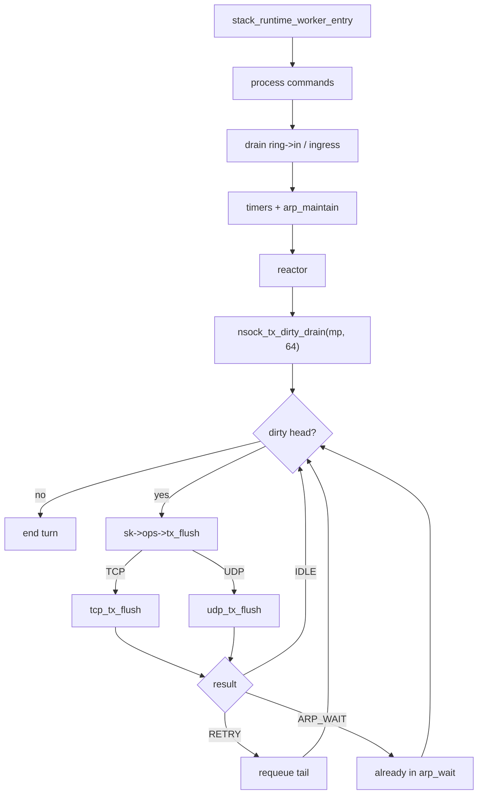
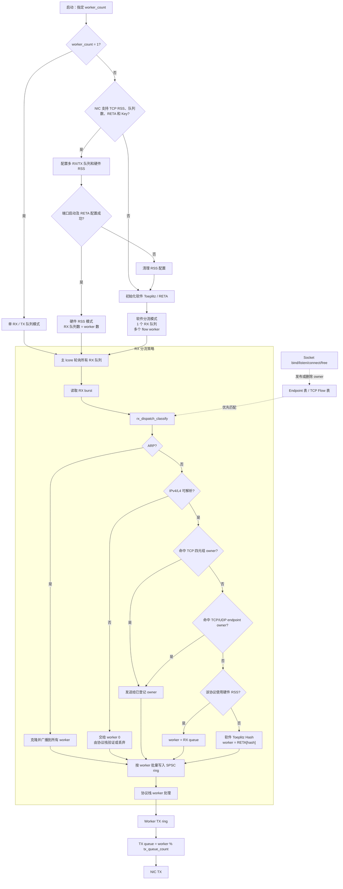
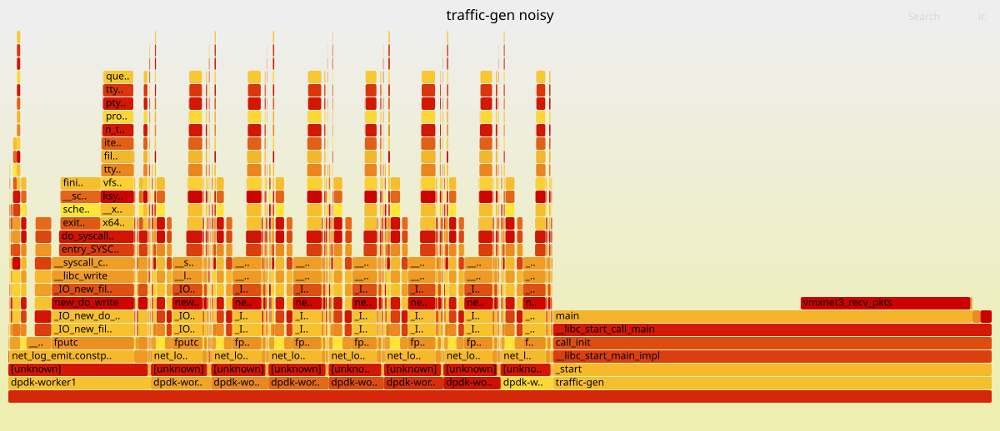
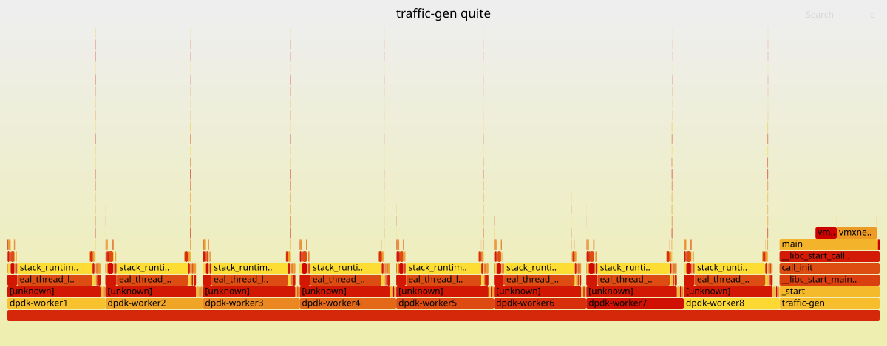

# DevLog

用于沉淀会影响后续实现、并发模型或模块边界的架构问题与决策。每一条记录独立编号，后续新增内容应追加为新的 `ARC-XXX` 条目，而不是混入已有条目。

## 记录索引

- [ARC-001：TCP 接收路径的跨 lcore 所有权缺陷](#arc-001tcp-接收路径的跨-lcore-所有权缺陷) — 接收路径已实施；生命周期收敛待后续处理
- [ARC-002：Socket 单 owner、代际句柄与命令队列](#arc-002socket-单-owner代际句柄与命令队列) — 已实施；取代跨 lcore 裸指针与 `tcp_rx_events` 过渡模型
- [ARC-003：traffic-gen owner-local 队列与按需 TCP 缓冲](#arc-003traffic-gen-owner-local-队列与按需-tcp-缓冲) — 已实施；原有单 worker 限制由 ARC-005 解除
- [ARC-004：短连接压测的全 socket TX 扫描与对端 RST](#arc-004短连接压测的全-socket-tx-扫描与对端-rst) — dirty TX queue 已实施；真实 NIC 回归待验证
- [ARC-005：多 owner worker、硬件 RSS 与软件接收分流](#arc-005多-owner-worker硬件-rss-与软件接收分流) — 已实施；真实 NIC 回退与压力回归待验证
- [ARC-006：traffic-gen UDP 直发与按需接收队列](#arc-006traffic-gen-udp-直发与按需接收队列) — 已实施；BSD/app-visible UDP 保留兼容路径
- [ARC-007：traffic-gen 日志处理与低开销可观测性](#arc-007traffic-gen-日志处理与低开销可观测性) — 已实施；性能测量与协议调试分离

## 条目格式

每个架构记录应包含：

1. **状态**：已识别 / 设计中 / 实施中 / 已实施 / 已废弃。
2. **范围**：受影响的模块、lcore 或 API。
3. **问题与证据**：当前行为、触发条件和风险。
4. **架构原则与推荐方案**：明确长期应遵守的所有权和数据流。
5. **实施要点与遗留事项**：后续改动的边界、依赖和验证重点。

---

## ARC-001：TCP 接收路径的跨 lcore 所有权缺陷

- **状态**：接收路径已实施；socket 生命周期收敛待后续处理。
- **范围**：`pro-stack/tcp.c`、`socket.c`、worker lcore、app lcore、`recv_buf`、TCP 接收流控。
- **触发**：实现 `rcvbuf_used` / 接收窗口更新时发现 app 消费数据与 worker 重组数据共享 TCP 接收状态。
- **长期原则**：worker 是 TCP 状态唯一 owner；app 只消费已交付数据并向 worker 发送事件。

### 背景

当前协议栈运行模型中，worker lcore 负责收包、TCP 状态机、乱序重组和发包；app lcore 调用 `nrecv()` / `tcp_recv()` 读取应用数据。TCP 已有：

- `recv_buf`：向应用交付按序 `tcp_rx_blob` 的环；
- `ofo`：保存尚不能按序交付的乱序段；
- `recv_ack`：下一个期待的对端序号，也是本端累计 ACK；
- `rcvbuf_used`：接收缓存中尚未被应用读取的逻辑字节数。

在实现收端流控时，发现这些对象的读写所有权没有完全划分清楚。

### 现有职责与数据流

```text
NIC
  │
  ▼
worker lcore
  ├─ tcp_ingress()
  ├─ tcp_state_established()
  ├─ tcp_ofo_insert() / tcp_ofo_drain()
  ├─ recv_buf（生产 tcp_rx_blob）
  └─ 发送 ACK / window-update
                   │
                   ▼
              app lcore
              └─ tcp_recv()（消费 tcp_rx_blob）
```

`recv_buf` 当前按单生产者、单消费者模式创建：

```c
sk->recv_buf = rte_ring_create(recv_name, RING_SIZE, rte_socket_id(),
                               RING_F_SP_ENQ | RING_F_SC_DEQ);
```

设计意图应是 worker 为唯一生产者，app 为唯一消费者。

### 问题一：应用释放空间后，协议层不会立即继续重组

场景：

```text
recv_buf: [A, B]   # 已满
ofo:      [C]      # C 的序号紧随 B，但此前无法放入 recv_buf
```

1. app 调用 `tcp_recv()` 并读取 A，`recv_buf` 出现可用空间。
2. 为了继续按序交付，协议层需要把 C 从 `ofo` 移到 `recv_buf`。
3. 同时需要推进 `recv_ack`，并向对端发送更新后的接收窗口 ACK。
4. 但 `tcp_ofo_drain()` 当前仅从 worker 的收包路径调用。app 读取完成并不会通知 worker。

结果是 C 可能一直滞留在 `ofo`，直到对端又发送新报文或重传，worker 才会再次运行 `tcp_ofo_drain()`。这会产生不必要的延迟和重传，也使“应用已释放缓存空间”不能及时反映在通告窗口中。

### 问题二：app 不能直接调用 `tcp_ofo_drain()`

这不是语言层面的限制，而是当前并发模型不允许。

`tcp_ofo_drain()` 会同时修改：

- `ofo` 链表及其中节点；
- `ofo_count`；
- `recv_ack`；
- 收到 FIN 时的 TCP 状态；
- `recv_buf`（通过 `tcp_deliver_payload()` 生产新的应用数据）。

worker 也会在 `tcp_ofo_insert()`、`tcp_ofo_drain()` 与状态机中并发读写这些字段。现有代码没有覆盖这些 TCP 接收状态的一把锁。

若 app 和 worker 同时 drain / 插入，可能发生：

```text
worker：读取 ofo 头节点 C
app：   也读取 ofo 头节点 C
worker：从链表摘除并释放 C
app：   继续访问或释放 C
```

后果包括 use-after-free、双重释放、链表损坏，以及 `recv_ack` / TCP 状态不一致。

此外，`tcp_ofo_drain()` 会调用 `tcp_deliver_payload()`，后者使用 `rte_ring_sp_enqueue()` 向 `recv_buf` 写入。若 app 也调用 drain，worker 与 app 会成为并发生产者，违反 `RING_F_SP_ENQ` 的单生产者前提。

### 问题三：短读时将未读 blob 重新入队会破坏 TCP 字节流顺序

当前 `tcp_recv()` 对一个 blob 的短读会把该 blob 放回 `recv_buf` 尾部：

```c
if (b->off < b->len) {
        rte_ring_mp_enqueue(sk->recv_buf, b);
        return n;
}
```

若队列原本为：

```text
recv_buf: [A, B]
```

app 取出 A，只读一部分后重新入队，结果为：

```text
recv_buf: [B, A 的剩余部分]
```

下一次 `tcp_recv()` 会先返回 B 的字节，再返回 A 的剩余字节，违反 TCP 必须以严格字节序交付给应用的语义。

这段代码还使 app lcore 通过 `rte_ring_mp_enqueue()` 反向写入原本由 worker 使用 `rte_ring_sp_enqueue()` 生产的 ring；两种生产路径并发时不满足 ring 的生产者模型。

### 对收端流控的影响

`rcvbuf_used` 应表示应用尚未读取的全部逻辑字节：

```text
rcvbuf_used =
    recv_buf 中未读字节
  + ofo 中尚未按序交付的字节
```

本端通告窗口应为：

```text
rcv_wnd = rcvbuf_size - rcvbuf_used
```

因此应用消费字节不仅是应用层事件，也是 TCP 协议状态变化：它会扩大 `rcv_wnd`，可能允许 OFO drain，并需要产生 window-update ACK。该状态变化必须由 TCP 接收状态的唯一 owner 串行处理。

### 推荐架构：worker 独占 TCP 状态，app 发送消费事件

#### 所有权规则

worker lcore 独占修改以下 TCP 状态：

- `recv_ack`；
- `rcvbuf_used`；
- `ofo` / `ofo_count`；
- TCP 状态机；
- ACK 和 window-update ACK；
- 长期也应包含 `sndbuf`、`sent_seq`、`snd_una`、`snd_wnd`。

app lcore 仅：

- 从 `recv_buf` 消费已经按序交付的数据；
- 保留自己的短读剩余数据；
- 向 worker 报告“已消费 N 字节”；
- 等待 API 操作的完成结果。

#### app 到 worker 的事件队列

增加一个 app → worker 的 TCP 事件 ring。事件至少包含：

```c
enum tcp_event_type {
        TCP_EVENT_RX_CONSUMED,
        TCP_EVENT_SEND,
        TCP_EVENT_CLOSE,
};

struct tcp_event {
        enum tcp_event_type type;
        struct nsock *sk;
        uint32_t bytes;
};
```

如果允许多个 app lcore，事件 ring 应为多生产者、单消费者；worker 是唯一消费者。

当 app 实际读走 `n` 字节时，不直接修改 `rcvbuf_used`，而是投递：

```text
TCP_EVENT_RX_CONSUMED(sk, n)
```

worker 处理该事件时：

1. 从 `rcvbuf_used` 扣除已消费字节；
2. 调用 `tcp_ofo_drain(sk)`，将现在可交付的连续 OFO 数据放入 `recv_buf`；
3. 构造 ACK，携带新的 `recv_ack` 和 `rcv_wnd`；
4. 将 ACK 放入发送路径。

这保证 OFO、累计 ACK、窗口通告和 TCP 状态迁移始终在同一个 lcore 串行发生。

#### 短读的正确处理

不要把未读 blob 重新放回 `recv_buf`。在 `nsock` 或 app 私有上下文中保存：

```c
struct tcp_rx_blob *rx_current;
```

接收逻辑：

```text
rx_current 为空：从 recv_buf 取出下一个 blob
复制所需字节
blob 未耗尽：保留为 rx_current
blob 耗尽：释放并将 rx_current 置空
```

因此 A 未读完时，下一次仍先读 A，只有 A 完全读完后才取 B。

#### 事件去重

每次小粒度 `recv()` 都分配并投递事件成本较高。可在 `tcp_stream` 中使用：

```c
atomic_uint rx_consumed;
atomic_bool rx_event_pending;
```

app 原子累积已消费字节；只有从“未挂起”变为“已挂起”时才投递一次 socket。worker 用原子交换批量取走消费计数，再处理 drain 和 ACK。实现时必须在清除 `rx_event_pending` 后复查计数，避免 app 与 worker 交错时丢失通知。

### 生命周期要求

事件若携带 `struct nsock *`，socket 释放前必须保证没有待处理事件继续引用该指针。长期应将 `nclose()` 也变为 worker 事件，并由 worker 统一停止 timer、摘除活跃队列、清理接收/发送状态和最终释放 socket。

更严格的实现可让事件携带 `{fd, generation}`，worker 查表并验证 generation，防止 fd 复用导致旧事件操作新连接（ABA 问题）。

### 本次实施（2026-07-29）

- 新增全局 MPSC、worker 单消费者的 `tcp_rx_events` ring；每个 socket 通过 `rx_event_pending` 合并多次读取事件。
- app 仅原子累计 `rx_consumed` 并投递 socket；worker 调用 `tcp_process_app_events()` 统一扣减 `rcvbuf_used`、drain OFO、发送 window-update ACK。
- `tcp_recv()` 使用 app 私有的 `rx_current` 保存短读剩余 blob，不再回写 `recv_buf`，保持 TCP 字节序和 worker 单生产者模型。
- worker 在每轮收包前后处理 app 事件，避免应用释放缓存空间后等待下一次网络报文或重传。
- 已执行 `make`，`pro-stack` 构建通过。

#### 修改思路与实现步骤

本次改动的目标不是让 app lcore “也能操作 TCP”，而是让 app 将已经发生的消费结果可靠地交给 TCP 的唯一 owner。数据路径被拆成两条单向路径：

```text
worker  -- 已按序的 tcp_rx_blob -->  recv_buf  --> app
app     -- 已消费字节数/通知      -->  tcp_rx_events --> worker
```

这保留了 `recv_buf` 的 SPSC 模型：worker 始终是唯一生产者，app 始终是唯一消费者。

**步骤 1：为消费通知建立独立的 MPSC ring**

- 在 `struct inout_ring` 中增加 `tcp_rx_events`。
- ring 中保存 `struct nsock *`，而非为每次 `recv()` 分配一个单独事件对象。
- 创建 ring 时使用 `RING_F_SC_DEQ`：允许一个或多个 app lcore 作为生产者，而 worker 是唯一消费者。
- `TCP_EVENT_RING_SIZE` 设置为 2048，大于 `NSOCK_FD_MAX`；每个可见 socket 同时至多挂起一个通知，因此正常情况下不会因 app 读取而填满。

这里没有复用 `recv_buf` 或 `send_buf`，因为它们分别承担 payload 交付和 TCP 控制段发送；把消费通知混入这些队列会混淆对象类型和队列所有权。

**步骤 2：将 app 的动作限制为“累计 + 唤醒”**

`tcp_recv()` 成功复制 `n` 字节后：

1. 使用 `atomic_fetch_add(rx_consumed, n)` 累计已经真正交给应用的字节数；
2. 使用 `rx_event_pending` 去重；
3. 仅在 pending 从 `false` 变为 `true` 时，将 socket 放入 `tcp_rx_events`。

这意味着连续的小读不会产生一条事件一个 ring entry。worker 最终看到的是一个合并后的消费字节总数。

app 不再直接修改 `rcvbuf_used`、`recv_ack`、OFO 链表或 TCP 状态。这些字段继续只由 worker 写入。

**步骤 3：worker 接收通知后串行恢复协议状态**

`tcp_process_app_events()` 在 `pkt_worker()` 的收包前后执行。对于每个通知：

1. `atomic_exchange(rx_consumed, 0)` 原子取走累计消费量；
2. worker 从 `rcvbuf_used` 扣除该数量，得到新的实际可用接收空间；
3. 执行 `tcp_ofo_drain()`：若原先因 `recv_buf` 满而卡在 OFO 的连续段现在可交付，则转入 `recv_buf` 并推进 `recv_ack`；
4. 构造纯 ACK。该 ACK 读取新的 `recv_ack` 和 `tcp_rcv_wnd()`，因而既确认新交付的数据，也向对端通告扩大后的接收窗口。

将事件处理放在收包前后有两个目的：

- worker 空闲但 app 正在读取时，下一轮循环即可处理窗口更新，不依赖新的网络包；
- app 在本轮处理网络包期间完成读取时，worker 在冲洗发送队列前仍能处理该通知。

**步骤 4：处理 `rx_event_pending` 清除时的竞态**

worker 处理一个 socket 后会清除 `rx_event_pending`。此时 app 可能正好新增一次读取。实现采用“清 pending 后检查计数”的循环：

```text
worker 取走 rx_consumed
worker 处理 OFO / ACK
worker 清除 pending
若 rx_consumed 仍非零：
  - 若 app 已重新置 pending 并入队，当前 worker 返回，后续事件处理；
  - 否则 worker 自己重新认领 pending，并在本地继续处理。
```

其不变量是：只要 `rx_consumed != 0`，要么 socket 已在事件 ring 中，要么当前 worker 正在处理它；不会因为 app 与 worker 的交错而永久丢失消费通知。

**步骤 5：用 app 私有 `rx_current` 修复短读**

此前短读会将 blob 放回 `recv_buf` 尾部。新逻辑如下：

```text
若 rx_current 为空：
  app 从 recv_buf 取一个 blob，保存到 rx_current

每次 tcp_recv：
  从 rx_current 拷贝最多请求长度的字节
  若未读完：保持 rx_current 不变
  若读完：释放 blob，并将 rx_current 置空
```

因此后续读取始终先消费同一个 blob 的剩余字节，只有耗尽后才从 `recv_buf` 取下一段数据；不会出现 `[A, B]` 短读 A 后变为 `[B, A 剩余]` 的乱序。

**明确未纳入本次范围的事项**

- `nsend()` 仍直接操作 `sndbuf`，尚未完全遵循 worker 独占发送状态的长期原则；
- `nclose()` / `nsock_free()` 尚未改为 worker 事件，事件携带裸 `struct nsock *` 的生命周期收敛仍是后续架构项；
- worker 已改为仅处理 dirty socket；`g_sock_list` 只保留作生命周期索引；
- 暂未引入窗口更新阈值或 delayed ACK；当前每次观察到应用消费都会排一个 window-update ACK，优先保证正确性与可观察性。

### 结论与后续实施要点

不要通过“把 `recv_buf` 改成 MP，然后让 app 直接调用 `tcp_ofo_drain()`”来修复问题。这会扩大并发写状态范围，并使 ACK、重组和 FIN 状态迁移难以保证顺序。

应采用 actor/owner 模型：worker 是 TCP 状态唯一 owner；app 仅消费数据并投递事件。该模型既修复 OFO 卡住和短读乱序，也为后续接收窗口更新、发送流控、dirty socket 队列和多核扩展提供一致的架构基础。

---

## ARC-002：Socket 单 owner、代际句柄与命令队列

- **状态**：已实施。
- **实施日期**：2026-07-31。
- **范围**：`pro-stack/socket_owner.h`、`socket_owner.c`、`socket.h`、`socket.c`、`tcp.c`、`tcp.h`、`udp.c`、`main.c`、`ring.c`、`ring.h`、`sock_ops.h`、`Makefile`。
- **触发**：fd、四元组和 listener 索引虽然由 `registry_lock` 保护，但 lookup 解锁后返回的 `struct nsock *` 仍可与 app `nclose()`、TCP timer 和 worker packet path 并发，形成 use-after-free；`tcp_rx_events` 过渡方案也在 app→worker ring 中携带裸指针，无法独立解决 socket 生命周期。
- **架构决策**：采用 actor/owner 模型。packet worker 是 `nsock`、TCP TCB、协议索引、TCP timer 和最终释放的唯一执行者；app lcore 只持有整数 fd，通过代际句柄和 MPSC command ring 请求 owner 执行 BSD API。
- **与 ARC-001 的关系**：ARC-001 记录的 `rx_consumed + tcp_rx_events` 是接收路径的过渡实现。本条目将 SEND、RECV、CONNECT、ACCEPT、CLOSE、timer 和 free 全部收敛到 owner，因此已经删除 `tcp_rx_events`、`rx_consumed` 和 `rx_event_pending`；应用不再直接消费 `recv_buf` 或修改任何 TCP 状态。

### 核心模型与不变量

旧模型在 `registry_lock` 解锁后把 `nsock *` 交给 app；任何并发 close、timer
或 worker free 都可能造成 UAF。单纯 refcount 无法解决 TCP 字段、timer 与状态机
跨 lcore 并发修改，因此采用严格单 owner。

```text
app fd → {id, generation, owner_lcore, protocol} → owner slots[id] → nsock *
```

- app 只能持有 fd/handle；跨 lcore command 不得携带 `nsock *`；
- owner packet worker 串行执行 ingress、command、TCP timer、状态迁移、索引更新
  和最终 `nsock_free()`；
- owner 解析 handle 时检查 lcore、id、slot、generation 和 protocol；失败即
  `EBADF`；
- slot 退休时先取消发布并递增 generation，再释放对象，阻止 fd/slot 快速复用的
  ABA；
- `fd_take()` 是 `nclose()` 的线性化点：fd 立即失效，但 TCP TCB 可继续完成
  FIN/TIME_WAIT。

主线程只桥接 NIC 与 `in/out` ring；worker 在收包前后 drain command ring，并在
同一 lcore 执行 TCP timer；app 线程只提交 command 并等待 completion。

### Command、waiter 与协议 hook

app 在栈上构造 `sock_cmd`（handle、参数和 completion），经 MPSC command ring
提交。owner 要么立即完成，要么把阻塞 command 放入 owner-only waiter；app 等待
completion，worker 永不等待网络进展。ring 满时 producer 使用 `rte_pause()` 背压，
避免已撤销 fd 的 CLOSE command 被丢弃。

transport hook 是一次非阻塞 probe：暂时无数据/空间返回 `EAGAIN`，连接发起返回
`EINPROGRESS`。ACK、payload、握手或 accept queue 状态进展时，owner 唤醒对应的
SEND/RECV/CONNECT/ACCEPT waiter。TCP 短读、`rcvbuf_used`、OFO drain 与窗口 ACK
均为 owner 私有，因此不再需要 ARC-001 的裸指针接收事件路径。

### 可见性、close、timer 与析构

`app_visible` 区分已暴露给应用的连接和 listener 的未 accept child；listener
teardown 只回收后者。`app_closed` 表示 fd 已撤销而协议 teardown 尚未结束，后续
非 CLOSE command 返回 `EBADF`。

CLOSE 由 owner 取消 waiter 并调用协议 hook：UDP 立即回收；TCP 按状态发送 FIN
或继续既有 teardown。`nclose()` 不等待 2MSL，fd 先失效，TCB 最终由状态机或
TIME_WAIT timer 回收。SYN、数据、FIN RTO 与 TIME_WAIT timer 都固定在 owner
lcore；析构前停止 timer、retire slot（取消发布并推进 generation）、移除索引和
活跃链表，再释放缓冲与对象。

并发 SEND/CLOSE 的执行顺序由 owner command 队列线性化：CLOSE 先执行则后续
command 被 `app_closed`、空 slot 或 generation 不匹配拒绝，绝不触及新对象。

### 结论

本次改动把 socket 生命周期从“跨 lcore 共享裸指针 + 局部加锁”转换为：

```text
fd
  → generation-checked handle
  → owner command ring
  → owner-local nsock / TCB
```

生命周期正确性不再依赖所有调用者都记得 pin 指针或持有同一把锁，而依赖更容易审计的结构不变量：**非 owner lcore 无法获得可解引用的 `nsock *`**。该边界也是后续 dirty queue、多 RX queue、RSS 和 per-worker 协议栈分片的基础。

---

## ARC-003：traffic-gen owner-local 队列与按需 TCP 缓冲

- **状态**：已实施；本条目实施时的单 worker 限制已由 ARC-005 解除。
- **范围**：`traffic-gen` owner-local flow、`owner_io`、`nsock`、TCP RX/TX 队列、发送缓冲和后续 per-worker 分片。
- **触发**：1000 CPS 短连接测试中，每个 socket 创建两个 DPDK ring；连接在 FIN_WAIT/TIME_WAIT 期间仍保留 ring，最终触发 DPDK memzone 段上限。
- **架构决策**：同一 owner worker 内的 traffic-gen socket 不创建 DPDK ring，改用嵌入 TCB 的 owner-local FIFO；DPDK ring 仅保留给跨 lcore 通信和 app-visible 兼容路径。

### 问题与证据

原路径中，一次 HTTP 短连接完成后，`tg_flow` 可立即归还对象池，但 TCP socket 还会经历 FIN_WAIT/TIME_WAIT。`nsock_free()` 之前，`recv_buf` 和 `send_buf` 一直占用两个 DPDK memzone。

```text
HTTP transaction complete
  → flow recycle
  → owner_io_close
  → FIN_WAIT / TIME_WAIT
  → nsock_free
  → rte_ring_free(recv_buf, send_buf)
```

因此 `max_concurrency` 只限制活跃 flow，不能限制仍在 TCP 关闭期的 ring 数。1000 CPS、约 2 秒关闭期可同时保留约数千个 socket，超过默认 memzone 描述符预算。

### 本次实施

1. 增加 `NSOCK_IO_OWNER_LOCAL` 模式；`traffic-gen` 使用 `owner_io_socket_create_local()` 创建该模式的 TCP socket。
2. TCP 收发路径统一通过 socket queue helper：
   - RX 队列保存 `tcp_rx_blob`；
   - TX 控制队列保存 `tcp_fragment`；
   - owner-local 模式使用嵌入 `tcp_stream` 的 FIFO，不调用 `rte_ring_create()`；
   - app-visible socket 保持原有 DPDK ring，避免改变 BSD API、UDP 和 echo app
     语义；traffic-gen UDP 的 owner-local 模式在 ARC-006 中单独定义。
3. `nsock_free()` 提供最终释放 observer；scheduler 分别记录活跃 transaction 与 `live_sockets`，后者仅在 TCP 完整释放后减少。
4. scheduler 停止、活跃 flow 与 `live_sockets` 均为零后，runtime 自动停止并等待 worker 退出。

### 按需内存实现

消除 ring 后，`tcp_sndbuf_init()` 若仍为每个 socket 预分配
`TCP_SNDBUF_SIZE`（64 KiB），100 万 socket 仅该项就约 61 GiB。本次实现将
该成本收敛为 owner-local 的显式预算：

1. `tcp_owner_memory` 属于 `socket_owner` shard；每个 owner 创建 TX chunk、
   RX blob、OFO node、control fragment 和 payload mempool，不共享热路径对象；
2. `tcp_sndbuf` 改为带序号的 TX chunk 链。只保存未 ACK 数据，部分 ACK 推进
   chunk offset，完整 ACK 将 chunk 归还本 owner；RTO 仍从相同序号范围重建；
3. scenario 在加载期为每个 HTTP class 序列化一次 request template；`tg_txn`
   只引用该模板和维护 offset，不再为每个 flow 复制 1 KiB 请求数组；
4. RX/OFO/control fragment 通过同一 pool 分配，owner 外的测试接缝才保留
   `rte_malloc` fallback；生产路径 pool 耗尽不会 `rte_exit`；
5. scheduler 用 low/high-water hysteresis 暂停/恢复新 flow admission，周期日志
   输出可用对象数、peak、allocation failure 和资源暂停次数。`ENOBUFS` 被归类
   为本地资源压力，而非远端 connect 或 I/O 错误。


---

---

## ARC-004：短连接压测的全 socket TX 扫描与对端 RST

- **状态**：dirty TX queue 已实施；worker/flow 诊断指标已保留，多 worker
  与真实 NIC 回归仍待继续验证。
- **范围**：`pro-stack/stack_runtime.c`、`tcp.c`、`socket.c`、`traffic-gen`
  reactor/scheduler、TCP TIME_WAIT 生命周期，以及对端
  `192.168.21.106:8888` 的短连接服务。
- **触发**：`http-100000cps.json`（120 秒、目标 100000 CPS、最大并发 1000）
  实测只有约 1k CPS；计划停止后大量 ESTABLISHED socket 收到可接受的 RST。
- **架构原则**：TX work 必须以 socket 状态变化驱动，不能由 worker 空转时扫描
  全部 TCB；本端指标与对端 TCP 统计必须同时采集，不能把对端 RST 直接归因为
  本地协议栈缺陷。

### 问题与证据

短 HTTP 连接在应用响应完成后立即归还 `tg_flow`，但其 TCP socket 仍要经历
FIN_WAIT/TIME_WAIT，因而 `scheduler.active` 与 `live_sockets` 不等价。
实施前 worker 每一轮均遍历 `g_sock_list` 并调用每个 socket 的 `tx_flush`：

```text
worker turn
  → RX ingress / timer / reactor
  → for every g_sock_list node: tx_flush()
```

当前 worker 从 owner-local dirty FIFO 取 socket，并以 `TX_DIRTY_BUDGET`
限制单轮 flush 数；ARP 未解析时从 FIFO 移到对应邻居的等待桶。

端到端调用路径（worker turn）：



在 2026-08-07 的稳定阶段，`active=1000`、`live_sockets≈2800–3000`。
诊断指标显示每秒约 1.6 万个 worker turn、约 4600 万至 4900 万次 socket
扫描/`tx_flush`，累计 `flush_us≈970000`。也就是说，约一个报告周期的大部分
时间耗在全量 TX 扫描，而非实际有待发送数据的 socket 上。

同时，当前证据排除以下主因：

- TX/payload memory pool 未暂停、无 allocation failure；
- NIC↔worker 软件 ring 高水位很低且无 RX ring/NIC TX drop；
- ready event burst 高水位约 6–7，未达到当前 32 的 reactor 单轮上限；
- ARP 缓存确认路径不是主要 CPU 消耗。

对端 RST 记录为 `tcp accepted RST ... state=ESTABLISHED`。本栈仅在序号精确
匹配 `RCV.NXT` 时接受同步状态下的 RST，因此这些包不是可被本端直接忽略的
陈旧或伪造 reset。计划停止后仍有约 1000 个 active flow 排空时，RST 使失败
数从约 402 增至约 1039，说明对端在高 churn/排空期间中止了一批已建立连接。
这可能来自对端应用、backlog/资源回收、中间设备或本端关闭后到达的迟到报文；
仅凭客户端日志无法判定根因。

### 已实施诊断

1. worker 周期输出 turn、RX packet、socket scan、`tx_flush` call 与
   RX/maintenance/reactor/TX-flush 分段耗时；
2. reactor 周期输出 turn、ready event、burst 高水位、scheduler start attempt
   与 token 积压；
3. 输出 RX/TX 软件 ring 高水位、RX ring drop、NIC TX 未发送 drop；
4. flow 记录 start、TCP CONNECTED、first response byte 和 terminal completion
   时间，输出平均及最大阶段延迟；
5. 输出 TCP socket 最终 release 数，以区分活跃 transaction 与关闭期 TCB。

### 推荐方案与验证

1. **已实现 owner-local dirty TX queue**：socket 从无发送工作变为有发送工作
   时只入队一次；worker 只 flush dirty socket。发送完成、ARP 未解析、RTO 或
   新数据到达均维护入队状态，不丢失待发送工作。
2. **保留 TIME_WAIT 语义**：压测专用缩短 `TCP_2MSL_MS` 或提高 socket 容量只能
   在测量 slot 压力后作为显式 benchmark 配置，不得改变默认协议语义。
3. **服务端联合取证**：记录服务端 accept rate、SYN backlog、`ss -s`、TCP
   abort/reset 统计和应用日志；必要时在两端抓包，确认 RST 的发起端、ACK/SEQ
   上下文及其是否紧随本端 FIN 或迟到数据。
4. **回归门槛**：dirty TX queue 后，`tx_flush` call 数应接近有发送工作的
   socket 数，而非 `worker_turns × live_sockets`；同时比较至少三轮相同环境的
   RPS、P50/P99 阶段延迟、RST 分类与 ring drop。

---

## ARC-005：多 owner worker、硬件 RSS 与软件接收分流

- **状态**：已实施；软件分流与拓扑单测已通过，真实 NIC 下的 RSS
  失败回退和长时间多核压力回归待完成。
- **范围**：`pro-stack/socket_owner.c`、`socket.c`、`ring.c`、`arp.c`、
  `stack_runtime.c`、`port.c`、`rx_dispatch.c`、`tcp.c`，以及
  `traffic-gen/main_tg.c` 的主 I/O lcore、packet worker 和 flow shard。
- **触发**：ARC-002/ARC-003 已建立 socket 单 owner 和 owner-local 内存边界，
  但多个 worker 仍会共享协议资源；同时仅依赖硬件 RSS 会使不支持 RSS、
  队列数不足或 RETA 配置失败的 NIC 无法运行多 worker。
- **架构决策**：协议可变状态严格按 owner lcore 分片；物理 RX 队列数与
  flow worker 数解耦；接收路径依次使用已发布 owner、硬件 RSS 队列和软件
  Toeplitz hash 决定目标 worker。

### 背景与实施演进

多 worker 不是简单地增加 RX queue。若 socket registry、owner slot、ARP 表、
timer、TCP memory 或软件 ring 仍是进程级可变单例，即使 NIC 能把四元组稳定
分配到不同队列，多个 worker 仍会并发修改同一协议对象，重新引入跨 lcore
锁、裸指针竞态和错误释放。

本次能力按以下顺序建立：

1. `eb571f6` 将 socket registry、socket owner、ARP 表和 NIC↔worker ring
   改为 per-lcore 分片，使协议状态具有明确 owner；
2. `e9cb965` 为 packet worker 建立独立 runtime、timer 和 RX/TX queue，
   配置 TCP RSS/RETA，并让主动连接选择能够回流到 owner queue 的临时端口；
3. `8ca3101` 将 traffic-gen 的 scenario、scheduler、flow pool、reactor 和
   统计按 shard 拆分，正式启用 `--workers N`；
4. 当前补充 `port_topology` 与 `rx_dispatch`：硬件 RSS 不可用时只创建一个
   RX queue，由主 lcore 软件分类到多个 owner worker；同时通过 endpoint/flow
   owner 表处理 listener、UDP bind 和已建立 TCP 连接的显式归属。

这组改动解除 ARC-003 中“`--workers > 1` 必须 fail-closed”的临时限制。

### 多核所有权与数据流不变量

1. 每个 packet worker 独占自己的 socket registry、socket/TCB、owner slot、
   command/ready queue、ARP 表、TCP memory domain、timer 和 reactor 状态。
2. 应用或其他 lcore 只能通过带 `{id, generation, owner_lcore}` 的 handle
   向 owner command ring 提交操作，不能跨 lcore 解引用 `nsock *`。
3. 主 I/O lcore 是所有 worker 输入 ring 的唯一生产者，也是输出 ring 的唯一
   消费者；即使一个物理 RX queue 软件分流到多个 worker，SPSC ring 前提仍成立。
4. `flow_queue_id` 表示稳定的软件 flow bucket，不再等同于物理 RX queue；
   `tx_queue_id` 独立映射为 `worker_index % tx_queue_count`。
5. endpoint/flow owner 表只发布路由元数据，不转移协议状态所有权。生命周期
   写入受 registry mutex 串行化，主 I/O lcore 在收包热路径进行原子只读查询。

### RSS 拓扑选择与接收分流

`port_init_queues()` 探测 NIC 能力并返回实际 `port_topology`：

- 单 worker 使用一个 RX/TX queue，不启用 RSS；
- NIC 支持 TCP RSS、queue 数量、RSS key 和 RETA 时，为每个 worker 创建
  RX/TX queue，并配置固定 RSS key 和轮转 RETA；
- 能力不足或可回退的 RSS 配置失败时，创建一个 RX queue 和不超过 NIC 上限的
  TX queues，同时建立固定 128 项软件 RETA；
- UDP RSS 只有在 NIC 明确支持时才启用；否则即使 TCP 使用硬件 RSS，UDP 仍由
  主 lcore 软件 hash。



分类优先级不能交换：

1. ARP 必须 fanout；原始 mbuf 交给一个 worker，其余 worker 接收带
   `ARP_MBUF_F_LEARN_ONLY` 的 clone，以保持每个 owner-local ARP 表可用；
2. 已建立 TCP 四元组命中时必须回到连接 owner；
3. TCP listener 或 UDP bind 命中 endpoint owner 时必须回到 endpoint owner；
4. 没有显式 owner 时，若 NIC 已对该协议执行 RSS，则沿用 `rx_queue`；
5. 其余 IPv4 流量使用固定 key 的软件 Toeplitz hash；无法安全解析的帧交给
   worker 0，由正常协议栈校验和丢弃。

### Socket owner 发布与主动连接

`socket.c` 将 dispatcher owner 发布绑定到 registry 生命周期：

- UDP bind 发布 `{protocol, local_ip, local_port} → owner_lcore`；
- TCP listen 发布 listener endpoint；
- TCP connection register 发布完整
  `{remote_ip, local_ip, remote_port, local_port} → owner_lcore`；
- unregister 和 `nsock_free()` 对称删除对应记录；
- 发布失败时回滚 socket registry 插入，避免 registry 与 dispatcher
  对同一对象给出不同结论。

主动 TCP 连接仍优先通过临时端口选择使 Toeplitz/RETA 结果匹配 owner 的
`flow_queue_id`。额外的全局 endpoint 查询防止不同 owner 与已发布 listener
竞争相同本地地址。连接进入 registry 后，精确四元组 owner 具有最高优先级，
因此后续报文不依赖 NIC 是否继续提供相同 RSS 能力。

### traffic-gen 多 shard 接入与可观测性

traffic-gen 为每个 worker 独立创建 plan shard、scheduler、flow map/pool、
reactor、socket owner 资源和 stack runtime。主 lcore：

1. 轮询 `port_topology.rx_queue_count` 个物理 RX queues；
2. 对 burst 中每个 mbuf 分类，按 worker 聚合后批量写入输入 ring；
3. 轮询所有 worker 输出 ring，并发送到各自映射的 TX queue；
4. 保持 ARP clone、ring enqueue 失败和 NIC 未发送 mbuf 的释放责任。

周期统计新增：

- `rx_owner_hits`：由 endpoint/flow owner 覆盖默认 RSS 结果的包数；
- `rx_software_hashes`：由软件 Toeplitz 选定 worker 的包数；
- `rx_parse_fallbacks`：因短帧、非 IPv4、IP options、分片或不完整 L4
  等原因交给 worker 0 的包数；
- 原有 `rx_ring_drops`、`tx_nic_drops` 和各 worker ring high-water。

这些指标用于区分 NIC RSS、owner 路由和软件 fallback 的实际占比，也能判断
吞吐下降来自分类成本、软件 ring 背压还是 NIC TX。

### 验证

新增测试：

1. `test_rx_dispatch` 验证软件 hash 稳定性、UDP endpoint owner、TCP
   listener/四元组优先级、ICMP hash、解析 fallback 和硬件 RX queue 继承；
2. `test_port_topology` 使用 `net_null` vdev 强制关闭硬件 RSS，验证两个
   flow worker 回退为一个 RX queue，并保留一到两个 TX queues；
3. 两个测试均以 `-Wall -Wextra -Werror -Wpedantic` 构建并通过。

### 遗留事项与验证重点

1. 在支持和不支持 RSS 的真实 NIC/PMD 上分别验证多 worker 启动、RETA
   映射、TCP/UDP 回流和持续压测；特别验证 RSS 启动或 RETA 配置失败后的
   stop/close/reconfigure 行为是否被目标 PMD 支持。
2. 当前 dispatcher 只直接解析无 VLAN、无 IPv4 options 且 L2/L3/L4 头位于
   mbuf 首段的报文；后续若要支持 VLAN、多段 mbuf 或 IP options，应扩展安全
   解析，而不能在热路径无边界访问。
3. 所有 IPv4 分片（含仅设置 `MF` 的首分片）均回退 worker 0，避免按不完整的
   L4 信息分流；当前不支持重组。
4. endpoint/flow 表当前为固定容量开放寻址表。需要增加容量占用、探测长度和
   `ENOSPC` 指标，并验证 tombstone 复用期间的无锁读取可见性。
5. ARC-004 的全 socket TX 扫描已由 owner-local dirty TX queue 替代；多 worker
   和 RSS 仍需结合真实 NIC 压力回归验证。

---

## ARC-006：traffic-gen UDP 直发与按需接收队列

- **状态**：已实施；BSD/app-visible UDP 仍保留 ring-backed 兼容路径。
- **范围**：`udp.c`、`udp_memory.*`、`socket_owner`、`owner_io` 和 UDP flow。
- **触发**：UDP traffic-gen 不需要 TCP 式 ACK 保留和重传发送缓存；每个
  socket 创建 `recv_buf/send_buf` 会让短生命周期流在高并发下持续占用 DPDK
  ring 元数据。
- **架构决策**：owner-local UDP 不创建 socket DPDK ring。发送路径在 ARP
  可用时直接把新建 mbuf 交给 worker 的 `ring->out`，输出队列满即释放并
  返回资源失败；ARP 未解析时只等待 socket 级 WRITE 事件，不保存 datagram。
  接收路径只按需从 owner UDP metadata pool 取得小节点，挂入有界 FIFO；队列
  满或节点耗尽时释放新到 mbuf 并计 drop。
- **顺序约束**：UDP 短读保留当前 mbuf，不把剩余 datagram 放回队尾；关闭
  先排空当前 mbuf 和 local RX FIFO，再执行 `nsock_free`。BSD/app-visible
  UDP 与 UDP echo 仍通过 `NSOCK_IO_RINGS` 使用原有语义。

---

## ARC-007：traffic-gen 日志处理与低开销可观测性

- **状态**：已实施；性能测量与协议调试分离，详细统计按需导出。
- **范围**：`pro-stack/log.h`、两侧 `Makefile`、`traffic-gen/core/stats.*`、
  `traffic-gen/core/stats_csv.*` 和 `traffic-gen/main_tg.c`。
- **触发**：周期性 INFO 统计和 TCP/DEBUG 日志直接写终端，会把可观测性
  开销变成压测热路径的一部分；需要保留诊断信息，又不能让 owner worker
  同步承担高频终端 IO。
- **架构决策**：故障提示保留在限频 stderr 路径，压测统计通过 owner-local
  snapshot channel 交给 main lcore，再由单一缓冲 CSV writer 写盘；性能
  测量默认低噪声，协议诊断通过编译期开关显式启用。

### 代码处理方式

本次工作区改动把“实时故障提示”和“压测数据采集”分成两条路径，避免
worker 在数据面同步刷屏：

1. `pro-stack/Makefile` 和 `traffic-gen/Makefile` 的默认 `LOG_LEVEL` 从
   `LOG_LVL_INFO` 调整为 `LOG_LVL_WARN`；ARP 日志以及 TCP INFO/DEBUG/TRACE
   和逐包日志仍通过编译期开关显式开启。正常压测只保留需要关注的
   warning/error，详细协议诊断由调试构建选择性启用。
2. `log.h` 将 ERROR/WARN 改为按调用点限频：第一次立即输出，同一调用点
   在一秒窗口内只保留一条，下一次输出追加 `suppressed=N`。限频状态使用
   atomic，多个 owner lcore 同时命中同一诊断点时不会恢复成无界刷屏。
   `LOG_COLOR=auto|always|never` 和 `NO_COLOR` 控制终端颜色；重定向时默认
   不输出 ANSI 转义，模块、级别、源位置和结构化 key 仍保留，便于检索和
   人工调试。
3. `traffic-gen` 不再由每个 worker 通过多条 `LOG_INFO` 周期性输出完整
   统计。owner 在本地采集 transaction、延迟、runtime、dirty-TX、reactor、
   ring/drop 和资源水位，写入容量为 16 的单生产者/单消费者 snapshot channel；
   channel 满时只丢统计记录并增加 `stats_queue_drops`，不阻塞收包和发包。
4. 传入 `--stats-csv PATH` 后，由 main lcore 统一消费各 worker snapshot，并
   使用 64 KiB 缓冲的单一 CSV writer 写盘。周期记录中 transaction/延迟为
   累计值，runtime 和 drop 为本周期值；worker 排空后再写完整的 `final` 行，
   最后写一行 aggregate。未指定 `--stats-csv` 时不启动该统计写盘路径，
   终端只承担仍然启用的 warning/error 和显式调试日志。

这样，数据面的处理顺序变为：

```text
owner worker
  → 采集本地 counters/metrics
  → 非阻塞发布 snapshot
main lcore
  → 批量 drain 各 worker channel
  → 单 writer 写入缓冲 CSV
```

日志错误仍走 stderr，但默认级别、编译期开关和调用点限频共同限制了终端
写入；详细统计则延后到 main lcore 的缓冲文件路径，避免在 owner lcore 上
执行 `fprintf`/TTY IO。

### 火焰图证据

对照场景为 `http-sweep-8kcps-250con`、`--workers 8`。吵档打开 TCP/DEBUG
类日志并直接写终端；安静档使用 `LOG_LEVEL=LOG_LVL_ERROR` 并丢弃重定向
输出。分析按 `.folded` 中是否出现日志或写终端相关调用栈汇总采样占比
（包括 `net_log`、`vfprintf`、`printf`、`fputc`、`__libc_write`、
`vfs_write`、`tty_*` 和 `n_tty_*`）；两档总采样数不同，因此比较百分比，
不比较绝对 sample 数。

| 指标（占该档全部采样） | noisy | quiet | 差值 |
| --- | ---: | ---: | ---: |
| 栈含日志/写终端相关帧 | **54.5%** | **0.6%** | +53.9 pt |
| 其中 write 家族 | 33.8% | 0.3% | +33.5 pt |
| 其中 tty 路径 | 15.4% | 0.2% | +15.2 pt |
| SVG 上 `net_log_emit` 最大 inclusive | ~12.7% | ~0.1% | — |


[](./assets/tg-noisy.svg)


[](./assets/tg-quite.svg)

结论是：实时把大量日志打到终端时，IO/TTY 路径约占一半采样；安静档低于
1%。吵档的叶子热点主要是 `write`、TTY 和调度等待，`net_log_emit`/`fputc`
自身只有约 0.1% 量级；quiet 档则由 `stack_runtime_worker_entry`、
`tg_shard_tick`、`vmxnet3_xmit/recv`、`tcp_tx_flush`、TCP options 和 ARP
组成，符合 DPDK busy-poll 与业务路径。因而不能用 noisy 火焰图直接归因
“协议栈慢”或“对端慢”。

### 修改后的使用和调试方式

1. **吞吐压测或采集火焰图**：使用默认 WARN，或显式构建
   `LOG_LEVEL=LOG_LVL_ERROR`，并将 stderr 重定向到文件或丢弃；不要在
   SSH/PTY 上同步刷高频日志。需要保留结构化结果时使用：

   ```bash
   sudo ./traffic-gen/build/traffic-gen -l 0-1 -- \
     --workers 8 --stats-csv /tmp/http-sweep.csv \
     debug/2026-08-12/http-sweep-8kcps-250con.json
   ```

2. **协议调试**：只开启需要的类别，例如
   `make -C pro-stack LOG_LEVEL=LOG_LVL_DEBUG TCP_LOG_INFO_ENABLED=1`
   `make -C traffic-gen LOG_LEVEL=LOG_LVL_DEBUG`；ACK、窗口、发送队列或
   逐包路径再分别打开 `TCP_LOG_DEBUG_ENABLED=1`、`TCP_LOG_TRACE_ENABLED=1`
   和 `TCP_LOG_PACKETS=1`。这些选项会增加日志量，应与性能测量分开。
3. **保留日志而不刷终端**：设置 `LOG_COLOR=never`，把 stderr 写入文件，
   配合限频和低频采样；`LOG_COLOR=always` 仅用于交互式人工排查。若必须
   比较 CPU 画像，应固定 noisy/quiet 的日志级别和输出去向。
4. **复现火焰图**：稳态后采样并生成 folded/SVG；本次归档的对照图为
   `docs/assets/tg-noisy.svg` 和 `docs/assets/tg-quite.svg`，其中
   `tg-quite.svg` 的拼写沿用原始实验产物。

```bash
PID=$(pgrep -n traffic-gen)
sudo perf record -F 99 -g -p "$PID" -o /tmp/tg-XXX.data -- sleep 30
sudo perf script -i /tmp/tg-XXX.data | "$FG/stackcollapse-perf.pl" \
  > /tmp/tg-XXX.folded
"$FG/flamegraph.pl" /tmp/tg-XXX.folded > /tmp/tg-XXX.svg
```
