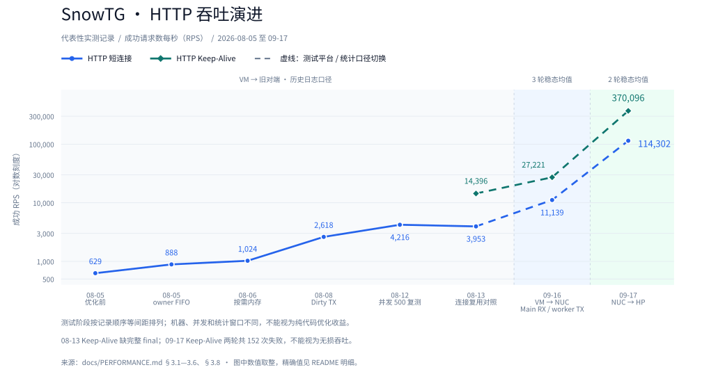

# traffic-gen 性能记录

**最新：[2026-09-26 同环境对照与容量边界](BENCHMARK.md)**，含 SnowTG / dperf / wrk、CPU 时间配额、RPS/PPS、错误与复现条件。以下保留历史口径，不能与新测评的服务端窗口 RPS 直接拼接。

短连接与 HTTP keep-alive GET 实测归档，历史记录更新至 **2026-09-20**。先看「指标说明」，再按日期读结果表；表内只放数字与结论关键词，解释性文字放表下备注。

---

## 1. 测试环境

| 项 | 值 |
| --- | --- |
| 08-05～08-13 服务端 | `192.168.21.106:8888` |
| 09-16 新服务端 | `192.168.10.86:8888`；i5-1240P / 16 线程 / 15.6 GiB / 1 Gbps，nginx |
| 负载形态 | 短连接 / HTTP keep-alive GET（按章节说明） |
| 历史默认时长 | 120 秒（表内另有说明除外） |
| 09-16 时长 | 模式 A/B 与候选复测每点 3×30 秒；参数探索每点 20 秒 |
| 客户端 | 本仓库 `traffic-gen` + `pro-stack`，真实 NIC |
| 09-16 客户端环境 | 16 vCPU VMware VM，vmxnet3 v1；Main lcore 1，workers 从 lcore 2 起 |
| 09-17 NUC 发流环境 | i5-1240P / I225-V / VFIO，1 Gbps；接收端 HP Ryzen 7 7730U / USB RTL8153 |

目标 CPS 是剧本设定值，不等于实测吞吐；应以 **成功 RPS / 实际 started CPS** 为准。

---

## 2. 指标说明

### 2.1 事务与吞吐

| 指标 | 含义 |
| --- | --- |
| **目标 CPS** | 剧本期望每秒发起的新事务数；调度上限，不是保证值 |
| **最大并发** | 剧本全局 in-flight 上限（`max_concurrency`）；启动时按 active shard **切开** |
| **workers** | 参与发包/状态机的 owner worker（lcore）数；active shard 数为 `min(workers, target_cps, max_concurrency)` |
| **started** | 已发起事务总数（含随后失败的） |
| **done** | 已结束事务总数（成功 + 失败） |
| **success** | L7 成功事务数（HTTP 2xx 等） |
| **fail** | 失败事务数 |
| **成功率** | `success / done × 100%` |
| **实际 started CPS** | `started / 时长`，真实发起速率 |
| **成功 RPS** | `success / 时长`，端到端成功完成速率（主吞吐指标） |

**09-16 使用稳态口径**：排除启动约 5 秒及末尾 2 秒，各 worker 按成功计数差 /
实际采样时间计算 RPS 后相加；表中再取三轮均值。稳态成功率与全程失败分别列出，
不能将稳态 100% 解读为整轮零失败。08-13 仍保留原 `success / 120 s` 口径。

### 2.2 延迟（phase latency）

单位多为毫秒或秒；多 worker 场景记为各 worker 的 **min–max 范围**。

| 指标 | 含义 |
| --- | --- |
| **connect** | 事务开始 → TCP 进入 CONNECTED |
| **first-rx** | 事务开始 → 读到首个应用层响应字节 |
| **complete** | 事务开始 → flow 终结回调（含关闭） |

`avg` / `max` 分别为样本均值与最大值。

09-16 的 `complete avg` 为稳态完成样本加权平均耗时，再跨轮取均值；未测 p99。

### 2.3 资源与丢包

| 指标 | 含义 |
| --- | --- |
| **live_sockets** | 仍占用 socket 槽位的连接数（含关闭中 / TIME_WAIT 等） |
| **live_sockets（结束→排空后）** | duration 结束时 → 排空阶段结束后的 live 数 |
| **tx_peak / payload_peak** | 运行期 TX mbuf / payload 缓冲占用峰值 |
| **paused / pauses** | 因本地资源不足触发的 scheduler 暂停次数相关计数 |
| **tx_alloc_fail** | TX / payload 分配失败次数 |
| **rx_ring_drops** | 软件 RX ring 丢包 |
| **tx_nic_drops** | 发往 NIC 路径上的丢包计数（日志已统计项） |
| **TX / RX** | 累计发送 / 接收包数（aggregate） |
| **ENFILE (errno=23)** | `socket_owner_adopt()` 槽位耗尽（traffic-gen 启动时选定的 per-owner capacity），不是 Linux 进程 fd 限制 |

### 2.4 Dirty TX（2026-08-08 起）

| 指标 | 含义 |
| --- | --- |
| **dirty budget 耗尽** | 单轮 flush 触达 `TX_DIRTY_BUDGET` 的次数 |
| **dirty depth** | dirty FIFO 队列深度相关观测 |
| **arp_wait** | 因 ARP 未解析而挂起等待的 TX 工作 |

路径健康时常见 `budget=0`、`depth=0`、`arp_wait=0`。

### 2.5 失败语义（解读用）

| 日志 / 现象 | 含义与边界 |
| --- | --- |
| **tcp accepted RST** | 本端收到对端 RST；不能单凭客户端日志断定为「对端性能不足」 |
| **rto-give-up kind=syn** | SYN 重传耗尽，connect 以 `ETIMEDOUT` 结束；可能是对端、网络或本端收发路径问题 |
| **资源计数全 0** | 仅排除**已统计**的本端 ring/分配失败；不排除 NIC 硬件计数、链路丢包、未覆盖路径 |

---

## 3. 结果年表

### 3.1 2026-08-05 — 基线与 owner-local FIFO

| 日期 | 改动 | 目标 CPS | 并发 | started | success | fail | 成功率 | 成功 RPS | 相对上次 | 瓶颈 |
| --- | ---: | ---: | ---: | ---: | ---: | ---: | ---: | ---: | --- | --- |
| 08-05 | 基线 | 100 | 1,000 | 11,999 | 11,999 | 0 | 100.00% | — | — | 低负载 |
| 08-05 | 优化前 | 1,000 | 100 | — | — | 44,143 | 63.09% | 628.99 | 未达目标 CPS | per-socket ring、memzone |
| 08-05 | owner-local FIFO | 1,000 | 100 | 106,601 | 106,601 | 0 | 100.00% | 888.34 | 成功 +41.1%；成功 RPS +259（+41%） | 并发 100、短连接 RTT |
| 08-05 | — | 100,000 | 100 | — | — | — | — | — | OOM killer 杀进程 | 每连接分配 sndbuf |

> 基线行未单独记成功 RPS；优化前行以当时日志的 success RPS / 成功率为准。

---

### 3.2 2026-08-06 — ARC-003 复测（含资源峰值）

ARC-003：按需内存分配、去除重复解析 scenario（详见 `DEVLOG.md`）。在真实 NIC 上跑通；**不得**把吞吐仍卡在 ~1k CPS 单纯归因于 mempool。

| 日期 | 改动 | 目标 CPS | 并发 | started | success | fail | 成功率 | 成功 RPS | live（结束→排空） | tx / payload peak | paused | tx_alloc_fail | 相对上次 | 瓶颈 |
| --- | --- | ---: | ---: | ---: | ---: | ---: | ---: | ---: | --- | --- | ---: | ---: | --- | --- |
| 08-06 | ARC-003 | 10,000 | 100 | 122,934 | 122,934 | 0 | 100.00% | 1,024.45 | 1,899 → 103 | 95 / 99 | 0 | 0 | vs 08-05 FIFO：成功 RPS +15% | 并发 100、RTT；目标 CPS 未触及 |
| 08-06 | ARC-003 | 100,000 | 100 | 115,366 | 115,366 | 0 | 100.00% | 961.38 | 1,937 → 92 | 50 / 50 | 0 | 0 | vs 同日 10k CPS：成功 RPS −6% | 抬目标 CPS 无收益 |
| 08-06 | ARC-003 | 100,000 | 1,000 | 124,291 | 123,422 | 869 | 99.30% | 1,028.52 | ~38 → 2（缺结束快照） | 866 / 868 | 0 | 0 | vs conc=100：吞吐几乎持平 | 对端 RST；并发抬升未转 CPS |
| 08-06 | ARC-003 | 100,000 | 10,000 | — | — | — | — | — | 未正常排空 | — | — | — | 恶化为 socket 表耗尽 | `NSOCK_ID_MAX=4096`；ENFILE |
| 08-07 | ARP 热路径 | 100,000 | 1,000 | 101,694 | 100,847 | 843 | 99.17% | 840.39 | 4（末次采样） | 866 / 868 | 0 | 0 | 无同环境对照，不归因吞吐 | 目标 CPS 未触及；ESTABLISHED RST |

**ARP 热路径（08-07）要点**

- request/reply → `arp_table_learn()`；TCP/UDP 入站 → `arp_table_confirm()`。
- 已存在且 MAC 未变的邻居：只刷新活跃时间，避免重复写缓存。
- `ARP_LOG_ENABLED` 默认关闭，避免热路径日志干扰统计。

---

### 3.3 2026-08-07 — 多 worker

默认：目标 100,000 CPS，时长 120 秒。数字为进程退出时的 aggregate。

#### 吞吐与结果

| workers | 并发 | started | done | success | fail | 成功率 | started CPS | 成功 RPS | TX / RX |
| ---: | ---: | ---: | ---: | ---: | ---: | ---: | ---: | ---: | --- |
| 2 | 1,000 | 74,032 | 74,032 | 72,977 | 1,055 | 98.57% | 616.93 | 608.14 | 2,730,563 / 6,421,976 |
| 4 | 1,000 | 82,449 | 82,449 | 81,525 | 924 | 98.88% | 687.08 | 679.38 | 3,048,874 / 7,174,200 |
| 4 | 10,000 | 78,668 | 78,668 | 66,251 | 12,417 | 84.22% | 655.57 | 552.09 | 2,801,307 / 5,830,088 |

#### 资源、延迟与结论

| workers | 并发 | 资源与丢包 | 延迟（worker 范围） | 结论 |
| ---: | ---: | --- | --- | --- |
| 2 | 1,000 | paused / tx_alloc_fail / rx_ring_drops / tx_nic_drops 均为 0；每 worker tx/payload peak 411–441 | connect avg 66–93 ms；first-rx avg 368–394 ms；complete avg 1.4–2.0 s；complete max 127 s | 远低于目标；1.43% 失败（ESTABLISHED RST、SYN RTO）；worker 启动 43,579 / 30,453，不均衡 |
| 4 | 1,000 | 同上均为 0；peak 219–246 | connect avg 74–106 ms；first-rx avg 345–435 ms；complete avg 1.2–2.9 s；complete max 127 s | vs 2w：成功 RPS +12%；失败率 1.12%；启动 25,473 / 21,394 / 24,993 / 10,589，仍不均衡 |
| 4 | 10,000 | 同上均为 0；peak 2,419–2,451 | connect avg 450–695 ms；first-rx avg 1.1–1.9 s；complete avg 15–18 s；complete max 140 s | vs 4w/1k：成功 RPS −19%；失败率 15.8%；`tokens≈2500` 积压；RST 与完成延迟显著恶化 |

**解读**

- 实际启动速率均不足目标的 0.7%；10k 并发未提升吞吐，反而放大 RST、完成延迟与失败率。
- 主瓶颈不在已统计的 RX ring、NIC 丢包或 TX/payload 分配失败。
- 1k 并发时 4 workers 名义上每核 25k CPS / 250 并发，但 started 仍不均衡；10k 时每核约 2,500 并发，`tokens` 仍积压而 complete 恶化到 15–18 s，说明准入之后完成/关闭路径或对端已饱和。
- 建议对端采 accept 队列、RST/重传、CPU；客户端采 NIC `xstats` 与 SYN/SYN-ACK/RST 抓包，按五元组关联后再归因。

---

### 3.4 2026-08-08 — dirty TX queue

**改动摘要**：worker 全量 `g_sock_list` TX 扫描 → owner-local 去重 dirty FIFO；TCP/UDP 新数据、控制段、RTO、窗口恢复标记 socket；ARP 未解析进入按 IPv4 分桶等待队列；单轮 flush 上限 `TX_DIRTY_BUDGET=64`。

实施前基线（ARC-004）：约 1.6 万 worker turns/s，约 4600–4900 万次 socket scan/flush，`flush_us≈970000`。

#### 复测（4 workers，目标 100k CPS，120 s）

1k 并发行：排空阶段 per-worker `stats` 汇总（日志交错，未见独立 aggregate 行）。  
10k 并发行：中途 `Ctrl+C`（exit 130），无完整排空。

##### 吞吐与结果

| workers | 并发 | started | done | success | fail | 成功率 | started CPS | 成功 RPS | TX / RX |
| ---: | ---: | ---: | ---: | ---: | ---: | ---: | ---: | ---: | --- |
| 4 | 1,000 | 315,774 | 315,724 | 314,112 | 1,612 | 99.49% | 2,631.45 | 2,617.60 | 11,628,138 / 43,347,456 |
| 4 | 10,000 | — | — | — | — | — | — | — | —（未跑满） |

##### 资源、延迟与结论

| workers | 并发 | 资源与丢包 | 延迟（worker 范围） | 结论 |
| ---: | ---: | --- | --- | --- |
| 4 | 1,000 | paused / tx_alloc_fail / ring drops 均为 0；tx/payload peak 157–207；dirty budget/depth/arp_wait=0 | connect avg 45 ms–1.56 s（max ≈30 s）；first-rx avg 107 ms–2.81 s；complete avg 150 ms–4.88 s（max ≈132–140 s） | vs 08-07 同场景成功 RPS 679：+1,938（+285%）；失败率仍约 0.5%；worker 启动 194k / 101k / 14k / 7k，不均衡加剧；dirty TX 健康，全表扫描已非主瓶颈 |
| 4 | 10,000 | 大量 `start failed … errno=23`（ENFILE）；paused / tx_alloc_fail 未见异常 | — | **动态容量改动前的历史结果**：全局 10k 切开后每 shard `active`≈2,500；固定 owner 容量 4,096，`live_sockets`（含 TIME_WAIT）可顶满该表；提高容量可消 ENFILE，不能单独解决 CPS/RST/不均衡 |

> 1k 并发下 dirty TX 显著提升吞吐，但仍远低于 100k CPS。主矛盾转向 worker 负载不均、SYN 失败/超时，以及调度只按 `active` 限流、未计入关闭中 socket。10k 并发仍先撞 ENFILE，无法与 1k 公平对比吞吐。

#### 多 worker 扩展（`http-100000cps-10000con.json`）

命令：`--workers N`；时长 120 s。剧本文件名含 `10000con`；下表 `目标 CPS` / 全局并发以当时 JSON 为准（均按 shard 切开，**不是** `workers × 并发`）。未特别注明时，数字为进程退出时的 aggregate。

##### 吞吐与结果

| 日期 | workers | 目标 CPS | 全局并发 | 每 shard 并发 | started | done | success | fail | 成功率 | started CPS | 成功 RPS | TX / RX |
| --- | ---: | ---: | ---: | ---: | ---: | ---: | ---: | ---: | ---: | ---: | ---: | --- |
| 08-08 | 8 | 100,000 | 500 | ≈62 | 1,430,504 | 1,430,504 | 1,430,479 | 25 | 99.998% | 11,920.87 | 11,920.66 | 52,927,945 / 197,406,102 |
| 08-12 | 8 | 100,000 | 1,000 | 125 | 499,007 | 499,007 | 498,583 | 424 | 99.915% | 4,158.39 | 4,154.86 | 18,455,378 / 68,804,454 |
| 08-12 | 4 | 100,000 | 500 | 125 | 577,585 | 577,585 | 577,559 | 26 | 99.995% | 4,813.21 | 4,812.99 | 21,370,090 / 79,703,142 |
| 08-12 | 8 | 15,000 | 500 | ≈62 | 505,996 | 505,996 | 505,946 | 50 | 99.990% | 4,216.63 | 4,216.22 | 18,720,742 / 69,820,548 |
| 08-12† | 8 | 100,000 | 5,000 | 625 | 473,828 | 473,828 | 468,228 | 5,600 | 98.818% | 3,948.57 | 3,901.90 | 17,420,192 / 64,615,464 |

† 排空阶段 `Ctrl+C`，无 `aggregate` 行；表内数字由 8 个 worker 末次稳定 `stats` 求和，CPS/RPS 仍按 `duration_sec=120` 计算。

##### 资源、延迟与结论

| 日期 | workers | 目标 CPS | 全局并发 | 资源与丢包 | 延迟（worker 范围） | 结论 |
| --- | ---: | ---: | ---: | --- | --- | --- |
| 08-08 | 8 | 100,000 | 500 | paused / tx_alloc_fail / rx_ring_drops / tx_nic_drops 均为 0；每 worker tx/payload peak ≈62–63；dirty budget/depth/arp_wait=0（运行中 dirty_hwm 约 15–50）；固定 owner 容量 4,096 | connect avg ≈14–16 ms（max ≈2–4 s）；first-rx avg ≈41–43 ms；complete avg ≈41–43 ms（max ≈32 s） | vs 同日 4w/1k：成功 RPS +9,303（+355%）；失败仅 25（多为 `rto-give-up kind=syn`）；worker started 172k–184k（比值 1.07） |
| 08-12 | 8 | 100,000 | 1,000 | paused / tx_alloc_fail / rx_ring_drops / tx_nic_drops 均为 0；每 worker tx/payload peak ≈110–125；dirty budget/depth/arp_wait=0（dirty_hwm 0–1）；自动 `socket_id_capacity=4096`（`max(4096, 2×125)`），无 ENFILE | connect avg ≈138–147 ms（max ≈8.1–8.2 s）；first-rx avg ≈223–237 ms（max ≈8.1–17.1 s）；complete avg ≈232–250 ms（max ≈32.1–32.4 s） | vs 08-08 8w/500：成功 RPS **−7,766（−65%）**；失败 424（排空期大量 `rto-give-up kind=syn`）；worker started 61.2k–65.1k（比值 1.06） |
| 08-12 | 4 | 100,000 | 500 | paused / tx_alloc_fail / rx_ring_drops / tx_nic_drops 均为 0；每 worker tx/payload peak ≈115–123；dirty budget/depth/arp_wait=0（运行中 dirty_hwm 约 15–64）；`socket_id_capacity=4096`，无 ENFILE；稳态 `active=125`、`tokens≈125` | connect avg ≈57–58 ms（max ≈2.1–4.1 s）；first-rx avg ≈102–105 ms（max ≈4.1–7.1 s）；complete avg ≈103–105 ms（max ≈7.1–32.0 s） | vs 08-08 8w/500：成功 RPS **−7,108（−60%）**；vs 同日 8w/1k：成功 RPS +658（+16%）；失败仅 26；worker started 143.3k–146.2k（比值 1.02） |
| 08-12 | 8 | 15,000 | 500 | paused / tx_alloc_fail / rx_ring_drops / tx_nic_drops 均为 0；每 worker tx/payload peak ≈49–62；dirty budget=0、depth≈11–17、hwm≈21–28；`socket_id_capacity=4096`，无 ENFILE；稳态 `tokens≈60–63`（贴每 shard ≈62） | connect avg ≈63–66 ms（max ≈2.1–4.1 s）；first-rx avg ≈116–120 ms（max ≈3.3–7.1 s）；complete avg ≈116–124 ms（max ≈32.0–32.3 s） | vs 08-08 **同结构** 8w/500：成功 RPS **−7,704（−65%）**；vs 同日 8w/1k：RPS 基本持平（+61）；未打到 15k 目标（仅用到约 28%）；失败 50；worker started 60.3k–65.3k（比值 1.08） |
| 08-12† | 8 | 100,000 | 5,000 | paused / tx_alloc_fail / rx_ring_drops / tx_nic_drops 均为 0；每 worker tx/payload peak ≈310–356；`socket_id_capacity=4096`（`max(4096, 2×625)`），无 ENFILE / 未见 `local port allocation failed`；稳态 `tokens=625`；排空末仍有 live 5–30 | connect avg ≈617–685 ms（max ≈16–17 s）；first-rx avg ≈1.06–1.15 s（max ≈35–67 s）；complete avg ≈1.25–1.42 s（max ≈63–125 s） | vs 同日 8w/500/15k：成功 RPS **−314（−7%）**；complete 从 ~120 ms 恶化到 **~1.3 s**；失败 5,600（成功率降至 98.8%）；worker started 54.4k–62.4k（比值 1.15） |

**解读**

- **08-08 / 8w / 500 / 100k CPS**：实际 started CPS ≈ 11.9k。Little's law：每 worker ≈1.5k CPS × 41 ms ≈ 61 in-flight，打满每 shard ≈62；资源侧干净。
- **08-12 / 8w / 1k / 100k CPS**：实际 ≈ 4.16k；每 shard 125 + complete ~244 ms → in-flight 贴满配额；抬并发后延迟恶化，吞吐下降。
- **08-12 / 4w / 500 / 100k CPS**：实际 ≈ 4.81k；每 shard 125 打满，complete ~104 ms；略优于同日 8w/1k，仍远低于 08-08。
- **08-12 / 8w / 500 / 15k CPS**：实际 ≈ 4.22k（目标的 28%）。与 08-08 **同为 8w + 全局 500**，但 complete 从 ~42 ms 恶化到 ~118 ms；Little's law：\(500 / 0.118 \approx 4.2\mathrm{k}\)，与实测一致。目标 CPS 已收到 15k（高于实测），**不是 token 瓶颈**；降 CPS 目标**未能**回到 08-08 的 ~12k，说明当日环境/对端延迟底噪已差于 08-08，或存在未对照的本端回归。
- **08-12 / 8w / 5k / 100k CPS**：实际 ≈ 3.95k。每 shard 625；Little's law：\(5000 / 1.33\mathrm{s} \approx 3.8\mathrm{k}\)，与实测一致。相对同日 500 并发档，并发×10 只换来更差的延迟与更多失败，RPS 不升反降。每 shard 625 仍低于 RSS 切分后的 ephemeral 端口池（约 ~2k/核），故未出现 10k 档的 `local port allocation failed`。
- **08-12 / 8w / 10k（未完整入表）**：稳态 `active=1250`、`live_sockets≈2000+`，大量 `tcp_connect: local port allocation failed` / `start failed errno=11`——端口池先于 socket 表耗尽（详见下文开放项）。
- 低并发档负载均衡尚可（started 比值 ≈1.02–1.08）；5k 档比值升至 1.15。失败以 SYN RTO / 对端 RST 为主。
- **socket 表**：ENFILE 见于高 per-shard `live` 顶满固定 4,096 时（如 4w/10k），不是 `workers × max_concurrency`。08-12 的 500/1k/5k 自动容量下均未撞表。
- **socket 容量策略（当前代码）**：`max(4096, 2 × ceil(max_concurrency / active_shards))`，可用 `--socket-id-max N` 增大。临时端口范围为 `49152–65535`（16384 个），再按 RSS 亲和切到各 worker。

##### 08-12 并发扫参 + SYN 抓包（材料 [`debug/2026-08-12/`](../debug/2026-08-12/)）

固定 8w、`target_cps=8000`，扫全局并发 250/500/750（~120s）。RPS 约 1205 → 1151 → 1138，complete p50 约 42 → 106 → 158 ms；无 ENFILE/端口耗尽。抓包 SYN→SYN-ACK：250 档 p50/p99 ≈19/35 ms、几乎无重传；750 档 p50/p99 ≈29/**1057** ms，SYN retrans 流约 4.5%。

**原因**：吞吐受「并发 ÷ 完成时延」约束；抬并发后对端/路径握手变慢（长尾+重传），占满客户端并发槽，RPS 不升反降——不是本机 TX/socket 表发不动。08-08→08-12 同结构 ~12k→~4k 的底噪差异仍可能含环境/对端变化，未单独做回归对照。

---

### 3.5 2026-08-13 — HTTP keep-alive 与短连接对照

固定 8 workers、目标 100,000 CPS、`duration=120 s`、对端
`192.168.21.106:8888`，只改变 HTTP `keepalive`。短连接 CSV 与
`-keepalive.csv` 使用相同并发档位；成功 RPS 为 `success / 120 s`。
复现实验脚本、统计口径和 Canvas 归档见
[`debug/2026-08-13/`](../debug/2026-08-13/)。

#### 吞吐、可靠性与时延

| 并发 | 模式 | started | success | fail | 成功率 | 成功 RPS | complete avg |
| ---: | --- | ---: | ---: | ---: | ---: | ---: | ---: |
| 500 | 短连接 | 477,148 | 474,412 | 2,736 | 99.427% | 3,953.43 | 126.1 ms |
| 500 | keep-alive | 1,730,148 | 1,727,547 | 2,601 | 99.850% | **14,396.23** | **34.6 ms** |
| 1,000 | 短连接 | 457,686 | 456,950 | 736 | 99.839% | 3,807.92 | 263.0 ms |
| 1,000 | keep-alive | 1,685,541 | 1,650,874 | 34,667 | 97.943% | **13,757.28** | **71.3 ms** |
| 5,000 | 短连接† | 517,253 | 463,892 | 53,361 | 89.684% | 3,865.77 | 1,172.1 ms |
| 5,000 | keep-alive† | 1,354,940 | 1,132,166 | 222,774 | 83.558% | **9,434.72** | **445.1 ms** |

† 5,000 档短连接与三份 keep-alive CSV 都没有完整 aggregate/final
行，采用最后一个完整的 8-worker 累计快照；因此不能把它们当作已完成排空的
最终结果。

- keep-alive 的成功 RPS 相对同日短连接提高 **3.64× / 3.61× / 2.44×**，
  complete 平均时延下降 **72.6% / 72.9% / 62.0%**。
- 500 并发 keep-alive 的 14,396 RPS 高于 08-08 的短连接最佳
  11,920.66 RPS（约 **+20.8%**）；跨日期差异仍只能作为参考。
- 500 并发 keep-alive 的 `complete≈34.6 ms` 与
  `500 / 34.6 ms≈14.5k CPS` 相符；若保持 500 并发而达到 100k CPS，
  平均完成时延需低于 5 ms，因此当前上限由响应路径时延和并发窗口共同决定。
- 该 CSV 不能单独证明是对端 CPU 瓶颈；但本端已统计资源与丢包项均为 0，
  若同次运行的日志出现对端 RST，应优先核查服务端处理延迟、连接上限、
  accept queue、RST/重传及 keep-alive 配置。
- 与 08-12 的短连接 8w/1k、8w/5k（4,154.86、3,901.90 RPS）相比，
  keep-alive 分别达到约 **3.31×、2.42×**，但高并发可靠性明显下降。

#### 连接池负载与握手压力

短连接三档均为 `connections_reused=0`，基本每个事务都要新建 TCP；
keep-alive 三档均满足不变量
`connections_created + connections_reused == started`：

| 并发 | pool max / shard | created | reused | 复用率 | 平均事务 / 物理连接 | live_sockets：运行末 → 最后快照 |
| ---: | ---: | ---: | ---: | ---: | ---: | ---: |
| 500 | ≈62/63 | 18,867 | 1,711,281 | 98.91% | 91.7 | 845 → 38 |
| 1,000 | 125 | 40,293 | 1,645,248 | 97.61% | 41.8 | 1,382 → 210 |
| 5,000 | 625 | 225,623 | 1,129,317 | 83.35% | 6.0 | 8,423 → 737 |

keep-alive **不是扩大服务端 `accepted_queue`**，而是把大量逻辑事务复用
到少量物理 TCP 连接上：例如 500 并发用约 18,867 条物理连接承载
1,730,148 个事务。新建连接速率下降后，SYN/SYN-ACK、服务端 accept
和短连接关闭的压力同步下降，这与 accepted queue 不再被频繁握手占满的
机制一致。客户端侧也能看到 `fail_connect` 从短连接的
2,732 / 254 / 36,645 降至 keep-alive 的 0 / 5 / 10,670。

本次 CSV 没有服务端 accept queue 深度或 overflow/drop 计数，因此上面是
由连接复用、建连失败和吞吐变化支持的解释，不是对 queue 的直接测量；后续
仍应同时采集服务端 accept queue、`ListenOverflows/ListenDrops` 及
SYN/RST 抓包。

高并发的代价也很清楚：keep-alive 失败从 `fail_connect` 转移到已建立连接
上的 I/O/HTTP protocol。1,000 档 `fail_proto=22,368`，5,000 档
`fail_proto=175,060`；同时 5,000 档平均每条物理连接只承载约 6 个事务，
连接池进入高 churn，而不是单纯的握手瓶颈。六次运行的
`tx_alloc_fail`、`rx_ring_drops`、`tx_nic_drops` 均为 0。

---

### 3.6 2026-09-16 — 多 RX/TX、强对端与参数扫描

新增 worker 独占 TX、RSS 多 RX 直接收包、错队列 owner 转交及 Main/NIC 观测
（[ARC-009](DEVLOG.md#arc-009多-rxtx-队列与-worker-直接收发)）。
旧对端在本轮诊断中 CPU 达 95%–100%，随后切换至 §1 的 NUC 对端；
这不能反推 08-13 当天也一定是对端 CPU 饱和。

#### 与 08-13 的跨日期变化

均为 **8 workers、全局并发 500、目标 100k CPS**；09-16 使用 Main RX + worker TX。

| 模式 | 08-13 成功 RPS | 09-16 成功 RPS | 变为原来的 | 增长 |
| --- | ---: | ---: | ---: | ---: |
| 短连接 | 3,953.43 | **11,161** | **2.82×** | **+182.3%** |
| keep-alive | 14,396.23 | **27,262** | **1.89×** | **+89.4%** |

这是跨日期的实测变化，包含代码、对端、链路、服务配置和统计窗口差异，
**不能全部归因于多 RX/TX 改造**。08-13 keep-alive 原记录还缺少完整 final/排空数据。
同环境收发路径的收益见下表；跨日期百分比不与其叠加。

#### 同环境收发路径 A/B

同一新对端、同一二进制切换模式，8 workers、并发 500，每点 3×30 秒，
第二轮反转模式顺序。Main/Main 复现集中收发路径，用于衡量路径切换收益。

| RX / TX | 短连接 RPS | keep-alive RPS | 较 Main/Main | 短连接 RX missed（三轮稳态合计） |
| --- | ---: | ---: | --- | ---: |
| Main / Main | 8,280 | 19,596 | 基线 | 13,323 |
| Main / worker | **11,161** | **27,262** | **+34.80% / +39.12%** | **0** |
| worker / worker | 8,666 | 23,504 | +4.67% / +19.94% | 15,198 |

18 轮均正常退出并排空，稳态成功率均为 100%；Main/Main keep-alive 第三轮
启动阶段仍有 40 次协议失败，未归因。直接 RX 的短连接增幅与基线 4.71% 的组内波动接近，
不作为稳定增益。原始记录保留本地，见 [实验数据索引](../debug/README.md)。

#### workers / 并发扫描与重复验证

覆盖 1/2/4/6/7/8/12 workers、并发 64～8000，分阶段探索与对照 58 组，
再对四个候选各重复 3×30 秒，共 **70 轮**。以下均为 Main RX + worker TX：

| 场景 | workers | 并发 | 三轮成功 RPS | 均值 | complete avg | 全程失败合计 |
| --- | ---: | ---: | --- | ---: | ---: | ---: |
| 短连接（推荐） | 8 | **256** | 11163 / 11209 / 11044 | **11,139** | **22.52 ms** | **0** |
| 短连接 | 8 | 4,000 | 11093 / 10922 / 10936 | 10,983 | 364.16 ms | 2 |
| keep-alive（推荐） | 8 | **1,000** | 27411 / 27212 / 27042 | **27,221** | 36.01 ms | **0** |
| keep-alive | 7 | 1,000 | 26420 / 26756 / 26659 | 26,612 | 36.88 ms | 0 |

推荐组波动分别为 1.48% / 1.36%，稳态成功率均为 100%，RX missed、RX ring drops、
TX NIC drops 均为 0。探索单次最高 11,513 / 28,885 RPS 未在对应组合的重复测试中复现，
不作为稳定上限。参数调整未带来相较前轮并发 500 的明确新吞吐增益。

#### 瓶颈与边界

- **多 RX 未实际分流**：成功配置 8 RX，但实流量与独立 testpmd 均只有 RXQ0 收包；
  直接收发时 worker 0 兼顾接收、转交和自身业务，RXQ0 满 burst 比例为 100%。
  当前收益主要来自 worker 独占 TX；此 PMD 的 `rte_flow queue` 验证返回 ENOSYS，
  FDIR 无法补上分流。6/7 workers 实际回退为 1 RX + 6/7 TX，核数比较同时包含队列配置变化。
- **RXQ0 定位补测**：绕过 SnowTG，独立 DPDK 将整张 RETA 强制指向 RXQ1，
  实收 **8190** 个 TCP 探针包仍全部进入 RXQ0，覆盖 **4096** 个源端口，RSS 哈希标记为 **0**。
  Linux vmxnet3 同样配置下完成 **256/256** 次真实 HTTP 连接，单播 RX 增量 **1477/0/…/0**。
  因而问题已定位到当前 VMware 虚拟接收路径未执行 RSS；DPDK RETA 读回只是配置副本，
  不能作为硬件分流成功证据。宿主机为 Workstation 17.6、有线地址 `192.168.10.254`，
  本轮同在 192.168.10 网段；用户确认自动桥接、I219-V 有线 Up / 1 Gbps、WLAN 断开，
  Windows RSS 查询无对象。宿主机直连的 **128/128** 次 HTTP 也成功、强制 RXQ1 仍只收 RXQ0。
  没有依据归因于 Wi-Fi；物理 RSS 与虚拟队列分流不能等同，
  仍需区分 Workstation 后端限制与宿主机配置。见 [本地定位数据](../debug/README.md)。
- **高并发的明确拥塞点是 Main→worker ring**：8 workers 短连接并发 256→4000，
  吞吐未增、平均完成时间约增至 16.2 倍，三轮稳态 RX ring drops 达 **139949**，
  同期 NIC RX missed 为 0。扩大并发或 ring 不能单独解决处理速率平台。
- **新对端 CPU、链路带宽未跑满**：推荐组对端平均 CPU **7.29% / 8.70%**，
  最忙核约 31%；客户端 NIC RX/TX 均不足 60 Mbps。Main CPU 约 99.5%–99.7%，
  worker 为 98.92%–100%，包含空轮询，不能仅凭 CPU 百分比定位热点。
- **待验证的固定开销**：前轮 RDTSC 微基准约 **4.1–4.2 μs/次**，worker 主循环每轮
  至少 11 次读时钟。已有 perf 仅覆盖 Main；需补 worker 剖析与读时钟/观测开销 A/B，
  尚不能给出它们对吞吐损失的精确占比。单 RX 也不能解释全部性能上限。
- **可靠性口径**：零请求失败不代表网络零丢包，推荐组服务端主机级 TCP 重传计数仍增长；
  不能将剩余损失完全归于客户端或对端。当天网络与宿主机代理的影响未单独隔离，
  以上是当前环境的可复现水平，不是硬件绝对上限。

完整矩阵、逐 lcore CPU、失败类型、原始 CSV、二进制/源码记录与复现计划见
[本地参数扫描数据索引](../debug/README.md)。
70 轮均通过退出、计数闭合、排空与统计完整性核对，压测后网卡及原地址/路由已恢复。

---

### 3.7 2026-09-17 — NUC 硬件 RSS 可行性验证

`192.168.10.86` 是裸机，Intel I225-V / igc 已启用 **4 RX + 4 TX**、128 项 RETA、
TCP 四元组 RSS；RPS 为关闭状态。向现有 nginx 发起 **2048 次独立 HTTP 连接、16 并发**，
全部成功，四个 RX 队列增量为 **2565 / 2563 / 2507 / 2627**，占比约
**25.00% / 24.98% / 24.43% / 25.60%**；RX missed 和各队列 drops 增量为 0。
这验证了真实硬件分流，计数含少量管理/背景流量；不是 RPS 容量测试，也尚未运行 NUC 上的 DPDK A/B。

后续适合测试 1/2/4 workers。内核当前 UDP 哈希仅包含 IP，DPDK 需独立配置。
同日已部署与 VM 同源码的 DPDK 26.07.0-rc3 / SnowTG、预留 2 GiB 大页，双机构建及回归通过。
增加限定源/目标地址的临时策略路由后，Wi-Fi SSH 回程走 wlo1，实际接管有线口期间保持可用。
**VFIO Type 1 + net_igc + 4 RX/4 TX** 启动成功，256 个不同源端口的 UDP 探针
全部收到、全部带 RSS 标记，队列计数为 **64/64/64/64**；NIC RX missed/errors/nombuf 为 0。
此轮 testpmd 协商为 **100 Mbps**，恢复 igc 内核驱动后回到 **1 Gbps**，原因待查；
仅证明分流和部署可用，不作为吞吐上限或架构收益。此阶段尚未进行 RPS A/B，后续容量与对照结果见 §3.8。
数据位置见 [本地实验索引](../debug/README.md)。

---

### 3.8 2026-09-17 — NUC 发流，HP 裸机接收

NUC（i5-1240P / I225-V / VFIO）从 `192.168.10.86` 发流至
`192.168.10.234`（HP Laptop 15-fc0xxx / Ryzen 7 7730U / 15322 MiB）。
对端 nginx `:8888`、dnsmasq `:1053`；USB3 RTL8153 / r8152 只有 1 RX + 1 TX。
内核 iperf3 正向、反向**分开测量**约 **938 / 942 Mbps**，不是同时双向结果，不能据此推定小包处理能力。

**基础扫描**：Main=E 核 CPU8，workers=P 核 CPU0/2/4/6；worker RX/TX，
目标 100 万 CPS，24 点各 20 秒，socket 容量默认每 owner 4096；对端软件 RPS 关闭。
下表为稳态成功 RPS，括号为**全程失败数**；带失败的峰值不是无损容量。

| 场景 / workers | 并发 32 | 并发 128 | 并发 512 | 并发 2048 |
|---|---:|---:|---:|---:|
| short / 1w | 19,017 (0) | 31,819 (902,424) | 31,473 (1,080,352) | 29,554 (1,134,464) |
| short / 2w | 17,739 (0) | 34,277 (128) | 34,904 (513) | 34,479 (651,166) |
| short / 4w | 14,348 (80) | 32,864 (64) | 34,643 (560) | 34,445 (3,825) |
| keepalive / 1w | 57,116 (0) | 126,909 (128) | 151,942 (2,341) | 133,444 (89,731) |
| keepalive / 2w | 48,127 (0) | 126,252 (128) | 141,714 (2,350) | 134,091 (21,124) |
| keepalive / 4w | 48,333 (40) | 117,095 (144) | 137,540 (2,377) | 132,083 (20,975) |

**定位与对照**：

- 单 worker 短连接并发 128 时，`live_sockets` 顶到 **4096**，出现 ENFILE；稳态成功率仅 **32.83%**。
  同二进制用现有 `--socket-id-max 16384` 复测 30 秒：**34,140 RPS / 99.9995%**，全程失败 6。
  对比默认容量的 31,819 RPS，主要收益是消除资源失败；并发数不能代表关闭中 socket 的总占用。
- 对端 RPS 关闭时，HTTP 高负载的 CPU10 **%soft≈100%**，NUC NIC missed 为 0。
  对端启用 `rx-0/rps_cpus=5155`，将协议处理分到 7 个物理核并避开 USB IRQ 核；
  这是 Linux 软件分流，不是 NUC 硬件 RSS，也不是 SnowTG 代码收益。
- 4w / 并发 512 / Keep-Alive，RPS 开启的两轮 30 秒分别为 **369,969 / 370,059 RPS**，
  均值 **370,014**；关闭后同参数 30 秒为 **141,645 RPS**，约 **+161.2%（2.61×）**。
  开启两轮全程失败 **182 / 665**、稳态成功率 **99.9987% / 99.9981%**，不能称零失败。
- 上述两轮 NIC TX 约 98 MB/s、112 万 packets/s。I225-V PMD 字节计数扣除了 FCS；
  按 `(obytes + opackets × 24) × 8` 补计 FCS、前导码和 IFG，发送线速约 **999.6 / 999.4 Mbps**。
  Keep-Alive 此时已接近当前 **1 Gbps TX 链路**上限，尚不能据此确定 NUC CPU 或 2.5 Gbps 端口的极限。
- 短连接启用对端 RPS 后单次 **47,314 RPS**，但稳态成功率 **97.78%**、全程失败 25,117，
  仍需控制本端 socket/连接注册容量；不把这个带失败结果作为推荐容量。

**同机收发模式对照**：2 workers（CPU0/2），Main=CPU4，均为独立 P 核；
对端 RPS=5155，所有模式 `--socket-id-max 16384`。短连接并发128，Keep-Alive并发512，
预定每点2×30秒、第二轮反转模式顺序；使用 ARP 重试修复前的同一二进制。
100 Mbps 异常轮不计入均值，使用新名字重测；下方 ARP 修复后候选另列，不混入该 A/B。

| RX / TX | 短连接各轮 RPS → 均值 | Keep-Alive 各轮 RPS → 均值 | Main CPU 短 / KA | 全程失败合计 短 / KA |
|---|---|---|---|---|
| Main / Main | 50357 / 50365 → **50361** | 369979 / 370014 → **369997** | 99.96% / 100.00% | 256 / 732 |
| Main / worker | 52580 / 53323 → **52952** | 223615 / 370107 → **296861** | 100.00% / 100.02% | 256 / 2862 |
| worker / worker | 52515 / 52446 → **52481** | 370056 / 370114 → **370085** | 2.10% / 2.15% | 0 / 228 |

直接收发较集中收发：短连接 **+4.21%**，Keep-Alive **+0.024%（线速下基本持平）**；
Main CPU 从约100%降到 **2.1%**，两 worker 仍约100% busy poll。
Main RX + worker TX 的 Keep-Alive 首轮低值保留；第三轮补测 **370,060 RPS**，
不能把该波动解释为必然的架构退化。低值轮 Main RX 空轮询约99.73%、NIC missed=0，
对端 CPU10 软中断约95.16%，仍需进一步区分对端处理波动和收发批次形态。

直接收发短连接两轮全程零请求失败，约 **52,481 RPS / complete avg 2.43 ms**；
Keep-Alive 两轮约 **370,085 RPS / 1.38 ms**，全程失败合计228。
这是 NUC→HP 的新平台结果，不能把与 VM 的差值全部归为多队列代码收益。
NUC 两队列实际均衡收包；少量 handoff 包含 ARP 广播复制，与 VM 全部进入 RX0 的情形不同。

**调优与 ARP 修复后的候选**：对端软件 RPS 开启，HTTP 使用每 owner 容量16384。

| 场景 / 配置 | 实测成功 RPS | 全程失败 | 口径 |
|---|---:|---:|---|
| 短连接 1w / 并发512 | **112608 / 115997，均值114302** | **0 / 0** | ARP 修复后，2×30秒 |
| 短连接 4w / 并发512 | 114707 | 0 | ARP 修复后，单次30秒；未优于单 worker 档位 |
| Keep-Alive 2w / 并发512 | **370129 / 370063，均值370096** | 7 / 145 | ARP 修复后，2×30秒；约999.99 / 999.85 Mbps TX线速 |
| Keep-Alive 1w / 并发512 | 369392 | 98 | ARP 修复前，单次30秒；单P核已接近线速 |
| Keep-Alive 2w / 并发256 | 285251 | 0 | ARP 修复前，单次30秒的零失败候选 |
| DNS 4w / 并发128 / 目标10万CPS | **92891** | **0** | ARP 修复后，单次20秒；未达到目标10万，不是DNS绝对上限 |

**高并发边界**：ARP 修复前同二进制、并发2048、容量16384，每点20秒；
1 worker 为 **73218 RPS / 稳态成功率93.38% / NIC missed 64890**，RX满burst约89.83%。
2 workers 为 **117740 RPS / 全程零失败 / NIC missed 0**，4 workers 为 **118313 RPS / 全程失败2048 / NIC missed 0**。
两队列解除单 worker 收包拥塞，但相比并发512，继续加并发主要增加耗时：
2w/2048 complete avg **17.47 ms**，修复后推荐1w/512约 **4.46 ms**。
118313 是带失败的单次探索峰值；当前更实用的短连接参数为 **1w / 并发512 / 容量16384**。

**启动可靠性修复**：抓包与CSV显示，旧路径前5秒停在ARP等待，首个非零成功采样在第6秒；
代码中的 INCOMPLETE 邻居没有周期唤醒 parked TX，首个ARP丢失时只能等应用超时后新请求重新触发探测。
在既有每秒维护中按探测间隔唤醒等待队列；丢失首个ARP的回归用例修复前失败、修复后及双机完整回归通过。
1w/512 两轮失败 **512/512→0/0**，首个成功采样提前到第3秒（1秒采样粒度）。
全程 `success/30s` 均值 **96232→106535 RPS（+10.7%）**；稳态均值 **115793→114302 RPS**，
收益来自缩短启动空窗与消除超时，不能宣传为稳态吞吐提升。首个ARP丢失的具体链路位置仍未确定。
ARP、lcore枚举和启动等待都是普通修复，不单列架构编号。

DNS 修复前目标1万/5万/10万CPS分别约 **10000 / 50000 / 93021 RPS**，全程失败 **0 / 122 / 128**；
本轮服务端 UDP `RcvbufErrors/InErrors` 增量均为0。DNS 约75%报文跨owner转交，TCP已做RSS端口亲和，
不能据TCP的队列亲和结果断言UDP也无需handoff。

**有效性与改动**：每轮保存链路、逐队列 RX、逐 lcore CPU、对端 SNMP/软中断与源码/二进制哈希。
少数轮次偶发协商到 **100 Mbps**，已保留并排除出千兆对比，不能归因于收发模式。
本轮修复了 Main lcore 编号较大时遗漏低编号 worker 的枚举问题，并在启动发流前等待链路就绪（最多 20 秒）；
后者不保证协商为千兆；随后完成上述ARP重试修复。两端均完成构建、完整回归与实际 lcore 布局检查。
原始数据及复现入口见 [本地实验索引](../debug/README.md)。

#### 3.8.1 固定配置与复现

| 项目 | NUC 发流端 | HP 接收端 |
|---|---|---|
| 机器 | Intel NUC12WSKi5，i5-1240P，12核16线程，15.6 GiB | HP Laptop 15-fc0xxx，Ryzen 7 7730U，8核16线程，15322 MiB |
| 系统 | Ubuntu 20.04.6，Linux 5.15.0-139，GCC 9.4 | Ubuntu 20.04.6，Linux 5.15.0-139，接交流电，CPU governor=`ondemand` |
| 数据口 | `0000:64:00.0` / I225-V `8086:15f3 rev03`，4 RX / 4 TX，RETA=128、RSS key=40B | `enx00e04c177428` / RTL8153，USB 5000M，1 RX / 1 TX |
| 地址 / 驱动 | `192.168.10.86/24`，压测用 `vfio-pci`，恢复后 `igc` / `enp100s0` | `192.168.10.234/24`，`r8152` |
| 链路 | 本轮有效样本均为 1000 Mbps；网卡硬件最高2.5 Gbps | 1000 Mbps，USB IRQ37主要落在CPU10/11 |
| DPDK / 内存 | 26.07.0-rc3，源码 `1fdcbea124bbd5b7de69ea02473e6626c1aee0d3`，2 GiB巨页，EAL `-m 1024` | 内核收包；软件 RPS 关闭=`0000`，开启=`5155` |
| 服务 | SnowTG，指标采样 `--metrics-sample 1024`，CSV间隔1秒 | nginx自动16 workers / HTTP 8888；dnsmasq / DNS 1053 |

NUC 的 P 核 SMT 配对为0/1、2/3、4/5、6/7，E 核为8–15；以下 worker 只用各 P 核的一个线程。
所有并发均为全局值，启动后按 active shards 划分；HTTP `target_cps=1000000` 是饱和调度目标。

| 实验 | EAL lcores / Main | 应用参数 |
|---|---|---|
| 原始扫描 | `8,0` / `8,0,2` / `8,0,2,4,6`；Main=8 | workers=1/2/4，并发32/128/512/2048，各20秒；容量4096，HP RPS关闭 |
| 同机架构 A/B | `4,0,2`，Main=4 | 2w；short并发128 / KA并发512；容量16384，HP RPS开启；每点2×30秒 |
| 修复后短连接推荐 | `8,0`，Main=8 | 1w，并发512，容量16384，HP RPS开启；2×30秒 |
| 修复后 KA 推荐 | `4,0,2`，Main=4 | 2w，并发512，容量16384，HP RPS开启；2×30秒 |
| 短连接探索峰值 | `8,0,2,4,6`，Main=8 | 4w，并发2048，容量16384，HP RPS开启；20秒，ARP修复前 |
| 修复后 DNS | `8,0,2,4,6`，Main=8 | 4w，并发128，目标100000 CPS，容量4096，HP RPS开启；20秒 |

峰值与推荐值的版本不同。架构 A/B、容量扫描使用 `traffic-gen-ready`，SHA256前缀 `202aa0e9c8d4`；
修复后候选使用 `traffic-gen-arp-fixed`，前缀 `2fe2abbc3403`。完整哈希、源码差异和命令均在逐轮 manifest 中。
本次默认容量调整发生在以上测试之后，不把历史结果标成新二进制的复测。

HP 的 `/home/lc/work/snowtg-20260917/nginx.conf`：

```nginx
worker_processes auto;
worker_rlimit_nofile 65535;
pid /home/lc/work/snowtg-20260917/nginx.pid;
error_log /home/lc/work/snowtg-20260917/nginx-error.log crit;
events { use epoll; worker_connections 16384; multi_accept on; }
http {
    access_log off;
    server_tokens off;
    tcp_nodelay on;
    keepalive_timeout 1s;
    keepalive_requests 1000;
    reset_timedout_connection on;
    server {
        listen 192.168.10.234:8888 reuseport;
        location / { default_type text/plain; return 200 "ok\n"; }
    }
}
```

同目录 `dnsmasq.conf`：

```ini
port=1053
listen-address=192.168.10.234
bind-interfaces
no-resolv
no-hosts
address=/snowtg.test/192.0.2.1
local-ttl=0
pid-file=/home/lc/work/snowtg-20260917/dnsmasq.pid
log-facility=/home/lc/work/snowtg-20260917/dnsmasq.log
```

服务已保留；重新部署时分别使用 `sudo nginx -c /home/lc/work/snowtg-20260917/nginx.conf`
和 `sudo dnsmasq --conf-file=/home/lc/work/snowtg-20260917/dnsmasq.conf`。
SnowTG 客户端每连接最多复用100次，nginx允许1000次，两者不能混为一谈。
调优组需要在 HP 启用以下软件分流；CPU掩码适用于本机的核布局，测试结束恢复原值：

```bash
# HP，保存原值后开启；本轮测试前后原值均为0000
peer_rps_path=/sys/class/net/enx00e04c177428/queues/rx-0/rps_cpus
peer_rps_before=$(cat "$peer_rps_path")
printf '5155\n' | sudo tee "$peer_rps_path"
# 测试完成后
printf '%s\n' "$peer_rps_before" | sudo tee "$peer_rps_path"
```

`5155` 将协议处理分到CPU0/2/4/6/8/12/14；原来CPU10软中断接近100%。
这里的 RPS 是 Linux Receive Packet Steering，与“每秒请求数”及网卡硬件 RSS 是三个概念。
[机制说明见 Linux 内核文档](https://docs.kernel.org/networking/scaling.html#rps-receive-packet-steering)。

短连接 `short.json`（KA只把 `keepalive` 改为 `true`）：

```json
{
  "name": "nuc-short", "duration_sec": 30, "max_concurrency": 512,
  "target_cps": 1000000, "report_interval_sec": 1,
  "classes": [{
    "name": "http_get", "weight": 1, "transport": "tcp",
    "peer": {"ip": "192.168.10.234", "port": 8888},
    "http": {"method": "GET", "path": "/", "keepalive": false}
  }]
}
```

DNS 将顶层改为 `duration_sec=20`、`max_concurrency=128`、`target_cps=100000`，
class 改为 `transport="udp"`、端口1053及 `"dns":{"qname":"snowtg.test","qtype":"A"}`，删除 `http` 字段。
NUC 通过 Wi-Fi `192.168.21.187` 独立管理，有线口用于数据；绑定及恢复操作见 README 的 `bind-dpdk.sh`。
已有巨页配置和独立管理通道后，短连接启动命令为：

```bash
cd /home/lca/work/dpdk-l
source /home/lca/work/snowtg-env.sh
# 确认独立管理连接回程不经过有线口后执行
./bind-dpdk.sh --driver vfio-pci --force 0000:64:00.0
run_dir=$(mktemp -d /home/lca/work/snowtg-run-XXXXXX)
sudo env LD_LIBRARY_PATH="$LD_LIBRARY_PATH" ./traffic-gen/build/traffic-gen \
  -l 8,0 --main-lcore 8 -a 0000:64:00.0 --file-prefix snowtg-bench -m 1024 -- \
  --workers 1 --local-ip 192.168.10.86 --port-id 0 \
  --rx-mode worker --tx-mode worker --socket-id-max 16384 \
  --metrics-sample 1024 --stats-csv "$run_dir/workers.csv" \
  --dataplane-csv "$run_dir/main.csv" short.json > "$run_dir/traffic-gen.log" 2>&1
# 完成后恢复内核网卡与地址，再运行内核iperf3
./bind-dpdk.sh --driver igc 0000:64:00.0
sudo nmcli connection up enp100s0-static
```

KA换成 `-l 4,0,2 --main-lcore 4 --workers 2` 及 KA scenario；
重现原始4096容量实验（包括DNS）时，新版本必须显式传 `--socket-id-max 4096`。
架构 A/B 仅切换 `--rx-mode` / `--tx-mode`，其他参数与二进制固定；每轮核对1 Gbps及实际 RX 队列计数。
以上是直接运行入口；完整采集脚本还记录逐秒链路、逐lcore CPU、HP CPU/softirq/SNMP和源码哈希，位于下方归档。

**统计与数据路径**：72轮完成，其中65轮全程千兆；4轮100 Mbps和3轮早期链路诊断排除容量对比。
稳态成功 RPS 为逐worker成功计数差/实际采样时长之和，去掉启动约5秒及末尾2秒；全程失败单独统计。
OS CPU包含空轮询，不能等同有效工作占比。NIC线速估算补计每包24B的FCS/前导码/IFG。

- VM：`/home/snow/dpdk-l/debug/2026-09-17-nuc-bench/`。
- NUC：`/home/lca/work/snowtg-bench-20260917/`。
- 全部逐轮结果与参数：`matrix.csv` / `matrix.md`、`results.json`；CPU：`lcores.csv`；有效性：`validation.json`。
- 原始证据：`raw/<run>/` 内的 scenario、manifest、workers/main CSV、日志、链路、两端CPU及对端SNMP。
- 原始数据与二进制不加入Git；本节保存配置、结论和复现方法，历史快照不随新代码覆盖。

#### 3.8.2 Socket 容量与热路径更新

本轮将 **traffic-gen 自动容量下限4096→16384 / owner**：
`max(16384, 2 × ceil(max_concurrency / active_shards))`。
显式 `--socket-id-max N` 可覆盖默认值，最低须满足 `max(4096, 2 × ceil(max_concurrency / active_shards))`，
小内存环境仍可选4096。协议栈独立示例的默认4096保持不变。

已有“动态容量”是**启动时按剧本计算**；owner槽位、连接注册表、flow map和事件队列随后一次性分配。
运行中的资源水位检查、暂停/恢复 admission、ready/dirty事件更新都保留，但**不会扩容这些表**。
短连接结束后 socket 可能仍处于关闭/TIME_WAIT，因此512个in-flight并不意味着只需512个socket槽位。
16384是本轮已通过显式参数验证的配置，代价是增加每owner的表与队列内存，仍非任意负载的容量保证。
本次代码只调整启动默认值与覆盖策略，不向收发热路径增加分配、锁或搬表。

容量策略回归覆盖自动下限、大并发增长、显式缩小及分片向上取整边界；VM与NUC均验证构建和net_null实际启动。
本次验证日志另存 `debug/2026-09-17-capacity-default/`，不混入上面的性能样本。

#### 3.8.3 用 iperf3 核对正向、反向与同时双向 Mbps

在网卡使用内核 `igc`、地址恢复后测试。HP启动服务：

```bash
iperf3 -s -B 192.168.10.234 -p 5202
```

NUC上分别执行（本轮归档使用 iperf3 3.7、4条TCP流、每次10秒、不忽略预热）：

```bash
# NUC发送 → HP接收
iperf3 -c 192.168.10.234 -B 192.168.10.86 -p 5202 -P 4 -t 10 -f m
# HP发送 → NUC接收
iperf3 -c 192.168.10.234 -B 192.168.10.86 -p 5202 -P 4 -t 10 -f m -R
# 同时发送和接收；这是另一组测试，不复用上面两次结果
iperf3 -c 192.168.10.234 -B 192.168.10.86 -p 5202 -P 4 -t 10 -f m --bidir
```

`-P 4` 是4条并行流，`-f m` 显示Mbit/s；读取结尾各方向的 `[SUM] ... receiver`，
不要把同一方向的sender和receiver相加。需归档时增加 `-J > 新文件.json`；可把 `-t` 改为30并加 `-O 3` 排除预热，
但要记录参数变化。[参数定义见 iperf3 官方文档](https://software.es.net/iperf/invoking.html)。
NUC已核对3.7支持 `--bidir`；[该选项从3.7加入](https://software.es.net/iperf/news.html#iperf-3-7-released)。

| 已实测方向 | 接收端TCP有效吞吐 | 原始文件 |
|---|---:|---|
| NUC → HP | **938.215 Mbps** | `iperf-forward.json` |
| HP → NUC | **941.539 Mbps** | `iperf-reverse.json` |
| 同时双向 | **尚未测量** | 上述 `--bidir` 为复测方法 |

面试表述：“先用iperf3建立内核TCP大流基线，正向938、反向942 Mbps，分别测量，接近千兆TCP有效吞吐；
再测SnowTG小请求RPS，结合NIC包率和以太网开销判断KA已接近1 Gbps发送线速。”
iperf3不经过SnowTG协议栈，不能证明其小包RPS上限；全双工链路可同时双向工作，分开测得的两个数不能相加冒充同时双向成绩。

---

### 3.9 2026-09-20 — NUC 短连接瓶颈定位

**当前 NUC→HP 平台主要受 HP 对端短连接处理路径限制**。关闭对端 RPS 时单核软中断饱和；
开启后，TCP/连接生命周期及连接跟踪的 CPU 开销限制进一步扩展。NUC 的超时扫描有明显开销，
但本轮削减扫描并未提高端到端吞吐。该结论不代表已经测出 NUC 协议栈的绝对上限。

本轮13个30秒样本均为非 Keep-Alive、worker RX/TX、目标100万CPS、每owner容量16384；
全部持续千兆、NIC计数有效、全程请求零失败，NIC missed/errors/nombuf均为0，最终socket全部排空。
稳态统计排除开始约5秒和末尾约2秒。基线源码 `ab97e90d`，单独构建并记录二进制哈希。

**对端单变量对照**：NUC数据路径不变，除指定项外保持HP RPS=5155、boost开启、nginx16 workers。

| 对照 | 成功RPS | 解释 |
|---|---:|---|
| HP RPS关闭，NUC 1w/512 | 33,947 | HP CPU11软中断100% |
| HP RPS开启，NUC 1w/512 | 111,834 | 带双端profile，仍提升3.29倍 |
| HP正常睿频，NUC 4w/512，无profile | 105,619 | 标准对照 |
| 仅关闭HP睿频，NUC 4w/512 | 65,293 | HP实读约1.7–2.0GHz，吞吐随对端处理能力下降 |
| 恢复HP睿频，NUC 4w/512 | 107,629 | 吞吐恢复；正常负载实读约3.2–3.6GHz |
| 仅对测试HTTP流量双向NOTRACK，NUC 4w/512 | 117,840 / 118,795 | 两轮均值118,317，较正常对照均值106,624约+11.0% |
| nginx workers 16→4，NUC 4w/512 | 103,202 | 没有改善，已恢复 |

NOTRACK仅匹配NUC与HP之间的TCP8888压测流量，原filter/NAT规则保持不变；
这用于验证conntrack开销，没有保留为永久配置。
HP perf的调用链累计占比：`net_rx_action`约52.88%、`nf_conntrack_in`约8.81%、
`eventpoll_release_file`约5.10%；这些占比包含下游且互相重叠，不能相加。
关闭路径可见 `osq_lock → mutex_lock → eventpoll_release_file → __fput`，但未证明某个锁是唯一瓶颈。

**固定2 workers与CPU布局，只改变全局并发**：

| 并发 | 成功RPS | complete avg | TX估算线速 |
|---|---:|---:|---:|
| 128 | 53,127 | 2.400 ms | 293.19 Mbps |
| 512 | 105,043 | 4.876 ms | 589.01 Mbps |
| 2048 | 117,159 | 17.594 ms | 657.73 Mbps |

各worker的active持续达到并发上限，令牌有余量、资源延后和内存暂停为0。
因此约5万RPS的低并发结果不是设备极限；并发512→2048时吞吐仅+11.5%，
平均耗时约3.61倍，继续增加并发主要增加等待。最高点仍未跑满千兆。

**NUC CPU开销与排除实验**：`tg_flow_expire()`每轮扫描16384项flow map，
单worker perf self占37.72%，4 workers时占75.71%。隔离诊断构建将扫描限制为每毫秒一次后，
占比降至1.37%，吞吐105,995 RPS，未高于基线111,834。该实验说明扫描值得优化，
但不足以突破当前对端平台；不把单次差异解释为精确的负收益。
诊断补丁会改变超时检查精度，只保留在实验目录，没有改动生产代码。

NUC已恢复igc、原地址/路由和千兆链路；HP已恢复RPS、睿频、nginx及原防火墙规则。
两端HTTP/DNS复核通过，无遗留压力进程或恢复timer。
完整原始数据、perf、配置快照与复算脚本见
[`debug/2026-09-20-short-bottleneck/`](../debug/2026-09-20-short-bottleneck/README.md)（仅本地保存）。

---

## 4. 历史结论（截至 2026-09-20）

分档数字见 §3；此处只留总览。

| 观察 | 说明 |
| --- | --- |
| VM 推荐路径 | **Main RX + worker TX**；当前 vmxnet3 接收路径仍只有 RX0 |
| VM 可重复的短连接水平 | **8w / 并发 256 → 11,139 RPS**，三轮全程零请求失败，complete avg 22.52 ms |
| VM 可重复的 keep-alive 水平 | **8w / 并发 1000 → 27,221 RPS**，三轮全程零请求失败，complete avg 36.01 ms |
| 与 08-13 的变化 | 同为 8w / 并发 500：短连接 **2.82×（+182.3%）**、keep-alive **1.89×（+89.4%）**；含更换对端与统计口径差异 |
| VM 同环境架构收益 | 集中收发 → Main RX + worker TX：短连接 **+34.8%**、keep-alive **+39.1%** |
| 当前 VM 的多 RX 限制 | Linux 与独立 DPDK 强制 RETA→RXQ1 仍只收 RXQ0，定位到当前虚拟接收路径未执行 RSS；宿主机侧具体原因待查，FDIR 不支持 |
| NUC 推荐条件 | worker RX + worker TX，`--socket-id-max 16384`，对端软件收包分流 RPS=5155；各场景 workers 如下 |
| NUC 可重复的短连接水平 | **1w / 并发512 → 114,302 RPS**，ARP修复后两轮全程零请求失败；同机收发A/B仍单独看2w/128 |
| NUC 可重复的 Keep-Alive 水平 | **2w / 并发512 → 370,096 RPS**，ARP修复后两轮全程失败合计152；接近千兆发送线速 |
| NUC 平台 | 实际 HTTP 已验证硬件多 RX 分流；Keep-Alive 开启对端软件 RPS 后达到约 37 万 RPS、接近 1 Gbps TX 线速；偶发 100 Mbps 样本排除 |
| NUC 短连接瓶颈（09-20） | 当前主要在HP对端短连接处理路径：RPS关闭时单核软中断饱和；开启后对端CPU频率及conntrack对照有明确影响，见§3.9 |
| VM 拥塞证据 | 高并发时 Main→worker RX ring 积压、丢包；新对端 CPU 与 1 Gbps 带宽未跑满 |
| VM 尚未定位到函数的开销 | worker 消费路径、虚拟化与频繁读时钟；CPU 100% 含 busy polling，不等于有效负载饱和 |
| 历史参考 | 08-08 短连接单次记录约 11,921 RPS，仍高于本轮复测均值；跨日期不据此判定代码回归 |
| 下一步 | VM 做 worker 热点剖析；NUC 的 Keep-Alive 继续扩展需更高带宽链路或减少每请求包数；短连接优先改善HP接收/连接处理，再测NUC上限。超时全表扫描作为独立CPU效率优化 |
| 对比纪律 | 稳态与全程、单次峰值与重复均值分开；跨日期变化不全部归因于代码，零请求失败不等于网络零丢包 |

## 5. 历史吞吐图与机器归档


以下展示截至 **2026-09-17** 的代表性 HTTP 成功 RPS 记录。横轴按测试阶段排列，
纵轴采用**对数刻度**，便于同时观察百级到十万级吞吐的变化。



**09-16 同时更换被压端并采用 worker TX**：发流端仍是 DPDK 虚拟机，被压端由
2 vCPU 虚拟机切换到 NUC，收发路径为 **Main RX + worker TX**。

各阶段的机器、并发与统计窗口存在差异，虚线标出平台或口径切换，不能将整条曲线
解释为同环境下的纯代码优化收益。09-17 使用重复测试均值：短连接 **114,302 RPS**
（两轮全程零失败），Keep-Alive **370,096 RPS**（两轮全程失败合计 **152**）。

<details>
<summary>查看图中数据与统计口径</summary>

图中标签取整，下表保留原记录精度；“—”表示该阶段未选取 Keep-Alive 记录。
数据来源：[`docs/PERFORMANCE.md`](../docs/PERFORMANCE.md) §3.1～3.6、§3.8。

| 日期 | 阶段 | 短连接成功 RPS | Keep-Alive 成功 RPS | 条件与口径 |
| --- | --- | ---: | ---: | --- |
| 08-05 | 优化前 | 628.99 | — | 并发 100，目标 1,000 CPS，原日志记录 |
| 08-05 | owner-local FIFO | 888.34 | — | 并发 100，目标 1,000 CPS，120 秒 |
| 08-06 | 按需内存（ARC-003） | 1,024.45 | — | 并发 100，目标 10,000 CPS，120 秒 |
| 08-08 | Dirty TX | 2,617.60 | — | 4 workers / 并发 1,000，按 120 秒及 worker 计数汇总 |
| 08-12 | 并发 500 复测 | 4,216.22 | — | 8 workers / 并发 500，目标 15,000 CPS，120 秒 |
| 08-13 | 连接复用对照 | 3,953.43 | 14,396.23 | 8 workers / 并发 500，累计成功数 / 120 秒 |
| 09-16 | VM → NUC，Main RX + worker TX | 11,139 | 27,221 | 短连接 8w/256；KA 8w/1,000；各 3×30 秒稳态均值 |
| 09-17 | NUC → HP 推荐配置 | 114,302 | 370,096 | 短连接 1w/512；KA 2w/512；各 2×30 秒稳态均值 |

08-13 Keep-Alive 使用最后一个完整的 8-worker 累计快照，缺少完整 final/排空记录。
08-08 的 8 workers 记录受当天较低的端到端延迟影响，未纳入曲线，避免将环境差异视为多 worker 优化收益。
09 月稳态统计排除启动约 5 秒及末尾约 2 秒，全程失败另计；图中未使用单次探索峰值。

09-16 在同一 NUC 对端、同一二进制、8 workers / 并发 500 下，仅将 Main TX 改为
worker TX，短连接由 **8,280 → 11,161 RPS（+34.80%）**，Keep-Alive 由
**19,596 → 27,262 RPS（+39.12%）**，每组均重复 3×30 秒。
这组对照用于衡量 worker TX 的收益，并发与图中推荐配置不同。

更换被压端的依据：旧虚拟机同期 CPU 达 95%–100%，短连接的 CPU1 几乎被软中断占满；
发流端 RX 满 burst 比例仅 0.006%–0.035%，RX/TX 软件丢包及有效 NIC RX missed 增量均为 0。
在旧对端上切换 worker TX 的三轮均值变化仅为 +2.12% / −1.17%，未显示稳定增益。
这些证据支持旧被压虚拟机的 CPU / 虚拟化网络路径限制吞吐；不能仅凭 DPDK 发流端
CPU 100% 判断其饱和，因为它包含空轮询。详见[本地实验数据索引](../debug/README.md)。

</details>

### 历史测试机器（09-16～09-17）

以下配置核对于 2026-09-16～09-17；虚拟机 CPU 型号为 guest 识别值，vCPU 不代表独占物理核，内存为 Linux 可见容量。

| 角色 | 机器型号 / CPU | CPU 与内存 | 压测网卡 | 用途与限制 |
| --- | --- | --- | --- | --- |
| DPDK 压测虚拟机（`snow`） | VMware Virtual Platform，Workstation 17.6；Intel Core Ultra 9 185H | 16 vCPU / 7.20 GiB | VMXNET3（`vmxnet3`，桥接） | 运行 SnowTG；当前虚拟接收路径实测全部进入 RX0，推荐 Main RX + worker TX |
| 初始被压虚拟机（`192.168.21.106`） | VMware Virtual Platform；Intel Core Ultra 9 185H | 2 vCPU / 3350 MiB | 虚拟 Intel 网卡（`e1000`） | 早期 HTTP/DNS 对端；HTTP 压测时 CPU 达 95%–100%，限制吞吐对比 |
| NUC 裸机（`192.168.10.86`） | Intel NUC12WSKi5；Intel Core i5-1240P | 12 核 / 16 线程，15.6 GiB | Intel I225-V（`igc`），最高 2.5 Gbps，当前链路 1 Gbps | 可作为 HTTP/DNS 对端或 DPDK 压测端；VFIO 与硬件 RSS 4 RX + 4 TX 已验证 |
| 新被压裸机（`192.168.10.234`） | HP Laptop 15-fc0xxx；AMD Ryzen 7 7730U | 8 核 / 16 线程，15322 MiB | Realtek RTL8153 USB 3 千兆网卡（`r8152`），1 RX / 1 TX | nginx HTTP / dnsmasq DNS；iperf3 正向、反向分别约 938 / 942 Mbps，小包能力需结合单核软中断判断 |

初始被压机最初按“2 核 / 2 GB”提供，表中内存采用后续实测的 3350 MiB。
NUC → HP 最高实测：HTTP 短连接 **118,313 RPS**（4w/并发2048，单次20秒，全程失败2048）；
Keep-Alive **370,129 RPS**（2w/并发512，单次30秒，全程失败7），接近千兆发送线速。
短连接推荐 **1w/并发512：两轮均值114,302 RPS、两轮全程零失败**。
以上均为稳态成功 RPS，对端启用软件 RPS、每 owner 容量16384；峰值与修复后推荐值的版本、完整配置及证据见
[`docs/PERFORMANCE.md`](../docs/PERFORMANCE.md#38-2026-09-17--nuc-发流hp-裸机接收)。这是当时的结论；09-26 的 CPU 时间受限对照见最新测评。

双机源码工作区为 VM 的 `/home/snow/dpdk-l` 和 NUC 的 `/home/lca/work/dpdk-l`。
后续代码修改同步到两端，分别构建、验证；源码同步排除编译产物和压测数据，实验快照另行归档。
NUC 构建前执行 `source /home/lca/work/snowtg-env.sh`，使用安装在
`/opt/dpdk-26.07-rc3` 的 DPDK。NUC 已验证 VFIO Type 1 和 DPDK 四队列 UDP RSS；
默认自协商多数为 1 Gbps，但仍偶发 100 Mbps；压测逐秒记录链路，异常样本单独保留并排除对比。
程序启动先等待链路就绪（最多 20 秒），避免将 PHY 协商时间计入发流阶段。
