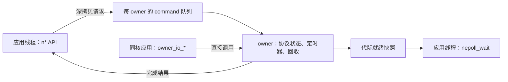
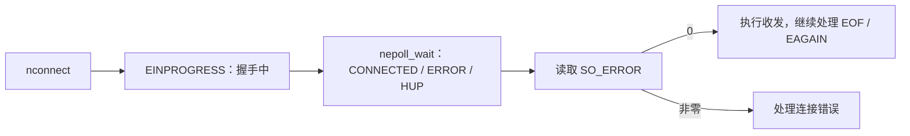
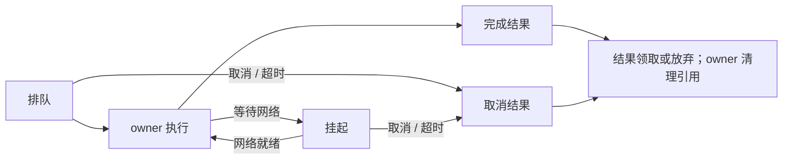

# 公开 socket API

面向普通应用线程的 IPv4 TCP/UDP 接口。包含 `socket.h`、`nepoll.h`，链接协议栈库及 `-pthread`；失败返回 `-1`，原因见 `errno`。完整用法见 [应用示例](../apps/README.md)。

## 调用路径

应用只持有 fd，不跨核访问 `nsock *`。**非阻塞仍需一次 owner 调度**，但不等待网络就绪或队列空间；无进展返回 `EAGAIN`。

## 接口速查

| 接口 / 选项 | 约定 |
| --- | --- |
| `nsocket(..., type \| SOCK_NONBLOCK, ...)` | 设置 socket 非阻塞；默认阻塞。 |
| `nfcntl(fd, F_GETFL/F_SETFL, ...)` | 查询 / 设置 `O_NONBLOCK`；查询同时返回 `O_RDWR`。 |
| `naccept4(..., SOCK_NONBLOCK)` | 标志只控制新连接；监听者状态决定是否等待，新连接不继承其非阻塞标志。 |
| `MSG_DONTWAIT` | 仅本次收发非阻塞；其他未支持的收发标志返回 `EOPNOTSUPP`。 |
| `SO_RCVTIMEO` | `timeval`，覆盖 recv/recvfrom/accept；无进展超时为 `EAGAIN`。 |
| `SO_SNDTIMEO` | 覆盖 send/sendto/connect；收发超时为 `EAGAIN`，connect 为 `ETIMEDOUT`。 |
| `SO_ERROR` | 只读，读取并清除待报告错误；不清除传输层终止错误。 |
| `TCP_NODELAY` | 默认 `1`；`0` 启用 Nagle，重新开启会唤醒待发送数据。 |
| `SO_REUSEADDR` | 默认关闭，须在 bind 前设置，规则见下表。 |
| `SO_LINGER` | 保留 TCP 异步关闭语义；`nclose` 返回不代表 TIME_WAIT 结束。 |

超时选项为零表示无限等待，等待入队也计时；不支持的状态标志、选项或非法长度会被拒绝。

**收发边界：** TCP 单请求最多 64 KiB，阻塞调用也允许短读短写。正常 EOF 返回 `0`，RST 返回错误；读取 `SO_ERROR` 不会把 RST 变成 EOF，对端 FIN 后仍可发送。公开 UDP sendto 不拆包，超 MTU 返回 `EMSGSIZE`；接收缓冲区不足时保留余量供下次读取，与 Linux 截断丢弃语义不同。owner-local UDP 保留原有发送行为。

### 异步 connect

握手期间再次 connect 返回 `EALREADY`，已连接时返回 `EISCONN`。

## 水平触发 nepoll

调用顺序：`nepoll_create` → `nepoll_ctl(ADD/MOD/DEL)` → `nepoll_wait` → `nepoll_close`。事件包含 `events`、socket `fd` 和用户 `uint64_t data`。

| 事件 | 当前就绪条件 |
| --- | --- |
| `READ` | 有数据、可读 EOF/终止错误，或有待接受连接。 |
| `WRITE` | 已连接 TCP 有发送空间，或 UDP 发送队列有空间。 |
| `CONNECTED` | TCP 握手成功，连接仍可通信。 |
| `ACCEPT` | 监听队列非空，同时报告 `READ`。 |
| `ERROR` | 有未读取的 `SO_ERROR`，无需订阅。 |
| `HUP` | 对端关闭或连接终止，无需订阅；不代表数据已读空。 |

- **水平触发**：注册即检查，就绪条件持续成立就持续返回；收发仍须处理 `EAGAIN`。支持跨 owner、多 poller。
- **等待与关闭**：超时参数 `-1` 无限、`0` 立即、正数为毫秒。关闭 poller 唤醒等待者并返回 `EBADF`；poller ID 与 socket fd 分属不同命名空间，分别关闭。
- **代际与容量**：订阅绑定 `(owner, slot, generation)`，过滤关闭 / fd 复用的旧事件。公开 poller 用快照轮转扫描，无额外 ready ring；每次最多扫描 `NSOCK_FD_MAX` 项，futex 仅负责唤醒。owner-local ready ring 满时保留事件位并补扫恢复。

不支持 ET、ONESHOT、嵌套 poller 或内核 fd。

## command 生命周期

入队的是独立分配的请求，持有自己的数据、地址和输出缓冲区；调用者成功领取结果后才复制输出。

| 机制 | 保证 |
| --- | --- |
| 引用计数 | 调用者与 owner 各持一个引用；首次取消通知额外持引用，重复取消合并，调用者继续等待时也能取消。 |
| 终态仲裁 | 只提交一次结果；已发生的收发不回滚，迟到通知不覆盖结果、不写调用者内存。内部取消 / 超时为 `ECANCELED` / `ETIMEDOUT`，取消阻塞 connect 会终止握手。 |
| 结果回收 | 领取结果或线程取消后，调用者引用转交回收通知；未领取的 CREATE/ACCEPT socket 由 owner 关闭。 |
| 队列背压 | 数据 MPSC ring 满时，阻塞提交用 futex 序号等待，非阻塞返回 `EAGAIN`；CLOSE 用独立 ring，取消 / 回收用请求自带链结。各类命令有界处理。 |

关闭请求由 owner 接管后才撤销 fd。截止时间使用单调时钟与 `owner_timer`，但 **owner 停滞时不保证硬实时返回**。本实现未增加 per-app ring、eventfd 或第二套水位机制。

停机顺序：`socket_owner_shutdown_local()` 停止接收、唤醒提交者并清理请求 / socket → 停止 timer engine → worker 退出 → 销毁 owner / registry。`stack_runtime_worker_entry` 已接入。

## 地址复用

统一检查跨 owner 的精确地址 / `INADDR_ANY` 重叠；共享索引只保存代际身份。

| 协议 | `SO_REUSEADDR` 规则 |
| --- | --- |
| TCP | 双方 bind 前开启才允许共享预留；禁止重叠活动 listener、重复四元组，保留 TIME_WAIT 保护。 |
| UDP | 双方 bind 前开启；精确地址优先，同等匹配最后绑定者优先，每包仅交付一次。关闭后回退；在途包校验接收者代际，不能转交复用后的新 socket。 |

未实现 SO_REUSEPORT、广播 / 组播复制、UDP TX IPv4 分片。

## 验证入口

| 命令（仓库根目录） | 内容 |
| --- | --- |
| `make -C test test-socket-public` | 取消、超时、队列满、代际、多 poller / owner、停机；至少两个 EAL lcore。 |
| `make -C test test-tcp-ack` | ACK、Nagle / NODELAY 发包断言。 |
| `make -C test build/test_socket_live` | 构建双机测试，按源码说明显式运行。 |
| `make -C test` | 完整回归；sanitizer 使用 `BUILD_DIR=build-sanitizers SANITIZERS=address,undefined`。 |

详细实验与失败轮次仅存本地验收目录，不进入版本管理。
