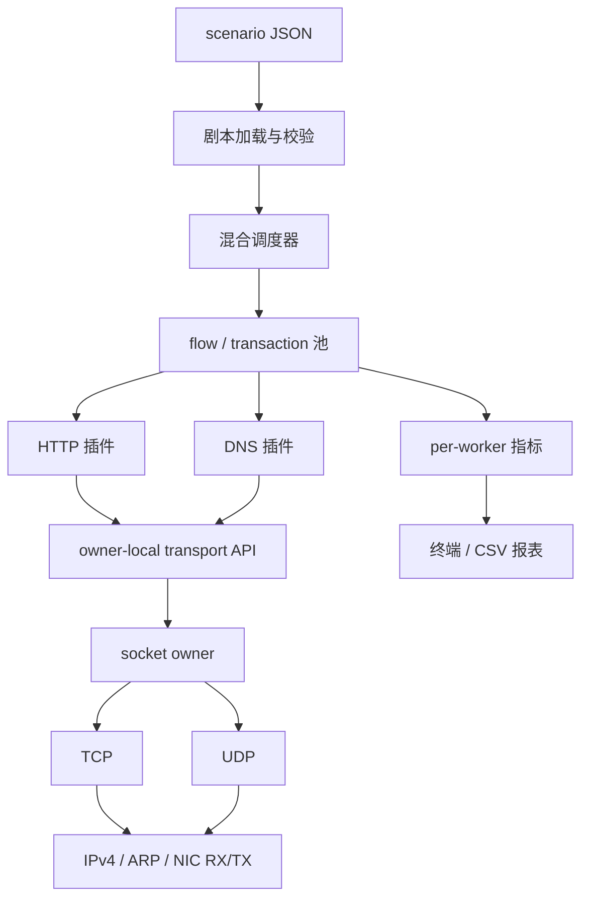
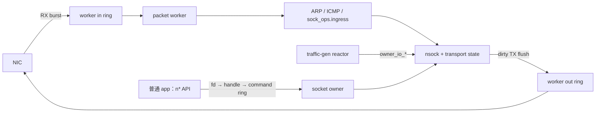

# 项目架构与 TODO

本文档记录 `SnowTG` 的项目架构和后续工作。构建与运行方法见 [`README.md`](../README.md)，并发与 owner 相关的设计决策见 [`DEVLOG.md`](DEVLOG.md)。

## 项目架构

### 分层结构

`SnowTG` 由用户态协议栈和流量发生器两层组成。`pro-stack` 负责包处理、传输状态和 socket 生命周期；`traffic-gen` 负责剧本、调度、应用层协议和指标，不绕过协议栈直接访问 TCB。



主要目录如下：

```text
pro-stack/
├── stack_runtime.*       owner worker 循环与 reactor callback
├── socket.*              socket、端点注册表与 BSD API 入口
├── socket_owner.*        代际句柄、命令环、waiter 与生命周期
├── owner_io.*            owner-local 非阻塞 transport API 与 ready queue
├── owner_timer.*         owner-local 通用定时器接口
├── tcp* / udp*           TCP/UDP 状态机、收发、内存与算法模块
├── arp.* / icmp.*        邻居解析与 ICMP
├── ipv4_reassembly.*     IPv4 分片重组
├── rx_dispatch.*         RSS 不可用时的软件流分发
├── pkt_frame.*           Ethernet/IPv4 共享组帧
└── port.* / ring.*       网卡与 NIC↔worker 数据通道

traffic-gen/
├── main_tg.c             EAL、端口和 owner-worker 入口
├── core/
│   ├── reactor.*         owner-local 调度循环
│   ├── scenario*         JSON 校验与 immutable plan
│   ├── scheduler.*       CPS、并发水位与混合选类
│   ├── flow* / txn.*     连接与事务状态机
│   ├── conn_pool.*       HTTP keep-alive 连接池
│   └── stats*            per-worker 指标与 CSV 汇总
├── proto/
│   ├── proto.h           L7 插件接口
│   ├── http/             HTTP/1.1 客户端插件
│   └── dns/              UDP DNS 客户端插件
└── scenarios/            可复现压测剧本
```

### owner 与线程模型

每条流固定归属于一个 worker。该 worker 独占 socket、TCP/UDP 状态、定时器、flow、L7 parser 和局部指标，热路径不迁移连接，也不使用跨核锁。

```text
main lcore
  ├─ NIC RX → worker in ring
  └─ worker out ring → NIC TX

packet-worker lcore（每个 owner 一个 shard）
  ├─ socket / TCP / UDP owner
  ├─ traffic-gen reactor
  ├─ flow、连接池与 timer
  └─ per-worker 指标
```

硬件支持时由 RSS 保持四元组亲和；否则使用单 RX queue 加软件分发。跨核通信只用于控制面、兼容 BSD API 的 command ring 和低频指标汇总。

普通应用仅持有整数 fd。fd 表保存 `{id, generation, owner_lcore, protocol}` 句柄，所有跨核 BSD API 操作经 command ring 提交，generation 用于阻止 slot 复用产生 ABA/UAF。traffic-gen reactor 与 owner 同核，使用 `owner_io_*` 非阻塞接口，避免每次收发都进行同步 RPC。

### 协议栈数据流



`struct nsock` 是统一 socket 对象，持有端点、协议 ops、owner slot/generation 和 TCP/UDP 私有状态。`struct sock_ops` 提供 `ingress`、`tx_flush`、`send`、`recv`、`connect`、`listen`、`accept` 和 `close`，运行时循环不依赖具体传输协议。

TCP 使用表驱动状态机。接收侧完成校验、窗口处理、按序/乱序重组、ACK 和重传后，向应用交付 payload 字节流；发送侧通过发送缓冲、滑动窗口、RTO、SACK 恢复和拥塞控制管理数据。UDP 保持数据报边界。

### traffic-gen 运行模型

Scenario 描述压测时长、并发上限、目标 CPS 和多个 traffic class。每个 class 绑定目标地址、权重、传输协议和 L7 插件配置。启动时 scenario 被严格校验并编译为不可变 plan，再按 active shard 拆分。

调度器使用令牌桶控制发车速率，以并发水位限制 in-flight transaction，并按权重选择 class。TCP class 优先复用同 class/peer 的空闲 keep-alive 连接；UDP class 直接推进请求/响应事务。停止发车后，reactor 等待活动 flow 排空，并以有界 drain timeout 回收残留资源。

核心对象的关系为：

| 对象 | 职责 |
| --- | --- |
| Scenario | 一次压测的声明式配置 |
| Traffic class | 一类 L7 行为及其传输、目标和权重 |
| Flow | 一条 TCP 连接或 UDP 数据流 |
| Transaction | 一次 L7 请求与响应判定 |
| Scheduler | 控制 CPS、并发和 class 选择 |
| Plugin | 构造请求、消费响应并判定成功或失败 |

TCP keep-alive flow 同一时刻只承载一个 transaction：

```text
NEW → CONNECTING → SENDING → RECEIVING → IDLE
       │            │          │          │
       └────────────┴──────────┴──────────┴→ CLOSING
```

UDP flow 的状态更短：

```text
IDLE → SENDING → RECEIVING → IDLE
         └───────────┴→ FAILED → IDLE
```

插件只处理应用层字节或数据报，不调用 `owner_io_*`。flow 层拥有 socket、非阻塞 I/O、ready event 和回收顺序；transaction 保存单次请求/响应状态。当前插件覆盖 HTTP/1.1 和 DNS，协议专用配置由插件自行编译、复制和释放。

### 就绪事件与每轮调度

owner-local socket 使用 generation handle 和合并后的 ready mask 传递 `READ`、`WRITE`、`CONNECTED`、`ACCEPT`、`ERROR`、`HUP` 等状态。队列项不保存可复用 fd；reactor 收到事件后持续推进 flow，直到完成、失败或返回 `EAGAIN`。

每个 worker 在有界预算内循环执行：

```text
RX ingress → owner timer → ready-event burst → flow state machine
           → CPS token bucket → dirty TX flush
```

ready burst 和新事务准入都有上限，防止单个繁忙 flow 或高 CPS 发车饿死收包和定时器。每个 worker 独立维护对象池和计数器，汇报路径只做低频聚合，避免热路径原子竞争。

### 资源与扩展原则

- `tg_flow`、`tg_txn`、TCP/UDP 节点等热路径对象来自 owner-local 固定池。
- socket 容量根据 scenario 并发和 active shard 自动计算，也可由 `--socket-id-max` 显式增大；运行中不扩容。
- 连接、流、解析器和定时器均不跨 worker 迁移，多核扩展采用 shard 复制而非共享全局 socket 表。
- 指标按 worker 采集吞吐、并发、成功/失败、错误分类、内存、丢包和 TCP/OFO 状态，再周期性汇总到终端或 CSV。
- 对外性能数字只使用固定硬件、剧本和构建参数下的可复现实测结果，详见 [`PERFORMANCE.md`](PERFORMANCE.md)。

## TODO

### 协议层 TODO

- [ ] 完善 command 生命周期与取消：将当前依赖调用者等待 completion 的 command 改为可独立管理的对象，并定义超时、取消、引用计数和 late completion 语义。
- [ ] 改进 command ring 背压：替换 ring 满时的持续忙等，为生命周期控制命令保留可靠容量，并评估 per-app ring、eventfd/futex 或高低水位方案。
- [ ] 提供公开的 epoll-like 就绪接口：向普通应用暴露 `READ`、`WRITE`、`CONNECTED`、`ACCEPT`、`ERROR`、`HUP`，按代际句柄合并事件并定义 ready ring 满时的恢复策略。
- [ ] 完成公开非阻塞 API：补充 socket 级 nonblocking 状态、`naccept4(..., SOCK_NONBLOCK)`、`ngetsockopt(SO_ERROR)`，统一短读、短写和异步 connect 错误语义。
- [ ] 补充常用 socket 选项：至少支持 `SO_REUSEADDR`、`TCP_NODELAY` 以及非阻塞状态的查询与设置。
- [ ] 评估并实现协议栈 payload 零拷贝：覆盖 TCP TX retained buffer、TCP RX/OFO slice 和 UDP RX 持有策略，同时提供复制回退、资源上限、释放语义和指标。
- [ ] 为 `owner_timer` 实现时间轮后端：先以 profile 验证收益，保持 TCP 和 traffic-gen 公共接口不变，并移除 flow 超时的全表扫描路径。
- [ ] 补齐协议栈资源可观测性：记录各 owner pool 的容量、当前值、峰值、分配失败原因，以及能定位缓慢泄漏的长期指标。
- [ ] 实现 Gratuitous ARP 与地址冲突检测，支持启动或地址变更时主动通告并检测重复地址。
- [ ] 补全 ICMP echo payload，并处理 destination unreachable、time exceeded 等非 echo 报文，将异步错误上报给 TCP/UDP/socket 层。
- [ ] 实现 UDP TX IPv4 分片，明确超 MTU 数据报的错误、分片和发送语义。
- [ ] 增加 IPv6，包括邻居发现、IPv6 输入输出和 TCP/UDP pseudo-header。
- [ ] 增加路由与多接口支持，引入路由选择、下一跳和按接口维护的本地身份。

### 应用层 TODO

- [ ] 将 TCP echo server 改为公开 nonblocking + ready API 驱动，避免单连接阻塞 `nrecv` 后停止接受其他连接。
- [ ] 增加一种轻量长连接协议插件：Redis 或 MQTT 二选一，复用现有 scenario、flow、连接池和统计抽象。
- [ ] 扩展高阶 L7 场景：可选 HTTPS 小并发/握手压测和极简 MySQL 客户端，并明确 TLS 与数据库状态机的 CPU、内存成本。
- [ ] 增加端到端延迟直方图，输出 P50、P95、P99 和最大值，并在 CSV 中保留分协议结果。
- [ ] 完善产品化入口：整理稳定的启动参数、scenario 样例、长测命令、结果报表和排障说明，将 benchmark 元数据与 CSV 一起归档。
- [ ] 增加可重复的长时间混合流量验收，覆盖停止发车、连接排空、超时强制回收和资源归零检查。
