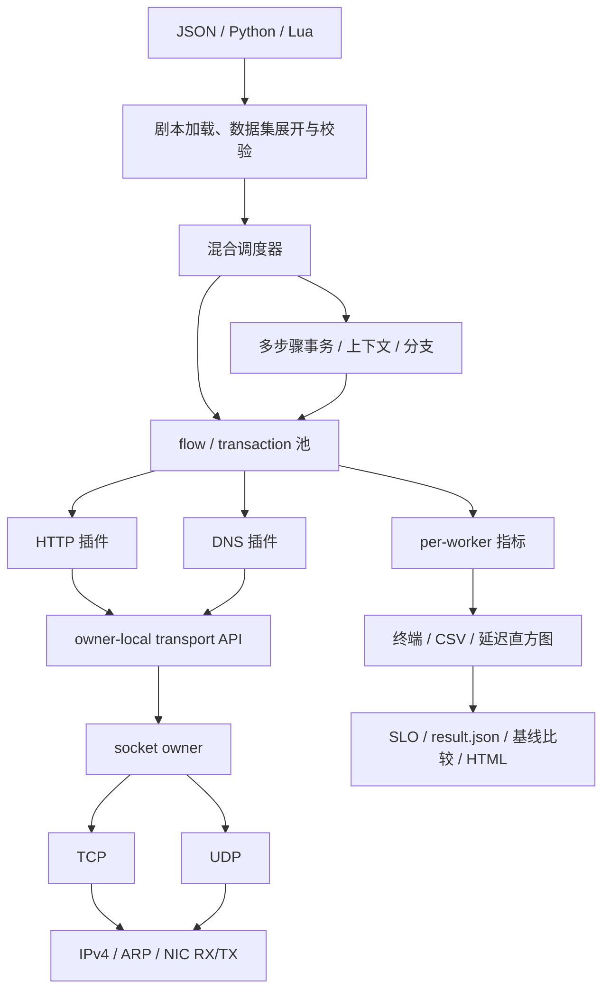
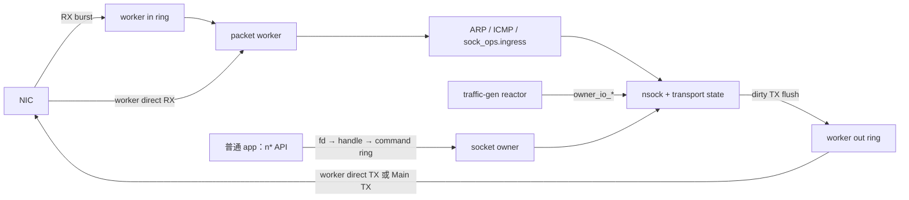

# 项目 TODO 与完成情况

本文档按“待办 → 完成情况与业务对比 → 项目架构”维护。最近核对：**2026-09-28**，依据当前代码、测试及本地实验记录；实现完成不等于真实环境验收完成。构建与运行见 [`README.md`](../README.md)，并发与 owner 设计见 [`DEVLOG.md`](DEVLOG.md)。

## TODO

### 应用层 TODO

P0 单机闭环已有实现，不再重复列为待开发。下列条目跟踪待办与验收进展。优先补齐单机业务验收，再按实际部署需要扩展协议和分布式能力。

#### P1：容量、故障与稳定性验收

- [x] **30 分钟混合流量验收**：完成 HTTP Keep-Alive/短连接/DNS = 60/20/20 的真实双机长测，907,500 次请求全部成功，正常排空且已观测资源归零。
- [x] **低速故障注入与恢复矩阵**：13 轮覆盖 HTTP RST/截断/非法响应/503/慢响应/正常主动关闭、DNS 超时/错误/非法/慢响应，以及网络完全丢包/延迟/确定性乱序；同一进程恢复阶段 SLO 均通过，未观察到应用请求重试放大。
- [ ] **最大可持续负载产品化**：已有 [`acceptance_search.py`](../test/acceptance_search.py) 验收脚本，支持逐级升压、区间搜索、重复测量、无效轮次中止及只报告下界。仍需接入正式 CLI、结构化容量结果、基线比较与“容量下降不超过指定比例”的退出码；单次 `result.json` 的 `maximum_sustainable_cps` 仍为 `null`。
- [x] **细化错误归因与扩展故障压力**：修复 TCP RST 被当成正常 EOF 的原因丢失；新增建连/响应超时、RST、提前 EOF、HTTP 状态、DNS RCODE、解析及其他终止原因，接入 CSV / JSON / HTML、SLO 与多步骤回归。完成 HTTP 2,000 CPS、DNS 1,000 CPS 故障恢复（HTTP 超时轮 1,000 CPS），以及 256 KiB 响应 / 200 CPS 的两轮返回方向乱序；累计接纳并回收 123,743 / 123,994 个 OFO 段，最终占用归零。15 个目标压力轮次及 11 个多步骤回归通过；对端文件描述符限制引起的 3 个首次失败保留，并以新目录重测通过。
- [ ] **小时级长测与完整资源验收**：在已通过的 30 分钟混合验收上扩展至数小时，补齐 flow/transaction/timer、TIME_WAIT、重传/OFO 队列的独立占用/峰值与趋势；补充 drain timeout 强制回收的端到端验收。现有强制回收单测和最终 TCP 对象归零不能替代所有资源的长期指标。
- [ ] **客户端、网络与服务端指标关联产品化**：本轮已保存两端主机计数、故障时间窗、对端请求日志和时钟偏差；继续将这些证据自动关联到报告，区分发压端并发保护、网络故障与服务变慢，明确不可归因的部分。底层资源计数依赖协议层资源可观测性待办。
- [x] **真实双机 Nginx 配置 A/B 案例**：完成 5 ms→50 ms 响应等待退化、容量边界搜索与恢复；A 在 2,000 CPS 通过、2,025 CPS 失败，B 在 300 CPS 通过、325 CPS 失败。固定 1,000 CPS 下拒绝 B，恢复 A 后 SLO 与基线比较通过。该场景为实验构造，不宣称生产事件。

#### P2：按需求扩展

- [ ] **封闭负载模型**：有固定客户端业务需求时增加“完成后再发起”的并发模型，明确思考时间、事务吞吐和开放模型到达率的区别，并补齐校验、统计与示例；当前只支持带并发保护上限的 `open` 模型。
- [ ] **分布式发压**：在单机 CPU、端口或链路容量确认受限后，增加场景/测试 ID 下发、版本与环境校验、同步启动、跨节点直方图与指标聚合、节点失联/部分失败处理及全局报告。
- [ ] **轻量长连接协议**：Redis 或 MQTT 按目标案例二选一，复用现有 scenario、flow、连接池和统计。若选择 MQTT，应覆盖 CONNECT/CONNACK、订阅/发布、QoS 1、心跳、掉线重连、会话恢复及消息吞吐/端到端延迟，不能只完成报文编解码。
- [ ] **高阶 L7 场景**：有明确案例后再增加 HTTPS 小并发/握手压测或极简 MySQL 客户端，说明 TLS 与数据库状态机的 CPU、内存成本。
- [ ] **TCP echo server 并发化**：待公开 nonblocking + ready API 完成后改造示例，避免单连接阻塞 `nrecv` 后停止接受其他连接。

### 协议层 TODO

- [x] 完善 command 生命周期与取消：请求深拷贝、引用计数、内部取消与单调时钟截止时间已实现；完成结果只提交一次，取消通知可独立推进，未领取结果与停机请求由 owner 回收。
- [x] 改进 command ring 背压：数据 ring 满时采用 futex 序号等待，非阻塞返回 `EAGAIN`；CLOSE 使用独立容量，取消与回收采用持有引用的合并通知，各类命令有界处理。保留每 owner MPSC，不增加 per-app ring/eventfd/第二套水位机制。
- [x] 提供公开的 epoll-like 就绪接口：`nepoll_*` 支持六类水平触发事件、多 owner/多 poller 和代际过滤；公开接口用持久化状态快照与轮转扫描避免通知队列溢出，原 owner-local ready ring 已补齐满队列恢复。
- [x] 完成公开非阻塞 API：支持 socket 级 `SOCK_NONBLOCK`、`naccept4`、`nfcntl`、`SO_ERROR` 读取清除及收发超时；区分短读短写、EOF、RST 和异步 connect 状态，TCP 单请求上限 64 KiB。
- [x] 补充常用 socket 选项：支持 `SO_REUSEADDR`、`TCP_NODELAY`、`SO_RCVTIMEO`、`SO_SNDTIMEO`，保留 `SO_LINGER`。NODELAY 默认开启；关闭后按 Nagle 控制小包，UDP 复用按精确地址优先、最后绑定者优先并支持关闭回退。
以上五项的接口、默认值与支持边界见 [公开 socket API](SOCKET_API.md)，设计见 [ARC-010](DEVLOG.md#arc-010公开-socket-命令生命周期与水平触发通知)。本地完整回归、跨 owner/取消/队列饱和测试、ASan/UBSan 及真实双机公开 API 验收通过（TCP 100/100、UDP 100/100、入站连接 20/20）；双机采用 AF_PACKET，结果证明功能正确性，不代表原生 PMD 性能基线。详细记录仅存本地。

- [ ] 评估并实现协议栈 payload 零拷贝：覆盖 TCP TX retained buffer、TCP RX/OFO slice 和 UDP RX 持有策略，同时提供复制回退、资源上限、释放语义和指标。
- [ ] 为 `owner_timer` 实现时间轮后端：先以 profile 验证收益，保持 TCP 和 traffic-gen 公共接口不变，并移除 flow 超时的全表扫描路径；当前后端仍为 `rte_timer`。
- [ ] 补齐协议栈资源可观测性：在已有 TCP 池、TX/payload/OFO 峰值和分配失败指标上，覆盖各 owner pool 的容量、当前值、峰值、失败原因及长期趋势，支持应用层长测和资源归零验收。
- [ ] 实现 Gratuitous ARP 与地址冲突检测，支持启动或地址变更时主动通告并检测重复地址。
- [ ] 补全 ICMP echo payload，并处理 destination unreachable、time exceeded 等非 echo 报文，将异步错误上报给 TCP/UDP/socket 层。
- [ ] 实现 UDP TX IPv4 分片，明确超 MTU 数据报的错误、分片和发送语义；公开 `nsendto` 超 MTU 返回 `EMSGSIZE`；既有 owner-local 大 buffer 拆包不是 IPv4 分片。
- [ ] 增加 IPv6，包括邻居发现、IPv6 输入输出和 TCP/UDP pseudo-header。
- [ ] 增加路由与多接口支持，引入路由选择、下一跳和按接口维护的本地身份；当前单端口多 RX/TX 队列不等于多接口路由。

## 完成情况与业务对比

### 业务能力逐项核对

“已实现”表示代码与对应测试已存在；真实设备、长时间运行和版本验收另行确认。未完成部分已归入上方应用层 TODO，不把已实现能力重新列为待办。

| 业务能力 | 当前状态 | 实现依据与剩余边界 |
| --- | --- | --- |
| 分阶段负载 | 开放模型已实现 | [`scenario.c`](../traffic-gen/core/scenario.c)、[`scheduler.c`](../traffic-gen/core/scheduler.c) 支持固定/线性变速阶段及并发上限，Python/Lua 可生成剧本；封闭模型尚未实现。 |
| 尾延迟与调度偏差 | 已实现 | [`latency.c`](../traffic-gen/core/latency.c) 按阶段/类别/协议输出 P50/P90/P95/P99/P99.9、最大值及可合并桶；覆盖调度、建连、首字节、完成、含调度的完成延迟和运行级排空。跳过/启动失败的到达有计数但没有响应延迟样本，不能解读为所有计划请求的延迟分布。 |
| SLO 与退出码 | 已实现 | [`snowtg_results.py`](../traffic-gen/snowtg_results.py) 支持作用域断言、实际值/阈值/结果；`run` 返回 0（通过）、2（关键 SLO 失败）、1（运行无效）。 |
| 结构化结果与基线 | 基础闭环已实现，容量搜索待补 | `result.json` 保存场景/哈希、构建/环境/服务版本、分组指标、断言和无效原因；`compare` 检查可比性并比较吞吐、P95/P99、错误率、资源峰值和新错误。单次容量字段仍为 null，独立验收脚本已有搜索结果；资源峰值是各 worker 高水位的最大值，不是同时刻总占用。 |
| 离线报告 | 已实现 | `report.html` 展示环境、流量、SLO、基线差异和时序图；时序延迟是区间均值，不能当作区间 P99。 |
| 多步骤事务 | 已实现 | [`workflow.c`](../traffic-gen/core/workflow.c)、[`workflow_plan.c`](../traffic-gen/core/workflow_plan.c)、[`snowtg_datasets.py`](../traffic-gen/snowtg_datasets.py) 支持 DNS→HTTP、模板、CSV/JSON 数据集、响应提取、上下文、前向分支、思考时间、步骤统计和整体判定；有步骤/变量/请求大小上限，区分业务 TPS 与网络步骤 RPS。 |
| 故障与恢复 | 错误细分与双机压力恢复已验收 | 在低速矩阵基础上完成终止原因传递、计数/SLO 和多步骤回归；HTTP/DNS 压力故障及大响应返回方向 OFO 接纳、回收和恢复实测通过。 |
| 最大可持续负载 | 验收脚本已实现，产品化待补 | 脚本已完成 Nginx A/B 共 36 轮 SLO 搜索与重复测量；正式 CLI、容量结果 schema 和容量比较门禁仍未接入。 |
| 长时间稳定性 | 30 分钟混合长测通过 | 907,500 次请求全部成功、排空正常；小时级混合实测及完整资源指标仍待补，不能用既有六小时 HTTP 剧本代替已执行证据。 |
| 分布式发压 | 未实现 | 多 worker 是单机分片，尚无多节点控制、同步与汇总。 |
| 协议扩展 | HTTP/DNS 已有，其余待选型 | [`registry.c`](../traffic-gen/proto/registry.c) 当前注册 HTTP/1.1 与 UDP DNS；MQTT/Redis/TLS/MySQL 不在现有插件中。 |
| 真实发布验收案例 | 实验室配置 A/B 案例完成 | 真实双机上记录场景、SLO、服务端耗时、容量边界、拒绝退化配置与恢复结果。生产业务案例仍需按实际业务设计。 |

原应用层 TODO 中的“端到端延迟直方图”已完成；“产品化入口”所列启动参数、剧本、长测命令、报告、排障与构建元数据归档已有基础实现和文档。长测与故障矩阵已有本轮实测，剩余产品化和覆盖边界按上方条目跟踪。

### 项目能力与业务目标

当前已具备“建模 → 单机执行 → SLO 判断 → 固定负载基线比较 → 离线报告”的工具链，也具备 HTTP/DNS 多步骤业务编排。距“新版本能否发布、容量下降多少、故障后是否恢复”的完整业务验收，已有 30 分钟混合长测、低速故障矩阵和 Nginx 配置 A/B 的双机证据，剩余工作集中在容量搜索与跨层自动归因的产品化、小时级完整资源验证；本轮已完成错误细分和所选 HTTP/DNS 压力/OFO 场景，具体速率与阈值见本地专项报告。

已有 [`BENCHMARK.md`](BENCHMARK.md) 记录 SnowTG/dperf/wrk 在固定环境下的吞吐、CPU 配额和短连接对照，也记录了 CPU 效率及资源压力的限制。这些结果证明特定条件下的性能表现，不代表通用性能领先、SLO 约束下的最大容量或生产发布结论。

### 本次核对与验证

- 已核对场景/调度、延迟、工作流、SLO/报告、插件注册，以及协议层公开 API、command、timer、ICMP 和 UDP 路径。
- `make -C test` 与 `make -C traffic-gen` 通过；`python3 test/test_workflow_cli.py`、`python3 test/test_slo_cli.py`、`python3 test/test_phased_latency.py` 通过，分别验证双 worker 事务/分支/资源收尾、SLO 的 0/2/1 退出码、分阶段到达计数与延迟归属。CLI 检查使用 `net_null`，不代表真实服务性能验收。
- 真实双机验收报告（含环境、失败轮次）保存在本地 `docs/acceptance/`，原始数据与临时调试工具保存在本地 `debug/`，新增报告、原始数据与临时工具均不纳入版本管理。小时级长测和未覆盖指标仍保留为待办。

## 项目架构

### 分层结构

`SnowTG` 由用户态协议栈和流量发生器两层组成。`pro-stack` 负责包处理、传输状态和 socket 生命周期；`traffic-gen` 负责剧本、调度、应用层协议和指标，不绕过协议栈直接访问 TCB。


```mermaid
flowchart TB
    Scenario["JSON / Python / Lua"] --> Loader["剧本加载、数据集展开与校验"]
    Loader --> Scheduler["混合调度器"]
    Scheduler --> Flow["flow / transaction 池"]
    Flow --> HTTP["HTTP 插件"]
    Flow --> DNS["DNS 插件"]
    Scheduler --> Workflow["多步骤事务 / 上下文 / 分支"]
    Workflow --> Flow
    HTTP --> OwnerIO["owner-local transport API"]
    DNS --> OwnerIO
    OwnerIO --> Socket["socket owner"]
    Socket --> TCP
    Socket --> UDP
    TCP --> IP["IPv4 / ARP / NIC RX/TX"]
    UDP --> IP
    Flow --> Stats["per-worker 指标"]
    Stats --> CSV["终端 / CSV / 延迟直方图"]
    CSV --> Report["SLO / result.json / 基线比较 / HTML"]
```

主要目录如下：

```text
pro-stack/
├── stack_runtime.*       owner worker 循环与 reactor callback
├── socket.*              socket、端点注册表与 BSD API 入口
├── socket_owner.*        代际句柄、命令环、waiter 与生命周期
├── owner_io.*            owner-local 非阻塞 transport API 与 ready queue
├── owner_timer.*         owner-local 通用定时器接口
├── tcp* / udp*           TCP/UDP 状态机、收发、内存与算法模块
├── arp.* / icmp.*        邻居解析与 ICMP
├── ipv4_reassembly.*     IPv4 分片重组
├── rx_dispatch.*         RSS 不可用时的软件流分发
├── pkt_frame.*           Ethernet/IPv4 共享组帧
└── port.* / ring.*       网卡与 NIC↔worker 数据通道

traffic-gen/
├── main_tg.c             EAL、端口和 owner-worker 入口
├── core/
│   ├── reactor.*         owner-local 调度循环
│   ├── scenario*         JSON 校验与 immutable plan
│   ├── scheduler.*       CPS、并发水位与混合选类
│   ├── flow* / txn.*     连接与事务状态机
│   ├── workflow* / value.* 多步骤编排、上下文与模板
│   ├── conn_pool.*       HTTP keep-alive 连接池
│   ├── latency.*         分组延迟直方图
│   └── stats* / dataplane_stats.* 指标与 CSV 汇总
├── proto/
│   ├── proto.h           L7 插件接口
│   ├── http/             HTTP/1.1 客户端插件
│   └── dns/              UDP DNS 客户端插件
├── snowtg.py / snowtg.lua JSON/Python/Lua 剧本入口
├── snowtg_datasets.py    启动时展开 CSV/JSON 数据集
├── snowtg_results.py     运行归档、SLO、基线比较与 HTML
└── scenarios/            可复现压测剧本
```

### owner 与线程模型

每条流固定归属于一个 worker。该 worker 独占 socket、TCP/UDP 状态、定时器、flow、L7 parser 和局部指标，热路径不迁移连接，也不使用跨核锁。

```text
main lcore
  ├─ 启动 / 控制 / 低频统计
  └─ RX/TX 回退路径：NIC ↔ worker ring

packet-worker lcore（每个 owner 一个 shard）
  ├─ 独占 NIC RX/TX queue（直接收发模式）
  ├─ socket / TCP / UDP owner 与 timer
  ├─ traffic-gen reactor
  ├─ flow、业务事务、连接池
  └─ per-worker 指标
```

`--rx-mode` / `--tx-mode` 默认为 `auto`，分别选择 worker 直接收发或 Main 回退路径。硬件支持时由 RSS 保持四元组亲和；否则使用单 RX queue 加软件分发。跨核通信包括回退收发、错队列报文移交、控制面、兼容 BSD API 的 command ring 和低频指标汇总；不是所有报文都经过 Main。

普通应用仅持有整数 fd。fd 表保存 `{id, generation, owner_lcore, protocol}` 句柄，所有跨核 BSD API 操作经 command ring 提交，generation 用于阻止 slot 复用产生 ABA/UAF。traffic-gen reactor 与 owner 同核，使用 `owner_io_*` 非阻塞接口，避免每次收发都进行同步 RPC。

### 协议栈数据流


```mermaid
flowchart LR
    NIC -->|RX burst| InRing["worker in ring"]
    InRing --> Worker["packet worker"]
    NIC -->|worker direct RX| Worker
    Worker --> Dispatch["ARP / ICMP / sock_ops.ingress"]
    Dispatch --> NSock["nsock + transport state"]
    App["普通 app：n* API"] -->|fd → handle → command ring| Owner["socket owner"]
    Reactor["traffic-gen reactor"] -->|owner_io_*| NSock
    Owner --> NSock
    NSock -->|dirty TX flush| OutRing["worker out ring"]
    OutRing -->|worker direct TX 或 Main TX| NIC
```

`struct nsock` 是统一 socket 对象，持有端点、协议 ops、owner slot/generation 和 TCP/UDP 私有状态。`struct sock_ops` 提供 `ingress`、`tx_flush`、`send`、`recv`、`connect`、`listen`、`accept` 和 `close`，运行时循环不依赖具体传输协议。

TCP 使用表驱动状态机。接收侧完成校验、窗口处理、按序/乱序重组、ACK 和重传后，向应用交付 payload 字节流；发送侧通过发送缓冲、滑动窗口、RTO、SACK 恢复和拥塞控制管理数据。UDP 保持数据报边界。

### traffic-gen 运行模型

Scenario 描述压测阶段、并发上限、目标到达率和多个 traffic class，支持固定负载及线性爬坡。普通 class 绑定目标地址、权重、传输协议和 L7 插件配置；业务 class 则定义带上下文和数据集的多步骤 transaction。Python/Lua 在启动时生成 JSON，C 层将其严格校验并编译为不可变 plan，再按 active shard 拆分。

调度器使用令牌桶控制开放模型的发车速率，以并发水位限制 in-flight transaction，并按权重选择 class；记录计划到达、实际准入、跳过和启动失败，不能把配置到达率当成实际 RPS。TCP class 优先复用同 class/peer 的空闲 keep-alive 连接；UDP class 直接推进请求/响应事务。业务事务按步骤执行 HTTP/DNS、提取与校验、分支和非阻塞思考时间，单独统计业务 TPS 与网络步骤 RPS。停止发车后，reactor 等待活动 flow 排空，并以有界 drain timeout 回收残留资源；强制回收不算正常排空。

核心对象的关系为：

| 对象 | 职责 |
| --- | --- |
| Scenario | 一次压测的声明式配置 |
| Traffic class | 一类 L7 行为及其传输、目标和权重 |
| Flow | 一条 TCP 连接或 UDP 数据流 |
| Transaction | 一次 L7 请求与响应判定 |
| Workflow | 多步骤业务事务，管理上下文、分支、步骤与整体期限 |
| Scheduler | 控制 CPS、并发和 class 选择 |
| Plugin | 构造请求、消费响应并判定成功或失败 |

TCP keep-alive flow 同一时刻只承载一个 transaction：

```text
NEW → CONNECTING → SENDING → RECEIVING → IDLE
       │            │          │          │
       └────────────┴──────────┴──────────┴→ CLOSING
```

UDP flow 的状态更短：

```text
IDLE → SENDING → RECEIVING → IDLE
         └───────────┴→ FAILED → IDLE
```

插件只处理应用层字节或数据报，不调用 `owner_io_*`。flow 层拥有 socket、非阻塞 I/O、ready event 和回收顺序；transaction 保存单次请求/响应状态。当前插件覆盖 HTTP/1.1 和 DNS，协议专用配置由插件自行编译、复制和释放。

### 就绪事件与每轮调度

owner-local socket 使用 generation handle 和合并后的 ready mask 传递 `READ`、`WRITE`、`CONNECTED`、`ACCEPT`、`ERROR`、`HUP` 等状态。队列项不保存可复用 fd；reactor 收到事件后持续推进 flow，直到完成、失败或返回 `EAGAIN`。

每个 worker 在有界预算内循环执行：

```text
RX ingress → owner timer → ready-event burst → flow state machine
           → CPS token bucket → dirty TX flush
```

ready burst 和新事务准入都有上限，防止单个繁忙 flow 或高 CPS 发车饿死收包和定时器。每个 worker 独立维护对象池和计数器，汇报路径只做低频聚合，避免热路径原子竞争。

### 资源与扩展原则

- `tg_flow`、`tg_txn`、TCP/UDP 节点等热路径对象来自 owner-local 固定池。
- socket 容量根据 scenario 并发和 active shard 自动计算，也可由 `--socket-id-max` 显式增大；运行中不扩容。
- 连接、流、解析器和定时器均不跨 worker 迁移，多核扩展采用 shard 复制而非共享全局 socket 表。
- 指标按 worker 采集吞吐、并发、成功/失败、错误分类、内存、丢包和 TCP/OFO 状态，再周期性汇总到终端或 CSV。
- 对外性能数字只使用固定硬件、剧本和构建参数下的可复现实测结果，详见 [`PERFORMANCE.md`](PERFORMANCE.md)。
